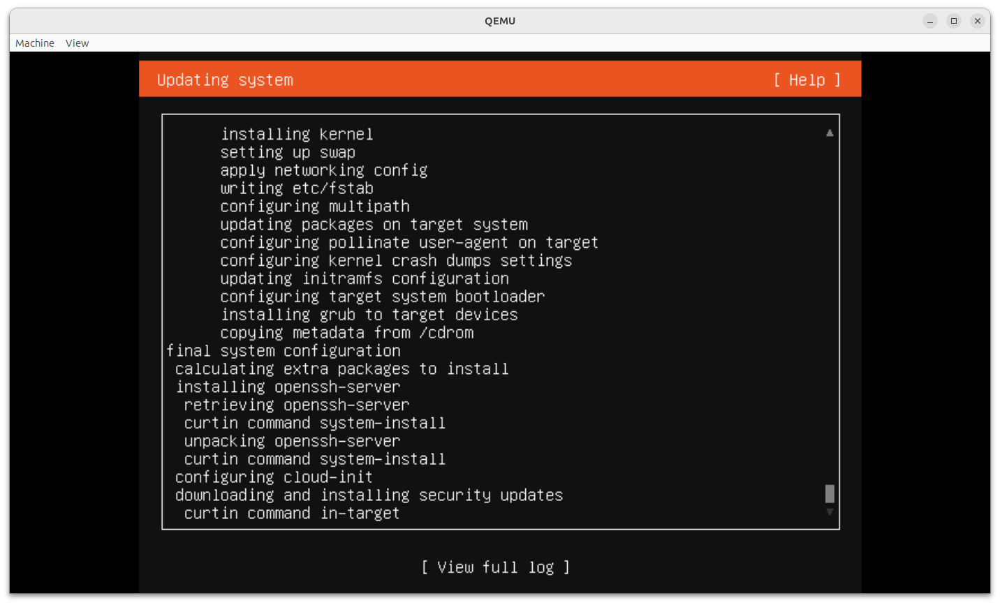

[**Cleuton Sampaio**](https://linkedin.com/in/cleutonsampaio) - Me siga!
[**RustingCrab.com**](https://rustingcrab.com).

# Criar uma VM com QEMU

Você deve estar se perguntando: "Porque diabos eu faria isso?" Afinal de contas, temos **Docker**, certo? E se precisarmos de uma VM temos o **VirtualBox** e outros softwares para isso. 

Bom, vamos começar do começo...

> Você não pode alterar o **kernel** do **container**, pois ele não possui um! Ele usa o do **host**.

> **VirtualBox** é ótimo, mas é um software comercial. **QEMU** é opensource.

Mas por que eu iria alterar o **kernel**? Boa pergunta! Se estiver pensando em criar aplicações de monitoração **eBPF** ou mesmo quiser criar um **driver** em Rust, vai precisar "futucar" o Kernel sim!

Com uma **VM** você pode fazer o que quiser!

## Etapas

Você vai precisar criar um disco virtual, baixar uma imagem **ISO** de um sistema operacional, instalar esse sistema no disco virtual e subir sua VM com o QEMU.

### Criar disco virtual: 

Já instalou o **QEMU**? Não, então instale: 

```shell
sudo apt install qemu-<sua plataforma>  
sudo apt install qemu-kvm
``` 

Você deve instalar o **qemu** apropriado para a sua plataforma: 

- qemu-system-x86
- qemu-system-arm

Agora, escolha uma pasta e crie um disco virtual, digamos com 100GB (pode criar com menos): 

```shell
qemu-img create -f qcow2 ubuntu-server-disk.qcow2 100G
```  

O formato **QCOW2** (QEMU Copy On Write 2) é um formato de disco virtual usado pelo QEMU para armazenar sistemas de arquivos de máquinas virtuais. Ele é amplamente utilizado por ser eficiente em termos de espaço e oferecer recursos avançados que tornam a virtualização mais prática e flexível.

### Baixar e instalar uma imagem de sistema operacional

Eu quero instalar o **Ubuntu** Server, então vou no site de download e baixo a imagem **ISO** de **cdrom** dele:

- https://mirror.uepg.br/ubuntu-releases/24.10/ubuntu-24.10-live-server-amd64.iso

Muito bem, agora, vamos "dar boot" em uma **VM** com o **cdrom** montado dando boot por ele: 

```shell
qemu-system-x86_64 \
  -enable-kvm \
  -m 2048 \
  -cpu host \
  -smp 2 \
  -cdrom ./ubuntu-24.10-live-server-amd64.iso \
  -drive file=ubuntu-server-disk.qcow2,format=qcow2 \
  -boot d \
  -vga virtio
```

Este comando configura e inicia uma máquina virtual usando o QEMU. Vou explicar cada opção:

#### **1. `qemu-system-x86_64`**
Este é o executável do QEMU que emula um sistema x86_64 (64 bits). Ele é usado para inicializar máquinas virtuais com processadores baseados em x86-64.

#### **2. `-enable-kvm`**
Ativa o **KVM** (**Kernel-based Virtual Machine**), uma tecnologia de virtualização que usa recursos do hardware para melhorar o desempenho das máquinas virtuais. Sem esta opção, o QEMU opera em modo de emulação pura, o que é mais lento.

#### **3. `-m 2048`**
Especifica a quantidade de memória RAM alocada para a VM, em megabytes. Neste caso:
- **2048 MB** = 2 GB de RAM.

#### **4. `-cpu host`**
Usa a configuração do processador do host para a VM. Isso permite que a VM use as instruções e recursos do processador físico da máquina em que o QEMU está sendo executado, aumentando a compatibilidade e o desempenho.

#### **5. `-smp 2`**
Configura o número de CPUs virtuais disponíveis para a máquina virtual:
- **`2`** indica que a VM terá 2 CPUs virtuais ou núcleos de processamento.

#### **6. `-cdrom path/to/ubuntu-server.iso`**
Especifica uma imagem ISO como dispositivo de CD-ROM da VM:
- **`path/to/ubuntu-server.iso`** é o caminho para o arquivo ISO do Ubuntu Server. Ele será usado como mídia de instalação.

#### **7. `-drive file=ubuntu-server-disk.qcow2,format=qcow2`**
Adiciona um disco virtual à VM:
- **`file=ubuntu-server-disk.qcow2`**: Nome do arquivo do disco virtual.
- **`format=qcow2`**: Especifica que o disco usa o formato QCOW2, que é eficiente em termos de espaço e suporta snapshots.

#### **8. `-boot d`**
Define a ordem de boot para a VM:
- **`d`**: Indica que o primeiro dispositivo de inicialização será o CD-ROM. Isso garante que a instalação do sistema operacional inicie pela ISO especificada em `-cdrom`.

#### **9. `-vga virtio`**
Configura o adaptador gráfico da máquina virtual:
- **`virtio`**: Usa o driver gráfico VirtIO, otimizado para virtualização. Isso melhora o desempenho gráfico e a compatibilidade com sistemas modernos.



Quando ele terminar de instalar, vai pedir para remover o **cdrom** de dar **reboot**. Você pode simplesmente usar o menu "Machine" e desligar ("power off"). 

### Como executar sua VM

É só subir uma **VM** sem o **cdrom** montado, apontado para o disco virtual: 

```shell
qemu-system-x86_64 \
  -enable-kvm \
  -m 2048 \
  -cpu host \
  -smp 2 \
  -drive file=ubuntu-server-disk.qcow2,format=qcow2,if=virtio \
  -vga virtio
```

## Você agora tem uma VM com seu próprio kernel

E só utilizou ferramentas **open-source**! Agora, vamos desenvolver um **driver**!

## Como permitir copy-and-paste entre o host e a VM

O sistema operacional dentro da VM não está configurado para redirecionar sua saída corretamente para o **console serial** quando o QEMU é usado no modo texto. Vou focar exclusivamente em resolver essa questão.

### **O Problema**
Quando você usa **`-vga virtio`**, o sistema operacional redireciona a saída para a interface gráfica da VM. Ao usar **`-nographic`**, ele precisa enviar a saída para o console serial (**ttyS0**), mas não está configurado para isso.

### Configurando sua VM para rodar em uma Janela Terminal

Isso é ótimo pois você pode copiar e colar do seu host para sua VM.

#### Corrija o Redirecionamento do Console Serial

Para que o sistema operacional funcione com `-nographic`, ele precisa estar configurado para redirecionar sua saída para o console serial (**ttyS0**).

Siga os passos abaixo para ajustar isso sem depender de interfaces gráficas.

#### Passo 1: Inicialize a VM com `-vga virtio`:

Use o comando que funciona para inicializar a VM com a interface gráfica:
```bash
qemu-system-x86_64 \
  -enable-kvm \
  -m 2048 \
  -cpu host \
  -smp 2 \
  -drive file=ubuntu-server-disk.qcow2,format=qcow2,if=virtio \
  -vga virtio
```

Dentro da VM, execute os comandos abaixo.

#### Passo 2: Configure o Console Serial

Dentro da VM (com o sistema operacional carregado):

1. Edite o arquivo **`/etc/default/grub`**:
   ```bash
   sudo nano /etc/default/grub
   ```

2. Encontre a linha:
   ```plaintext
   GRUB_CMDLINE_LINUX_DEFAULT="quiet splash"
   ```

3. Substitua por:
   ```plaintext
   GRUB_CMDLINE_LINUX_DEFAULT="console=ttyS0"
   ```

4. Atualize o GRUB:
   ```bash
   sudo update-grub
   ```

#### Passo 3: Tente Inicializar com `-nographic`

Após configurar o sistema para redirecionar a saída ao **ttyS0**, inicialize novamente com:

```bash
qemu-system-x86_64 \
  -enable-kvm \
  -m 2048 \
  -cpu host \
  -smp 2 \
  -drive file=ubuntu-server-disk.qcow2,format=qcow2,if=virtio \
  -nographic \
  -serial mon:stdio
```

