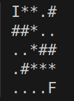

---


# A* em Rust



[**Cleuton Sampaio**](https://linkedin.com/in/cleutonsampaio)

[**Veja no GitHub**](https://https://github.com/cleuton/rustingcrab/tree/main/code_samples/a_star)

Estou criando um game em **Rust** com o nome provisório de **Funky & Skanky** (eu sei... Prometo mudar!) E precisava calcular o melhor caminho entre o **npc** e o **player**, então recorri ao famoso `A*` para isso. Essa é uma demonstração muito simplificada da implementação desse algoritmo em Rust. 

O `A*` é um algoritmo muito usado para encontrar o **melhor caminho** entre dois pontos. Você pode pensar nele como um "GPS inteligente", que não só olha a distância, mas também leva em conta outras coisas, como trânsito, subidas ou estradas ruins, dependendo do que você definir como "custo".

## Como ele funciona?

O `A*` combina duas ideias principais:

1. **O quanto você já andou** desde o ponto inicial até onde você está agora.
2. **Uma estimativa de quanto falta pra chegar ao destino**, chamada de *heurística* (é tipo uma suposição bem-feita sobre a distância restante).

Ele vai testando diferentes caminhos, sempre escolhendo o que parece mais promissor com base nessa soma: `Custo real até aqui + Estimativa do que falta`.

E o legal é que ele **não explora tudo ao acaso**, priorizando os caminhos mais prováveis de dar certo, o que o torna rápido e eficiente.

## Pra que serve?

O `A*` é muito usado em:
- **Jogos**: para personagens encontrarem o melhor caminho no mapa (tipo um inimigo te perseguindo sem ficar perdido).
- **Robótica**: para robôs planejarem trajetos evitando obstáculos.
- **Aplicativos de mapas**: versões dele ajudam a traçar rotas mais rápidas ou econômicas.

## Algoritmo típico

Vejamos a implementação típica do `A*` usando a **heurística de Manhattan**: 

```text
função A_estrela(início, objetivo):
    abertos = [início]           // Nós que queremos explorar
    veio_de = {}                 // Para saber por onde viemos
    g = {nó: infinito}           // Custo real pra chegar a cada nó
    f = {nó: infinito}           // f = g + heurística (estimativa total)
    g[início] = 0                // Custo do início pra ele mesmo é zero
    f[início] = heurística(início, objetivo)

    enquanto abertos não estiver vazio:
        atual = nó em abertos com menor valor de f

        se atual == objetivo:
            reconstrói o caminho usando veio_de
            retorna o caminho

        para cada vizinho em vizinhos(atual):
            custo_tentativo_g = g[atual] + distancia_entre(atual, vizinho)

            se custo_tentativo_g < g[vizinho]:
                veio_de[vizinho] = atual
                g[vizinho] = custo_tentativo_g
                f[vizinho] = g[vizinho] + heurística(vizinho, objetivo)

                se vizinho não está em abertos:
                    adiciona vizinho em abertos

        remove atual de abertos

    retorna "sem caminho"  // Se não achou caminho nenhum
```

### O que é a heurística de Manhattan?

Vamos imaginar que você está em uma cidade com ruas organizadas como um grid (tipo xadrez), onde você só pode andar para cima, baixo, esquerda ou direita, **não podendo andar na diagonal**.

A **heurística de Manhattan** calcula a distância entre dois pontos somando as diferenças absolutas das suas coordenadas:

```text
distância = |x2 - x1| + |y2 - y1|
```

**Exemplo:**

Se você está no ponto `(1, 2)` e quer ir até o ponto `(4, 6)`, a distância de Manhattan é:

```text
|4 - 1| + |6 - 2| = 3 + 4 = 7
```

Essa heurística é útil quando os movimentos são restritos ao grid e não permite diagonais. Ela dá uma **boa estimativa de quantos passos faltam pra chegar ao destino**, sem ultrapassar a realidade (é admissível), o que é importante pro `A*` funcionar bem.

Veja o [**código aqui!**](./a_star.rs).

