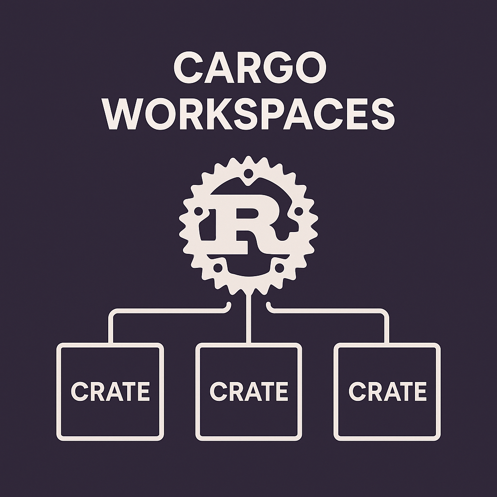

---


---

[**Cleuton Sampaio**](https://linkedin.com/in/cleutonsampaio)

[**Veja no GitHub**](https://https://github.com/cleuton/rustingcrab/tree/main/code_samples/leetcode)

# Entendendo Cargo Workspaces: Organizando Projetos Rust em Múltiplos Crates**

O Cargo, o sistema de build e gerenciamento de pacotes oficial da linguagem Rust, oferece uma funcionalidade poderosa chamada **workspaces** (espaços de trabalho), que permite gerenciar múltiplos crates dentro de um único projeto de forma integrada. Essa abordagem é especialmente útil quando se trabalha com aplicações modulares, bibliotecas compartilhadas ou projetos que evoluem em diferentes componentes interdependentes.

Um workspace é um agrupamento de crates que compartilham a mesma configuração de build, dependências e ferramentas. Ele permite que você compile, teste e execute todos os crates do projeto com um único comando, além de garantir que as versões das dependências sejam consistentes entre os módulos.

### Quando usar um workspace?

Workspaces são ideais em cenários como:
- Dividir uma aplicação grande em crates menores (por exemplo, uma API, um modelo de dados e um cliente HTTP).
- Criar uma biblioteca principal e várias extensões ou plugins.
- Desenvolver uma suíte de ferramentas que compartilham código comum.
- Implementar uma estratégia de monorepo, onde múltiplos projetos são mantidos no mesmo repositório.

### Exemplo Prático: Sistema de Gerenciamento de Tarefas

Vamos criar um projeto exemplo chamado **Sistema de Gerenciamento de Tarefas**, composto por três crates:
1. `core` – contém a lógica principal e os modelos de dados.
2. `api` – uma aplicação que expõe uma API REST para gerenciar tarefas.
3. `cli` – uma interface de linha de comando para interagir com o sistema.

Todos os crates pertencem ao mesmo workspace e compartilham a mesma configuração de build.

### Estrutura do Projeto

```
gerenciador_tarefas/
├── Cargo.toml              # Arquivo de workspace raiz
├── core/
│   ├── Cargo.toml
│   └── src/
│       └── lib.rs
├── api/
│   ├── Cargo.toml
│   └── src/
│       └── main.rs
└── cli/
    ├── Cargo.toml
    └── src/
        └── main.rs
```

### 1. Arquivo raiz: `gerenciador_tarefas/Cargo.toml`

```toml
[workspace]
members = [
    "core",
    "api",
    "cli"
]
resolver = "2"
```

Este arquivo define o workspace e lista os crates que fazem parte dele. O campo `resolver = "2"` habilita o novo resolvedor de dependências do Cargo, introduzido a partir do Rust 2021. Esse resolvedor melhora significativamente a forma como as dependências são analisadas e unificadas no projeto, especialmente em workspaces. Ele garante que, quando crates diferentes dependem de versões diferentes de uma mesma biblioteca, o Cargo consiga gerenciar essas dependências de forma mais previsível e evitando compilações duplicadas da mesma crate com versões ligeiramente distintas.

Além disso, o `resolvedor "2"` permite que crates dentro do mesmo workspace compartilhem dependências de forma mais eficiente, reduzindo o tempo de compilação e o tamanho dos binários finais. Ele também corrige comportamentos indesejados do resolvedor antigo ("1"), como a duplicação de crates no grafo de dependências quando há variações de features ou caminhos de dependência.

Por essas razões, o uso de `resolver = "2"` é fortemente recomendado em qualquer projeto com workspace, especialmente quando há dependências compartilhadas entre os crates.

### 2. Crate `core` – Lógica central

**Arquivo: `gerenciador_tarefas/core/Cargo.toml`**

```toml
[package]
name = "core"
version = "0.1.0"
edition = "2021"

[dependencies]
serde = { version = "1.0", features = ["derive"] }
```

**Arquivo: `gerenciador_tarefas/core/src/lib.rs`**

```rust
use serde::Deserialize;

#[derive(Debug, Clone, Deserialize)]
pub struct Tarefa {
    pub id: u32,
    pub titulo: String,
    pub concluida: bool,
}

pub struct GerenciadorDeTarefas {
    tarefas: Vec<Tarefa>,
}

impl GerenciadorDeTarefas {
    pub fn novo() -> Self {
        GerenciadorDeTarefas {
            tarefas: Vec::new(),
        }
    }

    pub fn adicionar_tarefa(&mut self, tarefa: Tarefa) {
        self.tarefas.push(tarefa);
    }

    pub fn listar_tarefas(&self) -> &Vec<Tarefa> {
        &self.tarefas
    }
}
```

Este crate define a estrutura de dados e a lógica básica do sistema.

### 3. Crate `api` – Servidor HTTP simples

**Arquivo: `gerenciador_tarefas/api/Cargo.toml`**

```toml
[package]
name = "api"
version = "0.1.0"
edition = "2021"

[dependencies]
actix-web = "4.0"
serde = "1.0"
serde_json = "1.0"
core = { path = "../core" }
```

**Arquivo: `gerenciador_tarefas/api/src/main.rs`**

```rust
use actix_web::{web, App, HttpResponse, HttpServer, Responder};
use core::GerenciadorDeTarefas;
use std::sync::Mutex;

async fn listar_tarefas(
    dados: web::Data<Mutex<GerenciadorDeTarefas>>,
) -> impl Responder {
    let gerenciador = dados.lock().unwrap();
    let tarefas = gerenciador.listar_tarefas();
    HttpResponse::Ok().json(tarefas)
}

#[actix_web::main]
async fn main() -> std::io::Result<()> {
    let gerenciador = web::Data::new(Mutex::new(GerenciadorDeTarefas::novo()));

    println!("Servidor rodando em http://127.0.0.1:8080");

    HttpServer::new(move || {
        App::new()
            .app_data(gerenciador.clone())
            .route("/tarefas", web::get().to(listar_tarefas))
    })
    .bind("127.0.0.1:8080")?
    .run()
    .await
}
```

Este crate usa Actix-web para criar um servidor que expõe as tarefas. Ele depende do crate `core` via caminho local.

### 4. Crate `cli` – Interface de linha de comando

**Arquivo: `gerenciador_tarefas/cli/Cargo.toml`**

```toml
[package]
name = "cli"
version = "0.1.0"
edition = "2021"

[dependencies]
core = { path = "../core" }
```

**Arquivo: `gerenciador_tarefas/cli/src/main.rs`**

```rust
use core::{GerenciadorDeTarefas, Tarefa};

fn main() {
    let mut gerenciador = GerenciadorDeTarefas::novo();

    let tarefa1 = Tarefa {
        id: 1,
        titulo: "Estudar Rust".to_string(),
        concluida: false,
    };

    gerenciador.adicionar_tarefa(tarefa1);

    println!("Tarefas cadastradas:");
    for tarefa in gerenciador.listar_tarefas() {
        println!("- [{}] {}", if tarefa.concluida { "x" } else { " " }, tarefa.titulo);
    }
}
```

Este crate demonstra como usar a lógica central em uma aplicação CLI.

### Como usar o workspace

1. Navegue até a pasta raiz: `cd gerenciador_tarefas`
2. Compile todo o projeto: `cargo build`
3. Execute a CLI: `cargo run -p cli`
4. Execute a API: `cargo run -p api`

O Cargo reconhece que todos os crates estão no mesmo workspace e permite executar comandos específicos para cada um com a flag `-p` (package).

### Benefícios do uso de workspaces

- **Build eficiente**: O Cargo compila apenas o necessário e reutiliza artefatos entre crates.
- **Gerenciamento unificado**: Todas as dependências e configurações podem ser coordenadas em um único ponto.
- **Desenvolvimento integrado**: Mudanças em um crate são imediatamente visíveis nos outros.
- **Facilidade de testes**: É possível rodar `cargo test` em todos os crates com `cargo test --all`.

### Conclusão

Cargo workspaces são uma ferramenta essencial para projetos Rust que crescem em complexidade. Eles permitem manter a modularidade sem sacrificar a simplicidade de gerenciamento. Com o exemplo apresentado, você pode ver como dividir uma aplicação em componentes coesos, reutilizar código e escalar seu projeto de forma organizada.

Ao adotar workspaces, você está preparado para estruturar projetos profissionais, aplicar boas práticas de arquitetura e facilitar a colaboração em equipes de desenvolvimento.