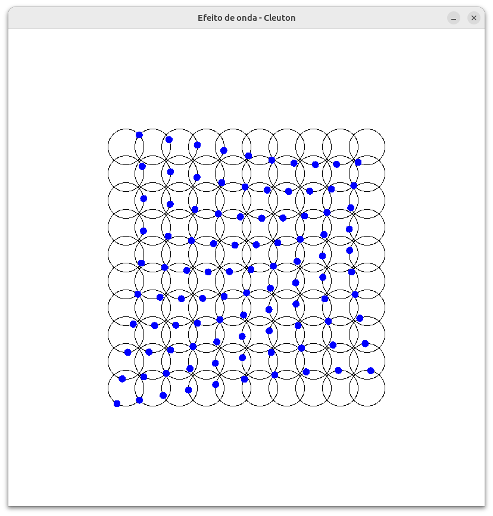

---


---

[**Cleuton Sampaio**](https://linkedin.com/in/cleutonsampaio)

[**Veja no GitHub**](https://https://github.com/cleuton/rustingcrab/tree/main/code_samples/circulos)

# Efeito de onda

Eu já havia criado esse efeito em [**Python** no Pythondrops](https://github.com/cleuton/pythondrops/blob/master/circulos/Circulos.ipynb), e estava quebrando a cabeça para fazer a versão **Rust** dele. Acho que consegui.

Antes de explicar o código, quero falar sobre a mátemática **cheirada** que usamos aqui e depois veremos o resto. 

## Explicação Matemática do Efeito Visual: Uma Abordagem Simples e Intuitiva

O código gera um efeito visual fascinante que parece criar ondas viajantes ou padrões dinâmicos em uma grade de círculos. O fenômeno por trás desse efeito está intimamente relacionado à matemática das ondas, interferência e transformadas harmônicas. Vamos explorar isso passo a passo de forma simples e intuitiva.

### 1. **Movimento Circular Básico**
Cada ponto azul na animação se move ao longo da circunferência de um círculo preto. Esse movimento é descrito pelas equações paramétricas do círculo:
- **x = centro_x + raio × cos(ângulo)**
- **y = centro_y + raio × sin(ângulo)**

Onde:
- **centro_x** e **centro_y**: Coordenadas do centro do círculo.
- **raio**: Distância do ponto ao centro do círculo.
- **ângulo**: Ângulo que varia com o tempo.

Essa é a base para o movimento circular uniforme de cada ponto.

### 2. **Fase Espacialmente Variável**
A chave para o efeito visual é que cada ponto tem uma **fase inicial diferente**, dependendo de sua posição na grade. Essa fase inicial é calculada como:
- **fase = (linha + coluna) × passo_fase**

Onde:
- **passo_fase = 2π / (linhas + colunas)**: Define o gradiente de fase espacial.
- **linha** e **coluna**: Índices da posição do ponto na grade.

Isso cria um **gradiente de fase no espaço**, onde pontos próximos têm fases ligeiramente diferentes. Por exemplo:
- Um ponto na linha 0, coluna 0 terá fase inicial zero.
- Um ponto na linha 1, coluna 1 terá fase inicial maior, pois `(1 + 1) × passo_fase`.

Esse gradiente de fase é crucial para criar o efeito de "ondas" emergentes.

### 3. **Interferência Construtiva e Destrutiva**
Embora cada ponto esteja girando independentemente, o padrão global exibe linhas claras ou curvas que parecem se mover. Isso ocorre porque os pontos estão sincronizados em termos de frequência angular, mas desfasados espacialmente.

Quando dois pontos vizinhos têm fases próximas, eles criam **interferência construtiva**, resultando em regiões mais visíveis (onde os pontos parecem alinhados). Quando os pontos têm fases opostas, ocorre **interferência destrutiva**, resultando em regiões menos visíveis (onde os pontos se cancelam mutuamente).

Esse fenômeno é análogo ao que acontece com ondas sonoras ou eletromagnéticas, onde a superposição de ondas com diferentes fases cria padrões complexos.

### 4. **Evolução Temporal**
Com o tempo, o ângulo global avança para todos os pontos simultaneamente. Isso significa que o padrão de interferência também evolui, criando a ilusão de ondas viajantes. A diferença de fase entre pontos vizinhos é pequena, o que faz com que as linhas de interferência construtiva pareçam se mover pelo espaço.

Matematicamente, o ângulo total de cada ponto é dado por:
- **ângulo_total = ângulo_base + fase_inicial**

Onde:
- **ângulo_base**: Varia linearmente com o tempo.
- **fase_inicial**: Dependente da posição do ponto na grade.

Assim, embora cada ponto esteja girando individualmente, o padrão global parece se propagar como uma onda.


### 5. **Por Que Vemos "Ondas Viajantes"?**
Mesmo que cada ponto esteja girando independentemente, o padrão global parece se mover porque:
- A diferença de fase entre pontos vizinhos é pequena.
- Com o tempo, o ângulo global avança uniformemente.
- Isso faz com que as linhas de interferência construtiva pareçam se deslocar no espaço.

É como se estivéssemos observando uma onda viajante, embora na verdade seja apenas a superposição de movimentos circulares individuais com fases diferentes.

## Estrutura e Funcionamento do Código Rust

O código Rust implementa uma animação visual em tempo real utilizando a biblioteca `ggez`, que é inspirada em engines de jogos 2D. A estrutura segue o padrão típico de aplicações ggez, com um loop principal de atualização e renderização.

### Arquitetura Principal

O programa é organizado em torno de uma struct `CirculosAnimation` que implementa a trait `EventHandler` do ggez. Essa abordagem separa claramente os dados do jogo (estado) da lógica de atualização e desenho.

```rust
struct CirculosAnimation {
    centros: Vec<Vec2>,
    fases: Vec<f32>,
    // ... outros campos de estado
}
```

A struct armazena todos os dados necessários para a animação: posições dos centros dos círculos, fases individuais de cada ponto, e contadores para controle de tempo e frames.

### Inicialização e Preparação

Na função `new()`, o código realiza todo o trabalho pesado de pré-calculo. Isso inclui determinar as posições exatas de cada círculo na grade e calcular as fases específicas que criarão o efeito de onda. Ao centralizar a grade na janela, garante-se que toda a animação seja visível.

### Loop de Jogo com ggez

O ggez utiliza um padrão de loop de jogo clássico com dois métodos principais:

```rust
impl event::EventHandler for CirculosAnimation {
    fn update(&mut self, ctx: &mut Context) -> GameResult { ... }
    fn draw(&mut self, ctx: &mut Context) -> GameResult { ... }
}
```

O método `update()` cuida da lógica de animação, avançando o tempo e atualizando qual frame da animação deve ser exibido. Já o `draw()` é responsável por renderizar tudo visualmente a cada frame.

### Sistema de Renderização

O ggez trabalha com um sistema de canvas onde todos os elementos visuais são desenhados antes de serem apresentados na tela. O código cria meshes (formas geométricas) para os círculos e pontos, reutilizando-os para eficiência.

A parte visual desenha primeiro todos os círculos estáticos em preto, criando a grade base, e depois posiciona os pontos azuis em movimento ao longo das circunferências. Cada ponto é calculado usando trigonometria básica para determinar sua posição exata no círculo correspondente.

### Controle de Tempo e Sincronização

O código implementa um sistema de controle de tempo preciso que garante a animação rode na velocidade correta independentemente do desempenho do hardware. Isso é crucial para manter a sincronização dos movimentos e o efeito visual consistente.

### Setup e Execução

A função `main()` configura o ambiente gráfico com janela de tamanho específico e título personalizado, tenta centralizar a janela no monitor e inicia o loop de eventos do ggez, que cuida de toda a interação com o sistema operacional e a apresentação da animação.

Essa estrutura resulta em uma aplicação eficiente que cria em tempo real o mesmo efeito visual do código Python original, mas com performance muito superior graças à compilação nativa do Rust e ao design otimizado da engine ggez.

## Como ggez e glam trabalham juntos: Uma explicação prática

O ggez é uma biblioteca para criar jogos 2D em Rust que segue um padrão bem definido. Vamos entender como ele funciona na prática olhando partes do nosso código.

### O Básico do ggez

```rust
use ggez::event;
use ggez::{Context, ContextBuilder, GameResult};

fn main() -> GameResult {
    let (ctx, event_loop) = ContextBuilder::new("nome", "autor")
        .window_mode(ggez::conf::WindowMode::default().dimensions(800.0, 800.0))
        .build()?;
    
    let game = CirculosAnimation::new();
    event::run(ctx, event_loop, game)
}
```

O ggez funciona com um **loop de eventos** clássico de jogos. Você cria um contexto (janela, recursos gráficos), instancia seu jogo, e o ggez chama automaticamente seus métodos 60 vezes por segundo.

### O Padrão EventHandler

```rust
impl event::EventHandler for CirculosAnimation {
    fn update(&mut self, ctx: &mut Context) -> GameResult {
        // Lógica do jogo aqui
    }

    fn draw(&mut self, ctx: &mut Context) -> GameResult {
        // Desenho aqui
    }
}
```

É exatamente como um jogo: `update()` atualiza a lógica (movimento, física, etc.) e `draw()` desenha tudo na tela. O ggez cuida de chamar esses métodos no momento certo.

### Por que usamos glam?

Aqui está o problema que glam resolve:

```rust
// Sem glam - trabalhoso!
let centro_x = 100.0;
let centro_y = 150.0;
let ponto_x = centro_x + raio * angulo.cos();
let ponto_y = centro_y + raio * angulo.sin();

// Com glam - simples e limpo!
let centro = Vec2::new(100.0, 150.0);
let offset = Vec2::new(raio * angulo.cos(), raio * angulo.sin());
let ponto = centro + offset;
```

O glam fornece tipos como `Vec2` que representam pontos/vetores 2D e já sabem fazer operações matemáticas automaticamente. Isso é perfeito para jogos onde você está sempre lidando com posições, movimentos e cálculos 2D.

### Renderização no ggez

```rust
fn draw(&mut self, ctx: &mut Context) -> GameResult {
    let mut canvas = graphics::Canvas::from_frame(ctx, graphics::Color::WHITE);
    
    // Criar uma forma uma vez
    let circle_mesh = graphics::Mesh::new_circle(/* ... */)?;
    
    // Usar ela várias vezes
    for &centro in &self.centros {
        let dest = graphics::DrawParam::new().dest(centro);
        circle_mesh.draw(&mut canvas, dest);
    }
    
    canvas.finish(ctx)?;
}
```

O ggez usa um sistema de "canvas" - você prepara tudo em uma tela virtual e depois mostra de uma vez. Isso é mais eficiente que desenhar diretamente na tela.

As formas (`Mesh`) são criadas uma vez e reutilizadas, como fazer um "carimbo" que você usa em vários lugares. Isso é muito mais rápido que ficar recalculando as formas toda hora.

### A Conexão Prática

Veja como tudo se conecta:

```rust
// Posições com glam (fácil de calcular)
let centro = Vec2::new(200.0, 300.0);
let offset = Vec2::new(RAIO * angulo.cos(), RAIO * angulo.sin());
let posicao_ponto = centro + offset;

// Desenho com ggez (fácil de mostrar)
let dest = graphics::DrawParam::new().dest(posicao_ponto);
ponto_mesh.draw(&mut canvas, dest);
```

O **glam** faz as contas matemáticas de forma limpa e eficiente, enquanto o **ggez** mostra o resultado na tela. São como duas peças de Lego que encaixam perfeitamente!

Essa combinação permite que você foque na lógica do seu jogo/animação sem se preocupar com detalhes complexos de matemática vetorial ou renderização de baixo nível.

## Documentação Completa do Código Rust - Animação de Círculos

Esta documentação detalha a implementação completa da animação de círculos em Rust utilizando a biblioteca `ggez`. O código cria uma grade de círculos com pontos em movimento circular, gerando padrões de onda visuais através da interferência de fases espaciais.

## Estrutura Geral do Projeto

### Dependências

```toml
[dependencies]
ggez = "0.9"
glam = "0.24"
winit = "0.28"
```

- **ggez**: Engine de jogos 2D que fornece o framework para renderização e loop de eventos
- **glam**: Biblioteca de matemática para gráficos que fornece tipos vetoriais e operações matemáticas otimizadas
- **winit**: Biblioteca de janelas utilizada internamente pelo ggez, usada aqui para centralizar a janela

## Constantes e Configurações

```rust
const LINHAS: usize = 10;
const COLUNAS: usize = 10;
const RAIO: f32 = 30.0;
const ESPACAMENTO: f32 = 45.0;
const QUADROS: u32 = 60;
const QUADROS_POR_SEGUNDO: f32 = 15.0;
```

Estas constantes definem os parâmetros da animação:
- **LINHAS/COLUNAS**: Dimensões da grade de círculos (10×10)
- **RAIO**: Raio de cada círculo individual
- **ESPACAMENTO**: Distância entre centros dos círculos
- **QUADROS**: Número total de frames na animação cíclica
- **QUADROS_POR_SEGUNDO**: Velocidade da animação

## Estrutura Principal - CirculosAnimation

```rust
struct CirculosAnimation {
    centros: Vec<Vec2>,
    fases: Vec<f32>,
    indice_quadro: u32,
    tempo_acumulado: f32,
    intervalo_quadro: f32,
}
```

Esta struct representa o estado completo da animação:

### Campos da Estrutura

- **`centros: Vec<Vec2>`**: Vetor contendo as coordenadas (x,y) de cada centro de círculo na grade. Cada `Vec2` é um vetor 2D do glam representando uma posição.
- **`fases: Vec<f32>`**: Vetor com as fases iniciais de cada ponto, determinando o deslocamento angular individual de cada movimento circular.
- **`indice_quadro: u32`**: Contador que rastreia qual frame da animação está sendo exibido (0 a QUADROS-1).
- **`tempo_acumulado: f32`**: Tempo acumulado desde o último frame, usado para controle de tempo preciso.
- **`intervalo_quadro: f32`**: Duração de cada frame em segundos (1.0/QUADROS_POR_SEGUNDO).

## Implementação da Estrutura

### Método `new()` - Construtor e Inicialização

```rust
impl CirculosAnimation {
    fn new() -> Self { ... }
}
```

O construtor realiza todo o trabalho de pré-processamento:

#### Cálculo do Passo de Fase
```rust
let passo_fase = 2.0 * std::f32::consts::PI / (LINHAS + COLUNAS) as f32;
```
Calcula o incremento de fase entre posições adjacentes na grade, criando um gradiente suave que resulta no efeito de onda.

#### Centralização da Grade
```rust
let window_width = 800.0;
let window_height = 800.0;
let total_width = (COLUNAS - 1) as f32 * ESPACAMENTO;
let total_height = (LINHAS - 1) as f32 * ESPACAMENTO;
let offset_x = (window_width - total_width) / 2.0;
let offset_y = (window_height - total_height) / 2.0;
```
Calcula os offsets necessários para centralizar a grade completa na janela de 800×800 pixels. A subtração de 1 no cálculo do tamanho total considera que N pontos têm N-1 espaços entre eles.

#### Geração de Centros
```rust
for j in 0..LINHAS {
    for i in 0..COLUNAS {
        let cx = i as f32 * ESPACAMENTO + offset_x;
        let cy = j as f32 * ESPACAMENTO + offset_y;
        centros.push(Vec2::new(cx, cy));
    }
}
```
Gera as coordenadas de todos os centros dos círculos, aplicando o offset de centralização calculado anteriormente.

#### Cálculo de Fases
```rust
for j in 0..LINHAS {
    for i in 0..COLUNAS {
        let fase = (i + j) as f32 * passo_fase;
        fases.push(fase);
    }
}
```
Calcula a fase inicial de cada ponto baseada na soma dos índices de linha e coluna, multiplicada pelo passo de fase. Isso cria o gradiente espacial de fases que gera o efeito de onda.

## Implementação do EventHandler

A struct implementa a trait `EventHandler` do ggez, que define os métodos chamados automaticamente pelo loop de eventos.

### Método `update()` - Lógica da Animaação

```rust
fn update(&mut self, ctx: &mut Context) -> GameResult {
    let delta_time = ctx.time.delta().as_secs_f32();
    self.tempo_acumulado += delta_time;
    
    while self.tempo_acumulado >= self.intervalo_quadro {
        self.indice_quadro = (self.indice_quadro + 1) % QUADROS;
        self.tempo_acumulado -= self.intervalo_quadro;
    }
    
    Ok(())
}
```

#### Controle de Tempo Baseado em Delta Time
O método utiliza `ctx.time.delta()` para obter o tempo decorrido desde o último frame, garantindo que a animação rode na velocidade correta independentemente do FPS do hardware.

#### Sistema de Acumulação de Tempo
O uso de `tempo_acumulado` permite que múltiplos frames sejam processados em um único update caso haja atrasos, mantendo a sincronização temporal precisa.

#### Atualização Cíclica do Índice
O operador módulo (`% QUADROS`) garante que a animação seja cíclica, reiniciando do frame 0 após o último frame.

### Método `draw()` - Renderização

```rust
fn draw(&mut self, ctx: &mut Context) -> GameResult {
    let mut canvas = graphics::Canvas::from_frame(ctx, graphics::Color::WHITE);
    // ... desenho dos elementos
    canvas.finish(ctx)?;
    Ok(())
}
```

#### Sistema de Canvas
O ggez 0.9+ utiliza um sistema de canvas para renderização. Todos os elementos são desenhados em um canvas virtual antes de serem apresentados na tela, permitindo otimizações e efeitos pós-processamento.

#### Desenho dos Círculos Estáticos
```rust
let circle_mesh = graphics::Mesh::new_circle(
    ctx,
    graphics::DrawMode::stroke(1.0),
    Vec2::ZERO,
    RAIO,
    0.1,
    graphics::Color::BLACK,
)?;
```
Cria uma única mesh (forma geométrica) representando um círculo, que é reutilizada para desenhar todos os círculos da grade. O modo `stroke(1.0)` cria círculos apenas com contorno.

#### Renderização em Loop
```rust
for &centro in &self.centros {
    let dest = graphics::DrawParam::new().dest(centro);
    circle_mesh.draw(&mut canvas, dest);
}
```
Desenha cada círculo na posição correta usando parâmetros de desenho (`DrawParam`) que especificam a posição de destino.

#### Cálculo das Posições dos Pontos Móveis
```rust
let angulo_base = self.indice_quadro as f32 * (2.0 * std::f32::consts::PI / QUADROS as f32);

for (i, &centro) in self.centros.iter().enumerate() {
    let angulo = angulo_base + self.fases[i];
    let offset = Vec2::new(RAIO * angulo.cos(), RAIO * angulo.sin());
    pontos_posicoes.push(centro + offset);
}
```
Calcula a posição de cada ponto móvel usando trigonometria circular, combinando o ângulo base da animação com a fase individual de cada ponto.

#### Desenho dos Pontos
```rust
let ponto_mesh = graphics::Mesh::new_circle(
    ctx,
    graphics::DrawMode::fill(),
    Vec2::ZERO,
    6.0,
    0.1,
    graphics::Color::BLUE,
)?;
```
Cria uma mesh para os pontos móveis, desta vez usando `fill()` para criar círculos preenchidos em azul.

## Função de Centralização da Janela

```rust
fn centralizar_janela(ctx: &Context) -> GameResult {
    let window = ctx.gfx.window();
    
    if let Some(monitor) = window.current_monitor() {
        let monitor_size = monitor.size();
        let window_size = window.inner_size();
        
        let x = (monitor_size.width - window_size.width) / 2;
        let y = (monitor_size.height - window_size.height) / 2;
        
        window.set_outer_position(LogicalPosition::new(x as f64, y as f64));
    }
    
    Ok(())
}
```

Esta função utiliza APIs do `winit` (biblioteca de janelas subjacente ao ggez) para posicionar a janela no centro do monitor principal. Obtém as dimensões do monitor e da janela, calcula a posição central e aplica através de `set_outer_position()`.

## Função Principal - main()

```rust
fn main() -> GameResult {
    let (ctx, event_loop) = ContextBuilder::new("circulos_animation", "autor")
        .window_setup(ggez::conf::WindowSetup::default().title("Efeito de onda - Cleuton"))
        .window_mode(ggez::conf::WindowMode::default().dimensions(800.0, 800.0))
        .build()?;
    
    let _ = centralizar_janela(&ctx);
    
    let game = CirculosAnimation::new();
    event::run(ctx, event_loop, game)
}
```

### Criação do Contexto
O `ContextBuilder` configura o ambiente de execução:
- **Identificação**: Nome e autor da aplicação
- **Janela**: Título personalizado e dimensões fixas de 800×800 pixels
- **Build**: Cria o contexto e o loop de eventos

### Inicialização e Execução
Após criar o contexto, centraliza a janela e instancia o jogo. O `event::run()` inicia o loop de eventos que chama continuamente os métodos `update()` e `draw()` da implementação de `EventHandler`.

## Fluxo de Execução Completo

1. **Inicialização**: `main()` cria contexto, centraliza janela e instancia `CirculosAnimation`
2. **Pré-cálculo**: `CirculosAnimation::new()` calcula centros, fases e configura parâmetros
3. **Loop Principal**: `event::run()` chama continuamente:
   - `update()`: Atualiza o índice do frame baseado no tempo
   - `draw()`: Renderiza a cena atual completa
4. **Renderização**: Cada frame desenha:
   - Fundo branco
   - Grade de círculos pretos
   - Pontos azuis em posições calculadas
5. **Continuidade**: A animação é cíclica, reiniciando após o último frame

## Otimizações e Características Técnicas

### Reutilização de Recursos
- **Meshes**: Formas geométricas são criadas uma vez e reutilizadas múltiplas vezes
- **Pré-cálculo**: Todas as posições e fases são calculadas na inicialização
- **Pooling**: Nenhum objeto é alocado/desalocado durante a animação

### Controle de Tempo Preciso
- **Delta time**: Tempo baseado em hardware para velocidade consistente
- **Acumulação**: Sistema robusto que lida com variações de FPS
- **Sincronização**: Animação mantém ritmo independente de performance

### Uso Eficiente de Memória
- **Stack allocation**: Tipos primitivos e vetores são alocados na stack quando possível
- **Zero-copy**: Referências são usadas em loops para evitar cópias desnecessárias
- **RAII**: Recursos são gerenciados automaticamente pelo sistema de ownership do Rust

Esta implementação demonstra práticas modernas de programação Rust combinadas com técnicas eficientes de renderização 2D, resultando em uma animação fluida e visualmente atraente.