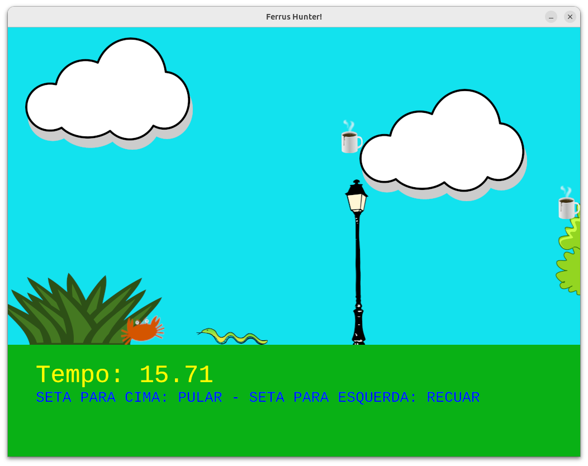

# Rusting game tech



[*Cleuton Sampaio*](https://linkedin.com/in/cleutonsampaio).

Esse é um dos projetos que eu apresendo no meu curso [**Rusting with Style**](../../rusting_with_style_PTBR/), para você entender como utilizar **Pseudo Orientação a Objetos** com `traits` e `structs`.

Acesse o [**REPO DO PROJETO**](./) e estude o código. 

## Framework utilizado

Nesse exemplo eu usei o [**ggez**](https://github.com/ggez/ggez) um framework simples para games 2D em **Rust**, semelhante ao projeto do [**Gopher Hunter**](https://github.com/cleuton/gopherhunter).

## Sobre o game

O código apresentado é um template de um jogo desenvolvido em Rust, utilizando a biblioteca **ggez** para renderização e eventos. A seguir, detalharei como o design do game é estruturado, especialmente no que diz respeito ao uso de traits, structs e coleções polimórficas, bem como o que cada parte do código faz.

## Visão Geral do Game Design

O jogo é baseado em um loop de eventos gerenciado pelo `ggez::event::run`. Ele renderiza um cenário (background fixo e elementos de cenário que se movem da direita para a esquerda) e um personagem principal (player), além de NPCs (personagens não-jogadores) que aparecem periodicamente. O player pode pular e recuar, e se colidir com um NPC, o jogo termina. Uma vez terminado, o jogador pode reiniciar ou encerrar.

### Principais elementos do jogo:

1. **Player (Ferris):** Controlável pelo jogador.  
2. **NPCs (Non-Player Characters):** Inimigos ou obstáculos que surgem no cenário e se movem de forma autônoma.
3. **Cenário Dinâmico:** Elementos de fundo que aparecem e se deslocam, simulando um cenário que passa.
4. **Gerenciamento de Estado do Jogo:** Tratamento de colisões, reinício, fim de jogo, medição de tempo etc.

## Uso de Traits, Structs e Polimorfismo

Uma parte crucial do design do código é a utilização do trait `GameObject`. O trait funciona como uma interface que determina um conjunto de métodos obrigatórios para objetos do jogo: `update`, `colidiu`, `desenhar` e `obter_propriedades`. Isso permite o polimorfismo, ou seja, que diferentes tipos de personagens (Player, Cobra, Gopher, Xicara, etc.) possam ser armazenados em uma mesma coleção, contanto que eles implementem o trait.

**Por que isso é útil?**  
Em linguagens com tipagem estática, coleções polimórficas são um desafio. Ao ter um trait, podemos criar um `Vec<Box<dyn GameObject>>` que armazena diferentes tipos de NPCs e iterar sobre eles de forma genérica, chamando métodos comuns.

### O Trait `GameObject`

```rust
trait GameObject {
    fn update(&mut self, dt: std::time::Duration);
    fn colidiu(&self, outro: &PropriedadesComuns) -> bool;
    fn desenhar(&self, canvas: &mut graphics::Canvas);
    fn obter_propriedades(&mut self) -> &mut PropriedadesComuns;
}
```

Ele define o que todo objeto do jogo precisa fazer:

- **update:** Atualiza posição, animações, físicas, lógica interna.  
- **colidiu:** Verifica colisão com outro objeto, baseado em retângulos.  
- **desenhar:** Renderiza o objeto no canvas.  
- **obter_propriedades:** Fornece acesso às propriedades comuns do objeto, como posição e imagem.

### Struct `PropriedadesComuns`

A struct `PropriedadesComuns` contém atributos que muitos objetos compartilham: imagens, posição, largura, altura, estado de pulo, estado invertido da imagem, etc. Isso permite que seja facilmente reutilizada por diferentes tipos de objetos do jogo (jogador, NPCs) sem duplicar código.

```rust
#[derive(Clone)]
struct PropriedadesComuns {
    imagem1: graphics::Image,
    imagem2: graphics::Image,
    posicao: Vec2,
    largura: f32,
    altura: f32,
    segundos_para_virar: f32,
    velocidade: f32,
    invertido: bool,
    saiu_de_cena: bool,
    pulando: bool,
    caindo: bool,
    limite_pulo: f32,
    posicao_vertical_original: f32,
    recuando: bool,
    acelerando: bool,
}
```

**A ideia:** Ter um "miolo" com atributos e comportamentos recorrentes, que é utilizado tanto pelo player quanto pelos NPCs. A lógica padrão (como mover para a esquerda, alternar imagens, checar colisão) já é implementada no `impl GameObject for PropriedadesComuns`. Assim, objetos mais simples (como a `Cobra` ou `Xicara`) apenas utilizam essa implementação padrão.

### Diferentes Tipos de GameObjects (Ferris, Cobra, Gopher, Xicara)

- **Ferris (player):** Possui algumas lógicas especiais, como pular e recuar, que não se encaixam exatamente no comportamento padrão de `PropriedadesComuns`. Assim, `Ferris` implementa `GameObject` manualmente e chama seus próprios métodos de movimentação dentro do `update`.  
- **Cobra, Gopher, Xicara (NPCs):** São implementados derivando as lógicas padrão de `PropriedadesComuns`, com pequenas diferenças. Por exemplo, o `Gopher` modifica o método `update` para permitir pulos aleatórios. A `Xicara` ajusta a posição inicial e velocidade de forma aleatória. Esses objetos se diferenciam do Ferris principalmente porque o player é controlado pelo usuário, enquanto NPCs seguem comportamentos automatizados.

### Coleções Polimórficas

No código, há uma coleção `Vec<Box<dyn GameObject>>` chamada `npcs`. Isso significa que o vetor pode conter `Cobra`, `Xicara`, `Gopher` ao mesmo tempo, pois todos implementam o trait `GameObject`. Assim, no loop `for npc in &mut self.npcs { ... }`, podemos chamá-los de forma genérica, executando `npc.update`, `npc.desenhar`, etc., sem precisar saber o tipo específico do NPC.

### O struct `Jogo` e o Loop Principal

```rust
struct Jogo {
    background: graphics::Image,
    imagens_cenario: Vec<graphics::Image>,
    dt: std::time::Duration,
    cenarios: Vec<Cenario>,
    player: Ferris,
    npcs: Vec<Box<dyn GameObject>>,
    ...
}
```

O `Jogo` armazena:

- **background:** Imagem de fundo estática.  
- **imagens_cenario:** Uma lista de imagens de cenário que serão utilizadas para gerar elementos no fundo, criando sensação de movimento.  
- **cenarios:** Vetor de `Cenario`, que não são polimórficos pois seu comportamento é simples. O `Cenario` não implementa `GameObject`, mas poderia ser reorganizado se quisessem tratá-lo de forma polimórfica também.  
- **player:** Uma instância de `Ferris`.  
- **npcs:** O vetor polimórfico com `Box<dyn GameObject>`.  

No `update` do `Jogo`, cada elemento é atualizado:

1. Atualizar cenários (remover os que saíram de tela, criar novos após certo intervalo).
2. Atualizar o player de acordo com input e lógica interna.
3. Atualizar NPCs (movimento, colisão com player).
4. Gerar novos NPCs após um certo tempo, aleatoriamente.

No `draw` do `Jogo`, desenha-se o background, cenários ativos, player e NPCs.

### Eventos e Controles

O `EventHandler` é implementado para `Jogo`, e nele há métodos como `key_down_event` para lidar com entradas de teclado, permitindo ao player pular ou recuar. Também há a possibilidade de reiniciar o jogo ou encerrá-lo.

## Resumo da Arquitetura

- **Traits (`GameObject`):** Definem o comportamento necessário para objetos do jogo.  
- **Structs de Propriedades (`PropriedadesComuns`):** Contêm atributos compartilhados, evitando duplicação de código.  
- **Implementações Diferentes:** Player (Ferris) e NPCs (Cobra, Gopher, Xicara) implementam o trait `GameObject`, permitindo comportamento variado sob uma interface comum.  
- **Coleções Polimórficas (`Vec<Box<dyn GameObject>>`):** Permitem armazenar diferentes tipos de objetos em uma única coleção, simplificando o loop de atualização e desenho.  
- **Cenário e Estado do Jogo:** Gerenciados pelo struct `Jogo`, que orquestra atualização e desenho.

O código utiliza traits para padronizar o comportamento de diferentes tipos de objetos, tornando o game design mais modular, extensível e organizado, enquanto as structs de propriedades comuns e o polimorfismo via `Box<dyn GameObject>` facilitam a criação de diversos elementos de jogo com comportamentos variados, mas interface uniforme.
