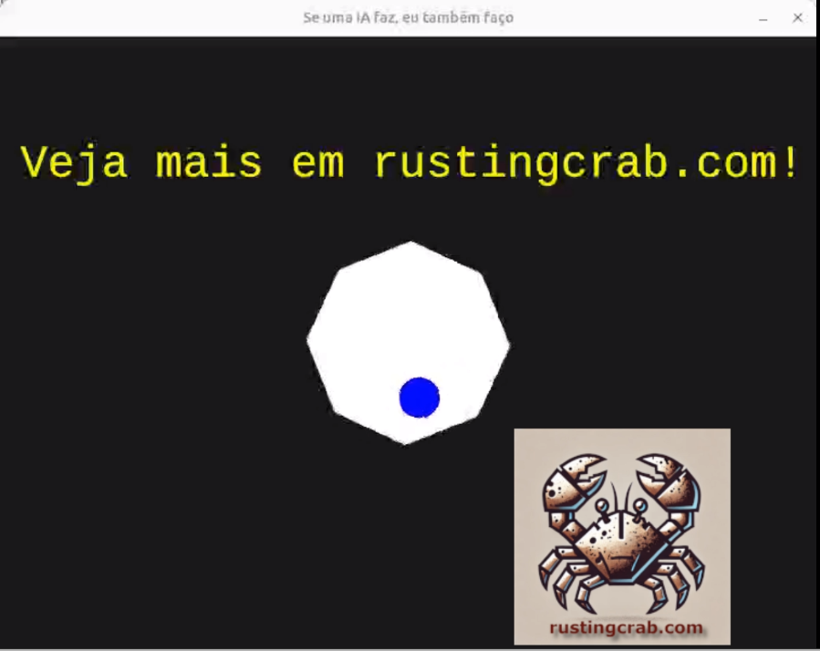

[**Cleuton Sampaio**](https://linkedin.com/in/cleutonsampaio)

[**VEJA NO GITHUB**](https://github.com/cleuton/rustingcrab)

[**Link para esse projeto**](https://github.com/cleuton/rustingcrab/tree/main/code_samples/gravity)

# Simulação Física com Octógono Giratório

Bombou por aí essa demo para testar **IA**. Houve variações com quadrado e octógono. Quando vi, achei um excelente desafio para
fazer com **Rust** e **ggez**. Depois de muita p0rr@da consegui fazer e documentei tudo para você. 

Depois de fazer, pedi para algumas IAs fazerem demo semelhante e todas erraram feio. Há muitos detalhes que só um programador
humano consegue resolver. 

## O código

Este [**código**](./src/main.rs) demonstra uma simulação física simples utilizando a biblioteca gráfica `ggez` em **Rust**. Um octógono gira continuamente enquanto uma bola quica em suas bordas, com detecção de colisão e física básica. O código demonstra conceitos de transformações geométricas, vetores e renderização 2D (tudo matemática de ensino médio, mas não é mole não!).

A documentação está em comentários dentro do código-fonte. 

1. **Estruturas Principais**  
   - **Estado**: Controla o estado global do jogo, armazenando:  
     - `octogono`: Objeto gráfico do octógono  
     - `rotacao_octogono`: Ângulo atual de rotação (em radianos)  
     - `bola`: Objeto da bola com física  

   - **Bola**: Gerencia a física e propriedades da bola:  
     - Posição, velocidade, raio  
     - Temporização para controle de quiques  
     - Lógica de colisão com as bordas  

2. **Funções Chave**  
   - **Bola::update()**:  
     Aplica gravidade (980 pixels/s²) e atualiza a posição. Permite quiques a cada 0.5 segundos.  

   - **Bola::verificar_colisao_ajustar()**:  
     Detecta colisões usando projeção vetorial. Calcula o ponto mais próximo nas arestas do octógono e ajusta a posição/velocidade da bola.  

   - **Estado::update()**:  
     Atualiza a rotação do octógono (1 radiano/segundo) e transforma seus vértices usando trigonometria.  

## Cálculos Trigonométricos

A rotação do octógono é calculada para cada vértice usando:

```rust
let rot_x = ponto.x * cos(θ) - ponto.y * sin(θ);
let rot_y = ponto.x * sin(θ) + ponto.y * cos(θ);
```  
- `θ`: Ângulo de rotação acumulado  
- `cos`/`sin`: Funções trigonométricas para rotação 2D  
- Após a rotação, os pontos são transladados para o centro da tela (400, 300).  

## Transformações Geométricas

1. **Rotações**:  
   - Cada vértice do octógono é rotacionado individualmente.  
   - Mantém-se o centro geométrico fixo durante a rotação.  

2. **Colisões**:  
   - Conversão entre sistemas de coordenadas: nalgebra → mint → ggez.  
   - Reflexão do vetor velocidade usando produto escalar para simular quique.  

## Sobre o ggez  
- Biblioteca leve para criação de jogos 2D em Rust.  
- Funcionalidades usadas:  
  - Gerenciamento de janela e contexto gráfico  
  - Renderização de formas básicas (círculos, polígonos)  
  - Sistema de coordenadas e transformações  
  - Loop principal de jogo (`EventHandler`)  

Se você quiser ver uma demonstração que eu fiz com `ggez` [**abra o projeto `ferris_hunter`](https://github.com/cleuton/rustingcrab/tree/main/code_samples/game).

## Como Executar

1. **Pré-requisitos**  
   - Rust e Cargo instalados ([rust-lang.org](https://www.rust-lang.org/))  

2. **Passos**  

   ```bash
   # Clone o projeto (ou crie os arquivos manualmente)
   git clone [URL_DO_REPOSITORIO]

   # Entre no diretório
   cd projeto

   # Execute (o Cargo cuidará das dependências)
   cargo run --release
   ```

3. **Controles**  
   - A simulação é automática.  
   - Feche a janela para encerrar.  

## Resultado Esperado

- Janela 800x600 com fundo escuro.  
- Octógono branco girando no centro.  
- Bola azul quicando nas bordas.  

