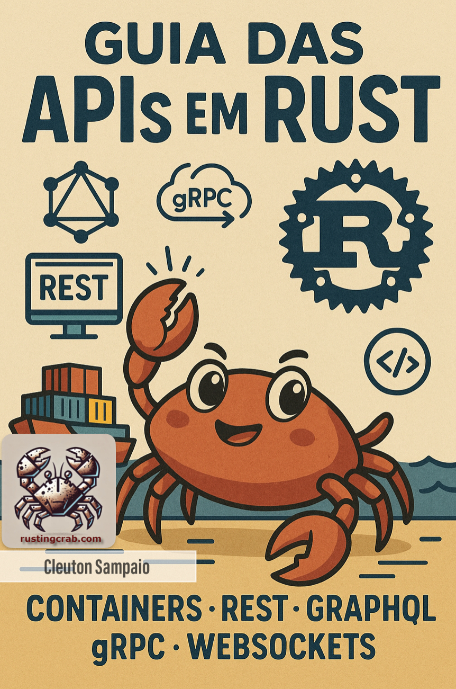

---

---

# Guia das APIs em Rust

<a href="https://github.com/cleuton/rustingcrab">Guia das APIs em Rust e todo código-fonte incluído</a> © 2025 by <a href="https://github.com/cleuton">Cleuton Sampaio</a> is licensed under <a href="https://creativecommons.org/licenses/by-sa/4.0/">CC BY-SA 4.0</a>

Este é um **ebook** interativo, com código-fonte disponível para você utilizar à vontade. Leia a licença de uso. 

## Containers

Veremos [**como criar containers**](./containers/) com **Podman** para compilar / distribuir nossas APIs de maneira simples e prática. 

## API Rest

Agora, veremos [**como criar API REST completa em Rust**](./api_rest/), incluindo **TSL** e **JWT**. 

## GraphQL

E podemos criar **API** em **GraphQL** também! [**Veja só esse tutorial de GraphQL**](./graphql/)!. 
