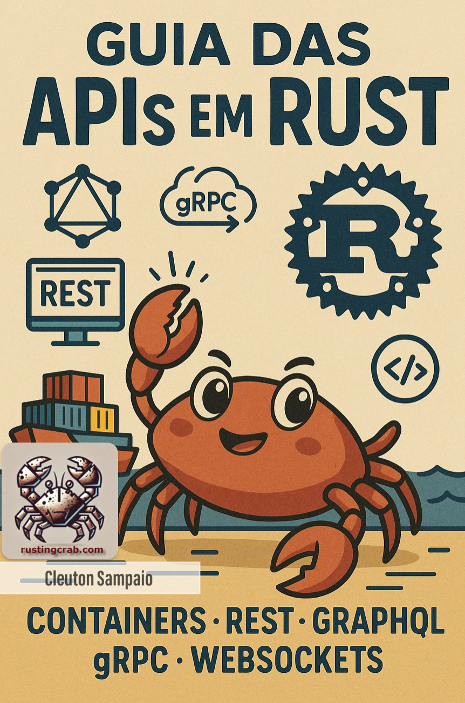

---


---

# Guia das APIs em Rust

## Containers

<a href="https://github.com/cleuton/rustingcrab">Guia das APIs em Rust e todo código-fonte incluído</a> © 2025 by <a href="https://github.com/cleuton">Cleuton Sampaio</a> is licensed under <a href="https://creativecommons.org/licenses/by-sa/4.0/">CC BY-SA 4.0</a>

Este é um **ebook** interativo, com código-fonte disponível para você utilizar à vontade. Leia a licença de uso. 

[**Retornar ao menu**](../)

**Contêineres** (*containers*) são a maneira mais prática de "empacotar" aplicações e em **Rust** isso não é diferente. Podemos criar contêineres para colocar em um ambiente de **Integração Contínua** que construirá as imagens necessárias para instalar nossa **API** em qualquer ambiente.

### Podman

O **Podman** é um projeto de código aberto para gerenciar e executar contêineres **OCI** (Open Container Initiative), sem a necessidade de um daemon, e com foco em segurança e execução de contêineres sem root por padrão. Ele oferece uma alternativa ao **Docker**, utilizando a mesma interface de linha de comando (CLI) e permitindo a execução de imagens Docker, além de imagens OCI. O Podman agrupa contêineres em pods, que podem compartilhar recursos como o Kubernetes. 

Instale o Podman em sua plataforma: 

- Linux / Ubuntu: `sudo apt install podman`
- MS Windows / MacOS: [**Leia a documentação**](https://podman.io/docs/installation) 

Mas o exemplo dado aqui funciona perfeitamente com **Docker**.

### Multistage build

```Dockerfile
# --- Stage 1: compilação ---
FROM docker.io/library/rust:latest AS construtor

# define o diretório de trabalho
WORKDIR /usr/src/api_simples

# copia o Cargo.toml e o Cargo.lock e faz o "fetch" das crates
COPY Cargo.toml Cargo.lock ./
RUN mkdir src && echo "fn main(){}" > src/main.rs
RUN cargo fetch

# agora copia o código-fonte e compila em release
COPY src/ src/
RUN cargo build --release

# --- Stage 2: runtime ---
FROM docker.io/library/debian:bookworm-slim

# instala certificados TLS (se sua API chamar HTTPS externamente)
RUN apt-get update \
 && apt-get install -y ca-certificates \
 && rm -rf /var/lib/apt/lists/*

# define diretório onde ficará o binário
WORKDIR /usr/local/bin

# copia o binário otimizado do stage anterior
COPY --from=construtor /usr/src/api_simples/target/release/api_simples .

# expõe a porta que a API usa
EXPOSE 3000

# comando de início
ENTRYPOINT ["./api_simples"]

```

O [**Dockerfile**](./simples/Dockerfile) foi criado usando uma técnica chamada **multistage build** (construção em múltiplos estágios). Vamos descrever ele em termos simples, passo a passo, e explicar por que há **dois `FROM`**. Primeiramente, por que isso? O **multistage build** permite compilar o código em um ambiente completo e copiar apenas o executável final para uma imagem pequena, gerando imagens menores, mais rápidas e seguras para produção.

#### Por que dois `FROM`?

Os dois `FROM` significam que estamos usando **dois estágios diferentes** na construção da imagem:

1. **Primeiro estágio**: para **compilar o código Rust**.
2. **Segundo estágio**: para **executar o programa já compilado**, de forma leve e segura.

Isso é útil porque:
- A imagem de desenvolvimento do Rust (`rust:latest`) é muito grande (precisa de compilador, bibliotecas, etc).
- Mas, depois que o programa está compilado, você só precisa do **arquivo executável final**.
- Então, ao invés de entregar toda a bagagem do Rust no final, usamos uma imagem pequena (Debian slim) apenas para rodar o programa.

> Assim, a imagem final fica **muito menor** e mais segura.

#### Criando a imagem e um contêiner

Para criar a imagem basta compilar usando o `podman` ou o `docker`: `podman build -t api_simples:latest .` depois é só subir um **contêiner** a partir dela e executar um `curl` para ver o resultado: 

```shell
podman run -d --name api_simples -p 3000:3000 api_simples:latest

curl -i http://localhost:3000/itens
HTTP/1.1 200 OK
content-type: application/json
content-length: 76
date: Tue, 22 Jul 2025 13:01:18 GMT

[{"id":1,"nome":"Maçã"},{"id":2,"nome":"Banana"},{"id":3,"nome":"Cereja"}]
``` 

## Resumindo

Este `Dockerfile` cria uma imagem pequena, contendo somente o essencial, para você poder fazer `deploy` para o seu ambiente operacional. E ele utiliza um ambiente de **contêiner** para compilar o código, baseado em **IaC** (infrastructure as code), ou seja, um ambiente limpo e de acordo com os seus requisitos arquiteturais e de segurança, evitando compilar em máquina de **dev**.

[**Retornar ao menu**](../)
