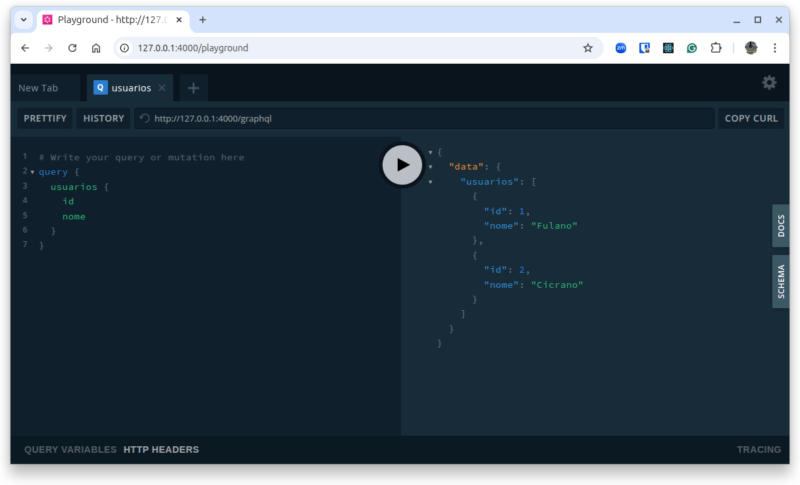

---


---

# Guia das APIs em Rust

## GraphQL

<a href="https://github.com/cleuton/rustingcrab">Guia das APIs em Rust e todo código-fonte incluído</a> © 2025 by <a href="https://github.com/cleuton">Cleuton Sampaio</a> is licensed under <a href="https://creativecommons.org/licenses/by-sa/4.0/">CC BY-SA 4.0</a>

Este é um **ebook** interativo, com código-fonte disponível para você utilizar à vontade. Leia a licença de uso. 

[**Retornar ao menu**](../)

**GraphQL** é uma linguagem de consulta e um ambiente de execução para APIs criado pelo **Facebook** em 2012 e lançado publicamente em 2015. Diferente das APIs tradicionais baseadas em REST, onde você acessa dados por múltiplos endpoints pré-definidos, o GraphQL permite que o cliente peça exatamente os dados que precisa, de forma única e estruturada, em uma única requisição. 

O cliente define a forma da resposta, quais campos, de quais objetos, com quais filtros e profundidade, e o servidor retorna apenas isso, sem sobrecarga. Ele funciona com um schema centralizado, escrito em SDL (Schema Definition Language), que descreve todos os tipos, campos, operações (queries, mutations, subscriptions) e suas relações, permitindo auto-documentação e validação em tempo de execução. 

Além disso, suporta evolução contínua da API sem versão, pois novos campos podem ser adicionados sem quebrar clientes antigos. Entre as principais vantagens estão: redução de over-fetching e under-fetching de dados, menos round trips entre cliente e servidor, tipagem forte, introspecção (a API pode descrever a si mesma), melhor controle do cliente sobre os dados e maior eficiência em aplicações com interfaces complexas ou dispositivos móveis com conexão limitada. É especialmente útil em sistemas com múltiplos clientes (web, mobile, IoT) que precisam de diferentes combinações de dados da mesma fonte.

## O exemplo

O exemplo monta um schema GraphQL bem enxuto, com um tipo `Usuario` que tem dois campos (`id` e `nome`), uma raiz de consultas (`Query`) e uma raiz de mutações (`Mutation`). Na `Query` você encontra o campo `usuarios`, que retorna uma lista fixa de usuários. Já na `Mutation` há o campo `criarUsuario(id: Int, nome: String)`, que recebe um `id` e um `nome`, adiciona esse novo usuário ao vetor interno e devolve o objeto criado.

Tudo isso fica acessível em `/graphql` (para chamadas HTTP) e em `/playground` (uma IDE web que carrega automaticamente o schema e deixa você testar tanto a query `usuarios` quanto a mutação `criarUsuario`).



## O código da API

O arquivo [`main.rs`](./src/main.rs) implementa esta API: 

```rust
use axum::{
    routing::{get, post},
    Extension, Router,
};
use async_graphql::{
    Context, EmptySubscription, Object, Schema, SimpleObject,
};
use async_graphql_axum::{GraphQLRequest, GraphQLResponse};
use std::{net::SocketAddr, sync::{Arc, Mutex}};
use tower_http::cors::{Any, CorsLayer};

/// Objeto de domínio: usuário simples
#[derive(SimpleObject, Clone)]
struct Usuario {
    id: i32,
    nome: String,
}

/// Raiz das consultas (queries) GraphQL
struct RaizDeConsulta;

#[Object]
impl RaizDeConsulta {
    /// Lê todos os usuários do estado compartilhado
    async fn usuarios(&self, ctx: &Context<'_>) -> Vec<Usuario> {
        let db = ctx.data::<Arc<Mutex<Vec<Usuario>>>>().unwrap();
        let guard = db.lock().unwrap();
        guard.clone()
    }
}

/// Raiz das mutações (mutations) GraphQL
struct RaizDeMutacao;

#[Object]
impl RaizDeMutacao {
    /// Cria um novo usuário e adiciona ao vetor compartilhado
    async fn criar_usuario(&self, ctx: &Context<'_>, id: i32, nome: String) -> Usuario {
        let usuario = Usuario { id, nome: nome.clone() };
        let db = ctx.data::<Arc<Mutex<Vec<Usuario>>>>().unwrap();
        db.lock().unwrap().push(usuario.clone());
        usuario
    }
}

#[tokio::main]
async fn main() {
    // Estado inicial
    let estado_usuarios = Arc::new(Mutex::new(vec![
        Usuario { id: 1, nome: "Fulano".into() },
        Usuario { id: 2, nome: "Cicrano".into() },
    ]));

    // Monta o schema e injeta o estado como dado
    let esquema = Schema::build(
        RaizDeConsulta,
        RaizDeMutacao,
        EmptySubscription,
    )
    .data(estado_usuarios)
    .finish();

    // Constrói o servidor Axum
    let aplicacao = Router::new()
        .route("/graphql", post(manipulador_graphql))
        .route("/playground", get(abrir_playground))
        .layer(Extension(esquema))
        .layer(CorsLayer::new().allow_origin(Any));

    let endereco: SocketAddr = "0.0.0.0:4000".parse().unwrap();
    println!("Playground em http://{}", endereco);

    axum::Server::bind(&endereco)
        .serve(aplicacao.into_make_service())
        .await
        .unwrap();
}

/// Handler principal de operações GraphQL
async fn manipulador_graphql(
    Extension(esquema): Extension<Schema<RaizDeConsulta, RaizDeMutacao, EmptySubscription>>,
    requisicao: GraphQLRequest,
) -> GraphQLResponse {
    esquema.execute(requisicao.into_inner()).await.into()
}

/// Serve o GraphQL Playground (IDE web)
async fn abrir_playground() -> axum::response::Html<String> {
    axum::response::Html(
        async_graphql::http::playground_source(
            async_graphql::http::GraphQLPlaygroundConfig::new("/graphql"),
        )
    )
}
```

Este exemplo monta uma API GraphQL em Rust de forma bem direta:

- Definimos um tipo `Usuario` (com `id` e `nome`) anotado com `#[derive(SimpleObject, Clone)]`, que gera automaticamente todo o código necessário para expor esse struct no schema GraphQL.
- Criamos duas “raízes”:

  - `RaizDeConsulta` (Query) com um método `usuarios` que, via `ctx.data::<Arc<Mutex<Vec<Usuario>>>>()`, acessa um vetor compartilhado de usuários e o retorna.
  - `RaizDeMutacao` (Mutation) com um método `criar_usuario(id, nome)` que bloqueia o mutex, adiciona um novo `Usuario` ao vetor e devolve esse usuário.

No `main`:

1. Inicializamos `estado_usuarios` como um `Arc<Mutex<Vec<Usuario>>>` com dois usuários iniciais.
2. Construímos o schema GraphQL passando `RaizDeConsulta`, `RaizDeMutacao` e `EmptySubscription`, e injetamos `estado_usuarios` com `.data(...)`.
3. Montamos um servidor Axum que:

   * Expõe POST `/graphql` para processar queries e mutations via `manipulador_graphql`.
   * Expõe GET `/playground` para servir o Playground (IDE web interativa).
   * Aplica CORS liberando qualquer origem.
4. Finalmente, `cargo run` sobe o servidor em `0.0.0.0:4000`.

No Playground você vê o schema carregado (tipos, queries e mutation) e pode testar, por exemplo:

```graphql
query { usuarios { id nome } }  
mutation { criarUsuario(id:3, nome:"Beltrano") { id nome } }
```

Tudo isso acontece de forma assíncrona (Tokio) e segura para concorrência (`Arc<Mutex>`).

O arquivo [`testes.txt`](./testes.txt) tem exemplos de como invocar essa API com `curl`.


[**Retornar ao menu**](../)
