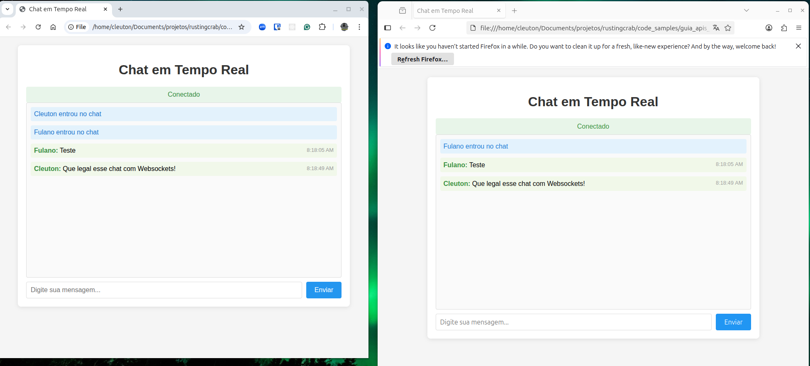

---


---

# Guia das APIs em Rust

## Websocket

<a href="https://github.com/cleuton/rustingcrab">Guia das APIs em Rust e todo código-fonte incluído</a> © 2025 by <a href="https://github.com/cleuton">Cleuton Sampaio</a> is licensed under <a href="https://creativecommons.org/licenses/by-sa/4.0/">CC BY-SA 4.0</a>

Este é um **ebook** interativo, com código-fonte disponível para você utilizar à vontade. Leia a licença de uso. 

[**Retornar ao menu**](../)

**WebSocket** é um protocolo de comunicação bidirecional em tempo real que funciona sobre uma única conexão TCP. Diferente do HTTP tradicional onde o cliente faz requisições e o servidor responde, o WebSocket permite que ambas as partes enviem mensagens a qualquer momento após a conexão inicial ser estabelecida.

O protocolo inicia com um handshake HTTP que é atualizado para uma conexão WebSocket persistente. Esta característica torna a tecnologia ideal para aplicações que exigem atualizações instantâneas como chats em tempo real, jogos multiplayer, dashboards com dados em tempo real, notificações push e colaboração simultânea em documentos.

Na comunicação cliente-servidor ambos os lados podem enviar mensagens de forma assíncrona sem a necessidade de polling constante. O servidor pode enviar dados para o cliente imediatamente quando disponíveis e o cliente pode enviar mensagens para o servidor a qualquer momento. A conexão permanece aberta até que uma das partes a feche explicitamente ou ocorra uma falha de rede.

O WebSocket oferece baixa latência e overhead reduzido comparado a soluções tradicionais de polling, pois elimina a necessidade de estabelecer uma nova conexão para cada troca de mensagem. O protocolo suporta transmissão de dados binários e textuais e funciona através de URLs com o esquema ws:// para conexões não seguras e wss:// para conexões criptografadas.

Uma característica importante dos servidores WebSocket é que eles são stateful, mantendo o estado das conexões ativas e as informações dos clientes conectados durante toda a duração da sessão. Isso significa que o servidor precisa gerenciar e armazenar informações sobre cada conexão estabelecida, diferentemente de servidores HTTP stateless que tratam cada requisição de forma independente.

## Websocket em Rust

O servidor WebSocket é construído utilizando o framework Axum que fornece suporte nativo para WebSockets através do módulo ws. O Tokio atua como runtime assíncrono gerenciando as operações de rede e concorrência. O servidor mantém um estado compartilhado usando Arc e RwLock para armazenar informações dos usuários conectados em uma estrutura HashMap.

Cada cliente estabelece uma conexão através de um handshake HTTP que é atualizado para o protocolo WebSocket. O servidor utiliza canais de broadcast do Tokio para distribuir mensagens entre todos os clientes conectados de forma eficiente. A comunicação bidirecional é gerenciada separando o socket em componentes de envio e recepção usando SinkExt e StreamExt.

O fluxo de funcionamento inicia com a configuração de uma rota específica para WebSockets no endpoint /ws. Quando um cliente se conecta, ele precisa primeiro enviar uma mensagem de entrada com seu nome de usuário. Após a autenticação inicial, o servidor cria tarefas assíncronas separadas para lidar com o envio e recepção de mensagens simultaneamente.

A serialização e desserialização de mensagens é feita com Serde utilizando JSON como formato de troca de dados. O servidor mantém um registro de todos os usuários conectados e seus respectivos canais de comunicação. Quando uma mensagem é recebida de um cliente, ela é retransmitida para todos os outros usuários conectados através do sistema de broadcast.

O gerenciamento de concorrência utiliza técnicas de programação assíncrona com tokio::spawn para criar tarefas independentes e tokio::select para monitorar quando qualquer uma das tarefas termina, seja por desconexão do cliente ou erro na comunicação. O estado compartilhado é protegido por locks de leitura e escrita permitindo acesso concorrente seguro aos dados dos usuários.

## O servidor

Nosso servidor **Rust** é bem simples de entender: 

```rust
use axum::{
    extract::ws::{Message, WebSocket, WebSocketUpgrade},
    response::IntoResponse,
    routing::get,
    Router,
};
use futures_util::{SinkExt, StreamExt};
use serde::{Deserialize, Serialize};
use std::collections::HashMap;
use std::sync::{Arc, RwLock};
use tokio::sync::broadcast;

// Estado compartilhado da aplicação
type Usuarios = Arc<RwLock<HashMap<String, broadcast::Sender<MensagemServidor>>>>;

// Estrutura para mensagens de chat
#[derive(Debug, Clone, Serialize, Deserialize)]
struct MensagemChat {
    usuario: String,
    texto: String,
    horario: String,
}

// Estrutura para diferentes tipos de mensagens do servidor
#[derive(Debug, Clone, Serialize, Deserialize)]
#[serde(tag = "tipo")]
enum MensagemServidor {
    UsuarioEntrou { usuario: String },
    UsuarioSaiu { usuario: String },
    MensagemChat(MensagemChat),
}

#[tokio::main]
async fn main() {
    // Armazenamento em memória dos canais de usuários conectados
    let usuarios: Usuarios = Arc::new(RwLock::new(HashMap::new()));

    // Criar rota para WebSocket
    let app = Router::new()
        .route("/ws", get(websocket_handler))
        .with_state(usuarios);

    let listener = tokio::net::TcpListener::bind("127.0.0.1:3030")
        .await
        .unwrap();
        
    println!("Servidor WebSocket rodando em ws://127.0.0.1:3030/ws");
    axum::serve(listener, app).await.unwrap();
}

// Handler para conexão WebSocket
async fn websocket_handler(
    ws: WebSocketUpgrade,
    axum::extract::State(usuarios): axum::extract::State<Usuarios>,
) -> impl IntoResponse {
    ws.on_upgrade(|socket| handle_socket(socket, usuarios))
}

// Função para tratar a conexão de um novo cliente
async fn handle_socket(socket: WebSocket, usuarios: Usuarios) {
    let (mut sender, mut receiver) = socket.split();
    
    // Esperar o nome de usuário do cliente
    let nome_usuario = loop {
        if let Some(Ok(message)) = receiver.next().await {
            if let Message::Text(texto) = message {
                if let Ok(msg) = serde_json::from_str::<serde_json::Value>(&texto) {
                    if msg["tipo"] == "entrada" {
                        if let Some(nome) = msg["usuario"].as_str() {
                            break nome.to_string();
                        }
                    }
                }
            }
        } else {
            return;
        }
    };

    // Criar um canal broadcast para este usuário
    let (tx, mut rx) = broadcast::channel(100);
    
    // Adicionar usuário à lista de usuários conectados
    usuarios.write().unwrap().insert(nome_usuario.clone(), tx.clone());

    // Notificar todos que um novo usuário entrou
    let msg_entrada = MensagemServidor::UsuarioEntrou {
        usuario: nome_usuario.clone(),
    };
    enviar_mensagem_todos(&usuarios, msg_entrada);

    // Clonar referências para as tarefas
    let usuarios_clone1 = usuarios.clone();
    let usuarios_clone2 = usuarios.clone();

    // Tarefa para enviar mensagens para o usuário
    let mut send_task = tokio::spawn(async move {
        while let Ok(msg) = rx.recv().await {
            if let Ok(texto) = serde_json::to_string(&msg) {
                if sender.send(Message::Text(texto)).await.is_err() {
                    break;
                }
            }
        }
    });

    // Tarefa para receber mensagens do usuário
    let mut recv_task = tokio::spawn(async move {
        while let Some(Ok(message)) = receiver.next().await {
            if let Message::Text(texto) = message {
                if let Ok(parsed) = serde_json::from_str::<serde_json::Value>(&texto) {
                    if parsed["tipo"] == "mensagem" {
                        if let (Some(usuario), Some(mensagem)) = (
                            parsed["usuario"].as_str(),
                            parsed["texto"].as_str(),
                        ) {
                            let msg_chat = MensagemServidor::MensagemChat(MensagemChat {
                                usuario: usuario.to_string(),
                                texto: mensagem.to_string(),
                                horario: chrono::Utc::now().to_rfc3339(),
                            });
                            enviar_mensagem_todos(&usuarios_clone1, msg_chat);
                        }
                    }
                }
            }
        }
    });

    // Aguardar qualquer tarefa terminar
    tokio::select! {
        _ = (&mut send_task) => recv_task.abort(),
        _ = (&mut recv_task) => send_task.abort(),
    }

    // Remover usuário e notificar saída
    usuarios_clone2.write().unwrap().remove(&nome_usuario);
    let msg_saida = MensagemServidor::UsuarioSaiu {
        usuario: nome_usuario,
    };
    enviar_mensagem_todos(&usuarios_clone2, msg_saida);
}

// Função para enviar mensagem para todos os usuários conectados
fn enviar_mensagem_todos(usuarios: &Usuarios, mensagem: MensagemServidor) {
    // Criar lista de usuários para evitar deadlock
    let lista_usuarios: Vec<String> = {
        usuarios.read().unwrap().keys().cloned().collect()
    };

    // Enviar mensagem para cada usuário
    for usuario in lista_usuarios {
        if let Some(tx) = usuarios.read().unwrap().get(&usuario) {
            let _ = tx.send(mensagem.clone());
        }
    }
}
```

Vamos explicar o código:

```rust
use axum::{
    extract::ws::{Message, WebSocket, WebSocketUpgrade},
    response::IntoResponse,
    routing::get,
    Router,
};
```
**Importações do Axum**: Trazer as funcionalidades necessárias do framework Axum, incluindo suporte a WebSocket, roteamento HTTP e tratamento de respostas.

```rust
use futures_util::{SinkExt, StreamExt};
use serde::{Deserialize, Serialize};
use std::collections::HashMap;
use std::sync::{Arc, RwLock};
use tokio::sync::broadcast;
```
**Crates auxiliares**: 
- `futures_util`: Fornece traits para trabalhar com streams assíncronos
- `serde`: Serialização e desserialização de dados
- `HashMap`: Estrutura para armazenar usuários
- `Arc/RwLock`: Compartilhamento de dados entre threads
- `broadcast`: Sistema de mensagens para distribuir mensagens

```rust
type Usuarios = Arc<RwLock<HashMap<String, broadcast::Sender<MensagemServidor>>>>;
```
**Tipo de estado compartilhado**: Define um tipo de dado que representa o estado da aplicação - um HashMap protegido por Arc (Atomic Reference Counting) e RwLock (Read-Write Lock) que mapeia nomes de usuários para canais de broadcast.

```rust
#[derive(Debug, Clone, Serialize, Deserialize)]
struct MensagemChat {
    usuario: String,
    texto: String,
    horario: String,
}

#[derive(Debug, Clone, Serialize, Deserialize)]
#[serde(tag = "tipo")]
enum MensagemServidor {
    UsuarioEntrou { usuario: String },
    UsuarioSaiu { usuario: String },
    MensagemChat(MensagemChat),
}
```
**Estruturas de dados**: Define como as mensagens são estruturadas em JSON. A enumeração usa `#[serde(tag = "tipo")]` para incluir um campo "tipo" nas mensagens que identifica seu tipo.

```rust
#[tokio::main]
async fn main() {
    let usuarios: Usuarios = Arc::new(RwLock::new(HashMap::new()));

    let app = Router::new()
        .route("/ws", get(websocket_handler))
        .with_state(usuarios);

    let listener = tokio::net::TcpListener::bind("127.0.0.1:3030")
        .await
        .unwrap();
        
    println!("Servidor WebSocket rodando em ws://127.0.0.1:3030/ws");
    axum::serve(listener, app).await.unwrap();
}
```
**Configuração do servidor**: Cria o estado inicial vazio, configura a rota "/ws" para aceitar conexões GET, associa o estado à aplicação e inicia o servidor na porta 3030.

```rust
async fn websocket_handler(
    ws: WebSocketUpgrade,
    axum::extract::State(usuarios): axum::extract::State<Usuarios>,
) -> impl IntoResponse {
    ws.on_upgrade(|socket| handle_socket(socket, usuarios))
}
```
**Handler de conexão**: Recebe a solicitação de upgrade HTTP para WebSocket e chama `handle_socket` quando a conexão é estabelecida.

```rust
let (mut sender, mut receiver) = socket.split();
```
**Divisão do socket**: Separa o socket WebSocket em duas partes - uma para enviar mensagens (`sender`) e outra para receber (`receiver`) - permitindo operações simultâneas.

```rust
let nome_usuario = loop {
    if let Some(Ok(message)) = receiver.next().await {
        if let Message::Text(texto) = message {
            if let Ok(msg) = serde_json::from_str::<serde_json::Value>(&texto) {
                if msg["tipo"] == "entrada" {
                    if let Some(nome) = msg["usuario"].as_str() {
                        break nome.to_string();
                    }
                }
            }
        }
    } else {
        return;
    }
};
```
**Autenticação do usuário**: Aguarda a primeira mensagem do cliente que deve ser do tipo "entrada" contendo o nome do usuário.

```rust
let (tx, mut rx) = broadcast::channel(100);
usuarios.write().unwrap().insert(nome_usuario.clone(), tx.clone());
```
**Registro do usuário**: Cria um canal de broadcast para o novo usuário e o adiciona ao HashMap global de usuários conectados.

```rust
let mut send_task = tokio::spawn(async move {
    while let Ok(msg) = rx.recv().await {
        if let Ok(texto) = serde_json::to_string(&msg) {
            if sender.send(Message::Text(texto)).await.is_err() {
                break;
            }
        }
    }
});

let mut recv_task = tokio::spawn(async move {
    // ... processa mensagens recebidas ...
});
```
**Tarefas assíncronas**: Cria duas tarefas concorrentes - uma para enviar mensagens recebidas do broadcast ao cliente e outra para processar mensagens enviadas pelo cliente.

```rust
tokio::select! {
    _ = (&mut send_task) => recv_task.abort(),
    _ = (&mut recv_task) => send_task.abort(),
}
```
**Gerenciamento de ciclo de vida**: Usa `tokio::select!` para monitorar quando qualquer uma das tarefas termina (desconexão) e aborta a outra tarefa automaticamente.

```rust
fn enviar_mensagem_todos(usuarios: &Usuarios, mensagem: MensagemServidor) {
    let lista_usuarios: Vec<String> = {
        usuarios.read().unwrap().keys().cloned().collect()
    };

    for usuario in lista_usuarios {
        if let Some(tx) = usuarios.read().unwrap().get(&usuario) {
            let _ = tx.send(mensagem.clone());
        }
    }
}
```
**Distribuição de mensagens**: Percorre todos os usuários conectados e envia a mensagem através de seus respectivos canais de broadcast.

## O cliente HTML / Javscript

Eu optei por criar um cliente com HTML e Javascript simples (evitando frameworks como **React** ou **Angular**) para ser o mais simples e transparente possível. É claro que você pode usar **Websocket** com seu framework **frontend** favorito. Esse projeto envia mensagem para todos os usuários conectados ao chat simultaneamente.



Vejamos o código cliente: 

```html
<!DOCTYPE html>
<html lang="pt-BR">
<head>
    <meta charset="UTF-8">
    <meta name="viewport" content="width=device-width, initial-scale=1.0">
    <title>Chat em Tempo Real</title>
    <style>
        body {
            font-family: Arial, sans-serif;
            max-width: 800px;
            margin: 0 auto;
            padding: 20px;
            background-color: #f5f5f5;
        }
        
        .container {
            background-color: white;
            border-radius: 8px;
            box-shadow: 0 2px 10px rgba(0,0,0,0.1);
            padding: 20px;
        }
        
        h1 {
            text-align: center;
            color: #333;
        }
        
        #tela-entrada {
            text-align: center;
        }
        
        #nome-usuario {
            padding: 10px;
            font-size: 16px;
            border: 1px solid #ddd;
            border-radius: 4px;
            width: 200px;
            margin-right: 10px;
        }
        
        #botao-entrar {
            padding: 10px 20px;
            font-size: 16px;
            background-color: #4CAF50;
            color: white;
            border: none;
            border-radius: 4px;
            cursor: pointer;
        }
        
        #botao-entrar:hover {
            background-color: #45a049;
        }
        
        #chat-container {
            display: none;
        }
        
        #mensagens {
            height: 400px;
            overflow-y: auto;
            border: 1px solid #ddd;
            border-radius: 4px;
            padding: 10px;
            margin-bottom: 10px;
            background-color: #fafafa;
        }
        
        .mensagem {
            margin-bottom: 10px;
            padding: 8px;
            border-radius: 4px;
        }
        
        .mensagem-sistema {
            background-color: #e3f2fd;
            color: #1976d2;
        }
        
        .mensagem-chat {
            background-color: #f1f8e9;
        }
        
        .usuario {
            font-weight: bold;
            color: #388e3c;
        }
        
        .horario {
            font-size: 0.8em;
            color: #999;
            float: right;
        }
        
        #formulario-mensagem {
            display: flex;
        }
        
        #entrada-mensagem {
            flex: 1;
            padding: 10px;
            font-size: 16px;
            border: 1px solid #ddd;
            border-radius: 4px;
        }
        
        #botao-enviar {
            padding: 10px 20px;
            font-size: 16px;
            background-color: #2196F3;
            color: white;
            border: none;
            border-radius: 4px;
            cursor: pointer;
            margin-left: 10px;
        }
        
        #botao-enviar:hover {
            background-color: #1976d2;
        }
        
        #status {
            text-align: center;
            padding: 10px;
            margin-top: 10px;
            border-radius: 4px;
        }
        
        .conectado {
            background-color: #e8f5e9;
            color: #388e3c;
        }
        
        .desconectado {
            background-color: #ffebee;
            color: #d32f2f;
        }
    </style>
</head>
<body>
    <div class="container">
        <h1>Chat em Tempo Real</h1>
        
        <div id="tela-entrada">
            <h2>Entre no Chat</h2>
            <input type="text" id="nome-usuario" placeholder="Digite seu nome" maxlength="20">
            <button id="botao-entrar">Entrar</button>
        </div>
        
        <div id="chat-container">
            <div id="status" class="desconectado">Desconectado</div>
            <div id="mensagens"></div>
            <form id="formulario-mensagem">
                <input type="text" id="entrada-mensagem" placeholder="Digite sua mensagem..." maxlength="200">
                <button type="submit" id="botao-enviar">Enviar</button>
            </form>
        </div>
    </div>

    <script>
        // Elementos da interface
        const telaEntrada = document.getElementById('tela-entrada');
        const chatContainer = document.getElementById('chat-container');
        const nomeUsuarioInput = document.getElementById('nome-usuario');
        const botaoEntrar = document.getElementById('botao-entrar');
        const mensagensDiv = document.getElementById('mensagens');
        const formularioMensagem = document.getElementById('formulario-mensagem');
        const entradaMensagem = document.getElementById('entrada-mensagem');
        const botaoEnviar = document.getElementById('botao-enviar');
        const statusDiv = document.getElementById('status');

        // Variáveis do WebSocket
        let websocket = null;
        let nomeUsuario = '';

        // Função para conectar ao WebSocket
        function conectarWebSocket() {
            // Conectar ao servidor WebSocket
            websocket = new WebSocket('ws://127.0.0.1:3030/ws');
            
            // Quando a conexão é aberta
            websocket.onopen = function(event) {
                console.log('Conectado ao servidor WebSocket');
                statusDiv.textContent = 'Conectado';
                statusDiv.className = 'conectado';
                
                // Enviar mensagem de entrada
                const mensagemEntrada = {
                    tipo: 'entrada',
                    usuario: nomeUsuario
                };
                websocket.send(JSON.stringify(mensagemEntrada));
            };
            
            // Quando recebe uma mensagem
            websocket.onmessage = function(event) {
                const dados = JSON.parse(event.data);
                adicionarMensagem(dados);
            };
            
            // Quando a conexão é fechada
            websocket.onclose = function(event) {
                console.log('Conexão WebSocket fechada');
                statusDiv.textContent = 'Desconectado';
                statusDiv.className = 'desconectado';
            };
            
            // Quando ocorre um erro
            websocket.onerror = function(error) {
                console.error('Erro no WebSocket:', error);
                statusDiv.textContent = 'Erro de conexão';
                statusDiv.className = 'desconectado';
            };
        }

        // Função para adicionar mensagem à interface
        function adicionarMensagem(dados) {
            const divMensagem = document.createElement('div');
            
            if (dados.tipo === 'UsuarioEntrou') {
                divMensagem.className = 'mensagem mensagem-sistema';
                divMensagem.textContent = `${dados.usuario} entrou no chat`;
            } 
            else if (dados.tipo === 'UsuarioSaiu') {
                divMensagem.className = 'mensagem mensagem-sistema';
                divMensagem.textContent = `${dados.usuario} saiu do chat`;
            } 
            else if (dados.tipo === 'MensagemChat') {
                divMensagem.className = 'mensagem mensagem-chat';
                const horario = new Date(dados.horario).toLocaleTimeString();
                divMensagem.innerHTML = `
                    <span class="usuario">${dados.usuario}:</span> 
                    ${dados.texto}
                    <span class="horario">${horario}</span>
                `;
            }
            
            mensagensDiv.appendChild(divMensagem);
            mensagensDiv.scrollTop = mensagensDiv.scrollHeight;
        }

        // Evento para entrar no chat
        botaoEntrar.addEventListener('click', function() {
            nomeUsuario = nomeUsuarioInput.value.trim();
            if (nomeUsuario) {
                telaEntrada.style.display = 'none';
                chatContainer.style.display = 'block';
                conectarWebSocket();
            } else {
                alert('Por favor, digite um nome de usuário.');
            }
        });

        // Evento para enviar mensagem
        formularioMensagem.addEventListener('submit', function(event) {
            event.preventDefault();
            
            const texto = entradaMensagem.value.trim();
            if (texto && websocket && websocket.readyState === WebSocket.OPEN) {
                const mensagem = {
                    tipo: 'mensagem',
                    usuario: nomeUsuario,
                    texto: texto
                };
                
                websocket.send(JSON.stringify(mensagem));
                entradaMensagem.value = '';
            }
        });

        // Permitir envio com Enter
        nomeUsuarioInput.addEventListener('keypress', function(event) {
            if (event.key === 'Enter') {
                botaoEntrar.click();
            }
        });

        // Permitir envio com Enter
        entradaMensagem.addEventListener('keypress', function(event) {
            if (event.key === 'Enter') {
                botaoEnviar.click();
            }
        });
    </script>
</body>
</html>
```

Vamos explicar o código cliente: 

```html
<!DOCTYPE html>
<html lang="pt-BR">
<head>
    <!-- Configurações básicas da página -->
    <meta charset="UTF-8">
    <meta name="viewport" content="width=device-width, initial-scale=1.0">
    <title>Chat em Tempo Real</title>
```
**Cabeçalho HTML**: Define a codificação UTF-8, viewport responsiva e título da página.

```css
body {
    font-family: Arial, sans-serif;
    max-width: 800px;
    margin: 0 auto;
    padding: 20px;
    background-color: #f5f5f5;
}
```
**Estilos CSS**: Define a aparência visual da aplicação com layout centralizado, tipografia e cores específicas para diferentes tipos de mensagens.

```javascript
// Elementos da interface
const telaEntrada = document.getElementById('tela-entrada');
const chatContainer = document.getElementById('chat-container');
const nomeUsuarioInput = document.getElementById('nome-usuario');
// ... outras declarações de elementos
```
**Seleção de elementos DOM**: Obtém referências para os elementos HTML que serão manipulados pelo JavaScript.

```javascript
// Variáveis do WebSocket
let websocket = null;
let nomeUsuario = '';
```
**Estado do cliente**: Armazena a instância do WebSocket e o nome do usuário atual.

```javascript
function conectarWebSocket() {
    websocket = new WebSocket('ws://127.0.0.1:3030/ws');
```
**Conexão WebSocket**: Cria uma nova conexão WebSocket apontando para o servidor Rust na porta 3030.

```javascript
websocket.onopen = function(event) {
    console.log('Conectado ao servidor WebSocket');
    statusDiv.textContent = 'Conectado';
    statusDiv.className = 'conectado';
    
    // Enviar mensagem de entrada
    const mensagemEntrada = {
        tipo: 'entrada',
        usuario: nomeUsuario
    };
    websocket.send(JSON.stringify(mensagemEntrada));
};
```
**Handler de conexão aberta**: Quando a conexão é estabelecida, envia imediatamente uma mensagem do tipo "entrada" com o nome do usuário para se registrar no servidor.

```javascript
websocket.onmessage = function(event) {
    const dados = JSON.parse(event.data);
    adicionarMensagem(dados);
};
```
**Handler de mensagens recebidas**: Processa todas as mensagens recebidas do servidor, convertendo o JSON em objeto JavaScript e passando para a função de exibição.

```javascript
function adicionarMensagem(dados) {
    const divMensagem = document.createElement('div');
    
    if (dados.tipo === 'UsuarioEntrou') {
        divMensagem.className = 'mensagem mensagem-sistema';
        divMensagem.textContent = `${dados.usuario} entrou no chat`;
    } 
    else if (dados.tipo === 'UsuarioSaiu') {
        divMensagem.className = 'mensagem mensagem-sistema';
        divMensagem.textContent = `${dados.usuario} saiu do chat`;
    } 
    else if (dados.tipo === 'MensagemChat') {
        divMensagem.className = 'mensagem mensagem-chat';
        const horario = new Date(dados.horario).toLocaleTimeString();
        divMensagem.innerHTML = `
            <span class="usuario">${dados.usuario}:</span> 
            ${dados.texto}
            <span class="horario">${horario}</span>
        `;
    }
```
**Renderização de mensagens**: Cria elementos HTML diferentes dependendo do tipo de mensagem recebida (entrada/saída de usuário ou mensagem de chat) e formata adequadamente.

```javascript
formularioMensagem.addEventListener('submit', function(event) {
    event.preventDefault();
    
    const texto = entradaMensagem.value.trim();
    if (texto && websocket && websocket.readyState === WebSocket.OPEN) {
        const mensagem = {
            tipo: 'mensagem',
            usuario: nomeUsuario,
            texto: texto
        };
        
        websocket.send(JSON.stringify(mensagem));
        entradaMensagem.value = '';
    }
});
```
**Envio de mensagens**: Intercepta o envio do formulário, previne o comportamento padrão, valida a mensagem e a envia ao servidor em formato JSON, limpando o campo de entrada após o envio.

```javascript
nomeUsuarioInput.addEventListener('keypress', function(event) {
    if (event.key === 'Enter') {
        botaoEntrar.click();
    }
});
```
**Atalhos de teclado**: Permite que o usuário pressione Enter para enviar mensagens ou entrar no chat, melhorando a usabilidade.

[**Retornar ao menu**](../)
