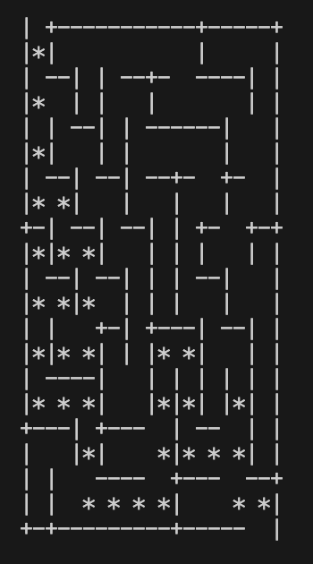
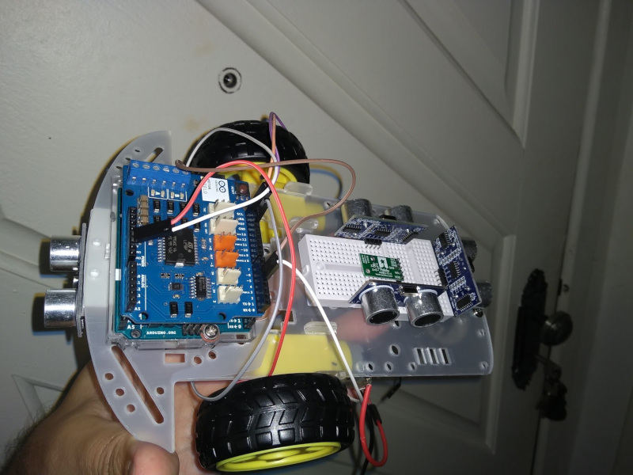

# Rusting maze


[*Cleuton Sampaio*](https://linkedin.com/in/cleutonsampaio)
[**Meus cursos**](https://cleutonsampaio.com/#cursos)

Vocês pediram e eu fiz! Converti o meu famoso programa do Labirinto para **Rust**. Esse programa foi criado para o meu **robô** (que descanse em paz) resolvedor de labirintos. O código original era **Python** e rodava em um **Raspberry PI** controlando um **Arduino**. Eu usei esse exemplo no meu famoso curso de Python e gosto muito dele. 



Ele utiliza a técnica de **backtracking** para resolver labirintos. E utiliza um algoritmo recursivo de backtracking para criar labirintos (não presente no caso do robô).

## Código fonte

O código em **Rust** está aqui. Ficou um pouco grande, mas é a primeira versão. Depois eu vou modularizar: 

```rust 
use rand::Rng;
use std::fmt;

// Definição da struct Celula (Célula do labirinto)
struct Celula {
    paredes: [bool; 4], // Paredes: Norte, Sul, Leste, Oeste
    visitada: bool,
    inicio: bool,
    fim: bool,
    x: usize,
    y: usize,
}

// Constantes para as direções
const NORTE: usize = 0;
const SUL: usize = 1;
const LESTE: usize = 2;
const OESTE: usize = 3;

// Definição da struct Pilha (Stack)
struct Pilha<T> {
    data: Vec<T>,
}

impl<T> Pilha<T> {
    fn new() -> Self {
        Pilha { data: Vec::new() }
    }

    fn push(&mut self, value: T) {
        self.data.push(value);
    }

    fn pop(&mut self) -> Option<T> {
        self.data.pop()
    }

    fn is_empty(&self) -> bool {
        self.data.is_empty()
    }

    fn top(&self) -> Option<&T> {
        self.data.last()
    }
}

// Definição da struct Labirinto
struct Labirinto {
    linhas: usize,
    colunas: usize,
    celulas: Vec<Vec<Celula>>,
    valido: bool,
    _corrente: Option<(usize, usize)>,
    _proxima: Option<(usize, usize)>,
    _qtd_total: usize,
    _qtd_visitadas: usize,
    pilha: Pilha<(usize, usize)>,
    caminho: Option<Vec<(usize, usize)>>,
}

impl Labirinto {
    // Método para criar um novo labirinto
    fn new(linhas: usize, colunas: usize) -> Self {
        let mut labirinto = Labirinto {
            linhas,
            colunas,
            celulas: Vec::new(),
            valido: false,
            _corrente: None,
            _proxima: None,
            _qtd_total: 0,
            _qtd_visitadas: 0,
            pilha: Pilha::new(),
            caminho: None,
        };
        labirinto.inicializar();
        labirinto
    }

    // Método para inicializar o labirinto
    fn inicializar(&mut self) {
        let mut contador = 0;
        while contador < 4 {
            self.celulas = Vec::new();
            for i in 0..self.linhas {
                let mut linha = Vec::new();
                for j in 0..self.colunas {
                    let celula = Celula {
                        paredes: [true, true, true, true],
                        visitada: false,
                        inicio: false,
                        fim: false,
                        x: j,
                        y: i,
                    };
                    linha.push(celula);
                }
                self.celulas.push(linha);
            }
            self.celulas[0][0].inicio = true;
            self.celulas[self.linhas - 1][self.colunas - 1].fim = true;
            contador += 1;
            self.pilha = Pilha::new();
            self._qtd_visitadas = 0;
            self.criar();
            if !self.fechada(&self.celulas[1][1]) && !self.fechada(&self.celulas[self.linhas - 2][self.colunas - 2]) {
                break;
            }
        }
        if contador < 4 {
            self.valido = true;
        }
    }

    // Método para verificar se uma célula está fechada (todas as paredes intactas)
    fn fechada(&self, celula: &Celula) -> bool {
        celula.paredes[NORTE] && celula.paredes[SUL] && celula.paredes[LESTE] && celula.paredes[OESTE]
    }

    // Método para criar o labirinto usando backtracking
    fn criar(&mut self) {
        self._qtd_total = self.linhas * self.colunas;
        let mut rng = rand::thread_rng();
        let linha = rng.gen_range(0..self.linhas);
        let coluna = rng.gen_range(0..self.colunas);
        self._corrente = Some((linha, coluna));
        self.celulas[linha][coluna].visitada = true;
        if let Some(proxima) = self.pegar_vizinha(linha, coluna) {
            self.celulas[proxima.0][proxima.1].visitada = true;
            self.quebrar_paredes((linha, coluna), proxima);
            self.pilha.push((linha, coluna));
            self._qtd_visitadas += 1;
            self._corrente = Some(proxima);
            self.processa_celula();
        }
    }

    // Método para processar células durante a criação do labirinto
    fn processa_celula(&mut self) {
        loop {
            if !self.pilha.is_empty() {
                let corrente = self._corrente.unwrap();
                if self.is_dead_end(corrente) || self.celulas[corrente.0][corrente.1].fim || self.celulas[corrente.0][corrente.1].inicio {
                    if let Some(proxima) = self.pilha.pop() {
                        self._corrente = Some(proxima);
                    } else {
                        self._corrente = None;
                    }
                } else {
                    if let Some(proxima) = self.pegar_vizinha(corrente.0, corrente.1) {
                        self.quebrar_paredes(corrente, proxima);
                        self.pilha.push(corrente);
                        self.celulas[proxima.0][proxima.1].visitada = true;
                        self._qtd_visitadas += 1;
                        self._corrente = Some(proxima);
                    }
                }
            } else {
                self.celulas[0][0].paredes[NORTE] = false;
                self.celulas[self.linhas - 1][self.colunas - 1].paredes[SUL] = false;
                return;
            }
        }
    }

    // Método para verificar se uma célula é um beco sem saída
    fn is_dead_end(&self, celula: (usize, usize)) -> bool {
        let (y, x) = celula;
        if y > 0 && !self.celulas[y - 1][x].visitada {
            return false;
        }
        if y + 1 < self.linhas && !self.celulas[y + 1][x].visitada {
            return false;
        }
        if x > 0 && !self.celulas[y][x - 1].visitada {
            return false;
        }
        if x + 1 < self.colunas && !self.celulas[y][x + 1].visitada {
            return false;
        }
        true
    }

    // Método para quebrar as paredes entre duas células
    fn quebrar_paredes(&mut self, c1: (usize, usize), c2: (usize, usize)) {
        let (y1, x1) = c1;
        let (y2, x2) = c2;
        if x1 > x2 {
            self.celulas[y1][x1].paredes[OESTE] = false;
            self.celulas[y2][x2].paredes[LESTE] = false;
        } else if x1 < x2 {
            self.celulas[y1][x1].paredes[LESTE] = false;
            self.celulas[y2][x2].paredes[OESTE] = false;
        } else if y1 > y2 {
            self.celulas[y1][x1].paredes[NORTE] = false;
            self.celulas[y2][x2].paredes[SUL] = false;
        } else if y1 < y2 {
            self.celulas[y1][x1].paredes[SUL] = false;
            self.celulas[y2][x2].paredes[NORTE] = false;
        }
    }

    // Método para pegar uma célula vizinha não visitada
    fn pegar_vizinha(&self, y: usize, x: usize) -> Option<(usize, usize)> {
        let mut procurar = true;
        let mut cel = None;
        let mut rng = rand::thread_rng();
        while procurar {
            let vizinha = rng.gen_range(0..4);
            match vizinha {
                NORTE => {
                    if y > 0 && !self.celulas[y - 1][x].visitada {
                        cel = Some((y - 1, x));
                        procurar = false;
                    }
                }
                SUL => {
                    if y + 1 < self.linhas && !self.celulas[y + 1][x].visitada {
                        cel = Some((y + 1, x));
                        procurar = false;
                    }
                }
                LESTE => {
                    if x + 1 < self.colunas && !self.celulas[y][x + 1].visitada {
                        cel = Some((y, x + 1));
                        procurar = false;
                    }
                }
                OESTE => {
                    if x > 0 && !self.celulas[y][x - 1].visitada {
                        cel = Some((y, x - 1));
                        procurar = false;
                    }
                }
                _ => {}
            }
        }
        cel
    }
}

// Implementação do Display para imprimir o labirinto
impl fmt::Display for Labirinto {
    fn fmt(&self, f: &mut fmt::Formatter<'_>) -> fmt::Result {
        let mut linhas = vec![vec![' '; (self.colunas * 3) + 1]; self.linhas * 3];
        for z in linhas.iter_mut() {
            z[self.colunas * 3] = '\n';
        }
        for i in 0..self.linhas {
            for j in 0..self.colunas {
                let matriz = self.get_celula(&self.celulas[i][j]);
                self.insert(&mut linhas, &matriz, i, j);
            }
        }
        for linha in linhas {
            for c in linha {
                write!(f, "{}", c)?;
            }
        }
        Ok(())
    }
}

impl Labirinto {
    // Método auxiliar para obter a representação de uma célula
    fn get_celula(&self, cel: &Celula) -> Vec<Vec<char>> {
        let mut linha1 = vec![' ', ' ', ' '];
        let mut linha2 = vec![' ', ' ', ' '];
        let mut linha3 = vec![' ', ' ', ' '];
        if cel.paredes[NORTE] {
            linha1 = vec!['-', '-', '-'];
        }
        if cel.paredes[SUL] {
            linha3 = vec!['-', '-', '-'];
        }
        if cel.paredes[OESTE] {
            linha1[0] = if linha1[0] == '-' { '+' } else { '|' };
            linha2[0] = '|';
            linha3[0] = if linha3[0] == '-' { '+' } else { '|' };
        }
        if cel.paredes[LESTE] {
            linha1[2] = if linha1[2] == '-' { '+' } else { '|' };
            linha2[2] = '|';
            linha3[2] = if linha3[2] == '-' { '+' } else { '|' };
        }
        // Marca o caminho se existir
        if let Some(ref caminho) = self.caminho {
            if caminho.contains(&(cel.y, cel.x)) {
                linha2[1] = '*';
            }
        }
        vec![linha1, linha2, linha3]
    }

    // Método auxiliar para inserir a representação de uma célula na matriz de caracteres
    fn insert(&self, linhas: &mut Vec<Vec<char>>, matriz: &Vec<Vec<char>>, i: usize, j: usize) {
        let linha = i * 2;
        let coluna = j * 2;
        for l in 0..3 {
            for c in 0..3 {
                linhas[linha + l][coluna + c] = matriz[l][c];
            }
        }
    }
}

// Definição da struct Solver (Resolvedor)
struct Solver {
    pilha: Pilha<(usize, usize)>,
    corrente: Option<(usize, usize)>,
    caminho: Vec<(usize, usize)>,
    incrementos: Vec<(isize, isize)>,
    visitadas: Vec<Vec<bool>>,
}

impl Solver {
    // Método para criar um novo Solver
    fn new() -> Self {
        Solver {
            pilha: Pilha::new(),
            corrente: None,
            caminho: Vec::new(),
            incrementos: vec![(0, -1), (0, 1), (1, 0), (-1, 0)], // Norte, Sul, Leste, Oeste
            visitadas: Vec::new(),
        }
    }

    // Método para resolver o labirinto
    fn solve(&mut self, labirinto: &mut Labirinto) {
        self.visitadas = vec![vec![false; labirinto.colunas]; labirinto.linhas];
        self.corrente = Some((0, 0));
        self.pilha.push((0, 0));
        self.procurar(labirinto);
        while let Some(pos) = self.pilha.pop() {
            self.caminho.push(pos);
        }
        labirinto.caminho = Some(self.caminho.clone());
    }

    // Método para procurar o caminho através do labirinto
    fn procurar(&mut self, labirinto: &Labirinto) {
        let mut buffer = None;
        while !self.pilha.is_empty() {
            let (y, x) = *self.pilha.top().unwrap();
            self.visitadas[y][x] = true;
            if labirinto.celulas[y][x].fim {
                return;
            }
            let mut proxima = None;
            for parede in 0..4 {
                if !labirinto.celulas[y][x].paredes[parede] {
                    let dy = self.incrementos[parede].1;
                    let dx = self.incrementos[parede].0;
                    let ny = y as isize + dy;
                    let nx = x as isize + dx;
                    if ny < 0 || nx < 0 || ny as usize >= labirinto.linhas || nx as usize >= labirinto.colunas {
                        continue;
                    }
                    let ny = ny as usize;
                    let nx = nx as usize;
                    if self.visitadas[ny][nx] {
                        continue;
                    }
                    proxima = Some((ny, nx));
                    if let Some(pos) = buffer {
                        self.pilha.push(pos);
                        buffer = None;
                    }
                    self.pilha.push((ny, nx));
                    self.corrente = Some((ny, nx));
                    break;
                }
            }
            if proxima.is_none() {
                let pos = self.pilha.pop().unwrap();
                self.corrente = Some(pos);
                buffer = Some(pos);
            }
        }
    }
}

// Função principal
fn main() {
    let args: Vec<String> = std::env::args().collect();
    let linhas = if args.len() > 1 { args[1].parse::<usize>().unwrap_or(10) } else { 10 };
    let colunas = if args.len() > 2 { args[2].parse::<usize>().unwrap_or(10) } else { 10 };

    let mut labirinto = Labirinto::new(linhas, colunas);
    println!("{}", labirinto);

    let mut solver = Solver::new();
    solver.solve(&mut labirinto);
    println!("{}", labirinto);
}

```

Vou explicar o código de forma geral e simplificada.

**Estruturas Principais:**

1. **Struct `Celula`:**
   - Representa cada célula do labirinto.
   - Possui um array `paredes` de quatro posições, indicando se há paredes nas direções Norte, Sul, Leste e Oeste.
   - Tem campos booleanos para marcar se a célula foi `visitada`, se é o `inicio` ou o `fim` do labirinto.
   - Armazena suas coordenadas `x` e `y` na grade.

2. **Constantes de Direção:**
   - `NORTE`, `SUL`, `LESTE`, `OESTE` são usados como índices para acessar as paredes no array `paredes`.

3. **Struct `Pilha<T>`:**
   - Implementa uma pilha genérica usando um `Vec<T>`.
   - Fornece métodos para `push`, `pop`, verificar se está `is_empty`, e obter o elemento do topo com `top`.

4. **Struct `Labirinto`:**
   - Representa o labirinto em si.
   - Armazena o número de `linhas` e `colunas`, e uma matriz de `celulas`.
   - Possui campos auxiliares para a geração do labirinto, como `_corrente`, `_proxima`, `pilha` e `caminho`.

5. **Struct `Solver`:**
   - Responsável por resolver o labirinto.
   - Utiliza uma pilha para rastrear o caminho e um vetor `visitadas` para marcar células já visitadas.
   - Os `incrementos` definem como mover-se nas direções Norte, Sul, Leste e Oeste.

**Geração do Labirinto:**

- **Inicialização:**
  - O método `inicializar` cria a grade de células, todas com paredes em todas as direções e não visitadas.
  - Define a célula inicial (`inicio`) no canto superior esquerdo e a célula final (`fim`) no canto inferior direito.

- **Criação com Backtracking:**
  - O método `criar` inicia a partir de uma célula aleatória.
  - Marca a célula atual como visitada e empilha sua posição.
  - Enquanto houver células na pilha:
    - Busca uma vizinha não visitada usando `pegar_vizinha`.
    - Se encontrar, quebra a parede entre as células com `quebrar_paredes`, marca como visitada e continua.
    - Se não houver vizinhas não visitadas, faz o backtracking desempilhando a pilha.

- **Quebra de Paredes:**
  - O método `quebrar_paredes` remove as paredes entre duas células adjacentes, atualizando o array `paredes` de ambas.

**Resolução do Labirinto:**

- **Busca em Profundidade:**
  - O `Solver` realiza uma busca em profundidade a partir da célula inicial.
  - Marca as células visitadas e empilha as posições à medida que avança.
  - Se chegar à célula final, o caminho é registrado.
  - Utiliza backtracking para retornar em caso de becos sem saída.

**Exibição do Labirinto:**

- **Implementação do Display:**
  - A trait `fmt::Display` é implementada para `Labirinto`, permitindo imprimir o labirinto no terminal.
  - O método `get_celula` cria uma representação visual de cada célula, considerando as paredes e marcando o caminho se existir.
  - O labirinto é construído como uma matriz de caracteres e concatenado em uma string para exibição.

**Função Principal (`main`):**

- Lê os argumentos de linha de comando para definir as dimensões do labirinto, com valores padrão de 10x10.
- Cria uma instância de `Labirinto`, gera o labirinto e o imprime.
- Cria uma instância de `Solver`, resolve o labirinto e imprime novamente, agora com o caminho da solução marcado.


O código implementa um gerador e resolvedor de labirintos em Rust utilizando algoritmos de backtracking. Ele cria um labirinto aleatório, garantindo que haja um caminho do início ao fim, e depois encontra esse caminho usando uma busca em profundidade com backtracking. A visualização é feita diretamente no terminal, mostrando as paredes e o caminho percorrido.

**Conceitos Utilizados:**

- **Backtracking:** Tanto na geração quanto na resolução, o algoritmo retrocede quando não encontra opções, explorando diferentes caminhos.
- **Recursão Implícita com Pilha:** Em vez de usar chamadas recursivas, o código utiliza uma pilha para controlar o fluxo de execução.
- **Randomização:** A escolha aleatória de células vizinhas durante a geração garante labirintos diferentes a cada execução.
- **Estruturas de Dados Simples:** Pilha, matriz bidimensional e arrays para representar o labirinto e suas células.

## Como criar o projeto

Para começar, instale o [**rustup**](https://rustup.rs/) se ainda não tiver o **Rust** instalado. O **VSCode** serve bem como editor.

Crie um projeto com o **cargo**: 

```shell
cargo new labirinto_demo --bin
```

Modifique o arquivo `Cargo.toml` para acrescentar a dependência do `rand`: 

```toml
[package]
name = "labirinto_demo"
version = "0.1.0"
edition = "2021"

[dependencies]
rand = "0.8"
```

Agora, substitua `src/main.rs` pelo código-fonte listado acima. 

Para executar, rode esse comando no terminal, na pasta onde está o arquivo `Cargo.toml`: 

```shell
cargo run
``` 

Ele criará um labirinto 10x10 e o resolverá com asteriscos. 