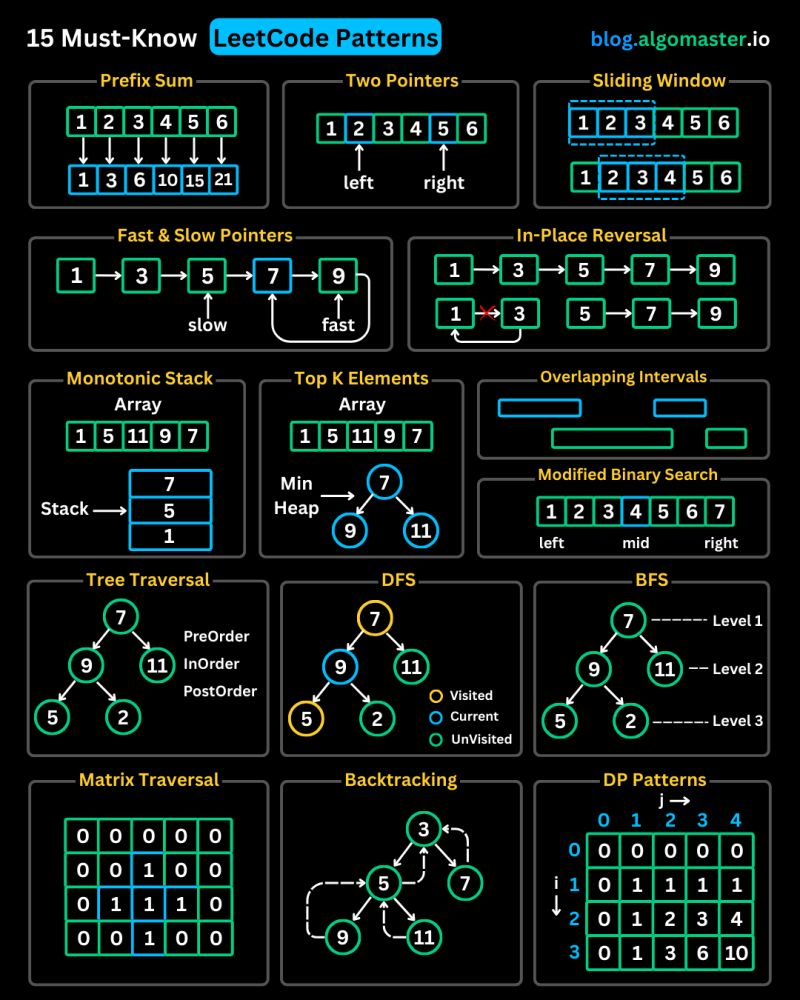

[**Cleuton Sampaio**](https://linkedin.com/in/cleutonsampaio)

[**Veja no GitHub**](https://https://github.com/cleuton/rustingcrab/tree/main/code_samples/leetcode)



Eu vi esse post de [**Ashish Pratap Singh**](https://www.linkedin.com/in/ashishps1?miniProfileUrn=urn%3Ali%3Afsd_profile%3AACoAABT9QE0BiP3CAWgDMTJ5NLKmcGaVCgNn_nI&lipi=urn%3Ali%3Apage%3Ad_flagship3_detail_base%3BqTuSBrb%2BSWC2s8J1moQR%2Fg%3D%3D) no **Linkedin** e, como já tinha escrito implementações em **Rust** para quase todos esses tipos de problemas, resolvi criar essa página com as explicações e os fontes. 

Tive que acrescentar uns dois ou três, mas ficou muito legal para você, que está estudando para **entrevistas** de **emprego**. 


## 1) Prefix Sum

Prefix Sum: esse padrão aparece em problemas que exigem calcular rapidamente a soma de um subarray ou responder múltiplas consultas de soma em intervalos. Exemplos típicos são “Subarray Sum Equals K” (encontrar quantos subarrays têm soma igual a um valor dado) e “Range Sum Query” (criar uma estrutura que retorne a soma de elementos entre dois índices em tempo constante após um pré-processamento).

Vejamos um problema de "Subarray Sum Equals K": 

Dado um vetor de inteiros `nums` e um inteiro `k`, retorne o número de subarrays contíguos cuja soma seja exatamente `k`.
Um subarray contíguo é uma sequência de elementos adjacentes em `nums`.

**Exemplos**

* Entrada: `nums = [1, 1, 1]`, `k = 2`
  Saída: `2`
  Explicação: os subarrays `[1,1]` (índices 0–1) e `[1,1]` (1–2) somam 2.

* Entrada: `nums = [1, 2, 3]`, `k = 3`
  Saída: `2`
  Explicação: os subarrays `[1,2]` (0–1) e `[3]` (2–2) somam 3.

**Restrições**

* `1 ≤ nums.len() ≤ 2·10⁴`
* `-1000 ≤ nums[i] ≤ 1000`
* `-10⁷ ≤ k ≤ 10⁷`

Aqui está uma implementação: 

```Rust
use std::collections::HashMap;

fn subarray_sum(nums: &[i32], k: i32) -> i32 {
    let mut soma_prefix = 0;
    let mut freq = HashMap::<i32, usize>::new();
    let mut resposta = 0;
    freq.insert(0, 1); // Para lidar com subarrays que começam do índice 0

    for &valor in nums {
        soma_prefix += valor; 
        let comp = soma_prefix - k;
        resposta += freq.get(&(soma_prefix - k)).unwrap_or(&0);
        *freq.entry(soma_prefix).or_insert(0) += 1
    }
    resposta as i32
}

fn main() {
    let nums = vec![1, 1, 1];
    let k = 2;
    let resultado = subarray_sum(&nums, k);
    println!("{}", resultado); // 2

    let nums2 = vec![1, 2, 3];
    let k2 = 3;
    let resultado2 = subarray_sum(&nums2, k2);
    println!("{}", resultado2); // 2

    let nums3 = vec![3, 4, 7, 2, -3, 1, 4, 2];
    let resultado3 = subarray_sum(&nums3, 7);
    println!("{}", resultado3); // 4
}
```

Essa função conta, em tempo linear, quantos subarrays de soma igual a k existem num slice, mantendo uma soma acumulada e um `HashMap` que guarda quantas vezes cada valor de prefix sum já apareceu (começando com `0→1` para subarrays que iniciam em 0). A cada elemento você atualiza a soma, olha quantas vezes já viu `(soma_prefix–k)` (cada ocorrência é um subarray válido) e depois incrementa a frequência do `soma_prefix` atual; no `main` são apenas três testes exemplificando esse comportamento.

---

## 2) Two Pointers

Two Pointers: consiste em usar dois índices que se movem em direções (ou velocidades) diferentes num mesmo array para reduzir a complexidade. Problemas clássicos incluem “Container With Most Water” (maximizar área entre duas linhas).

Um problema clássico é: 

Dado um vetor desordenado de inteiros, retorne os índices de dois elementos que, somados,
resultam no valor alvo fornecido. Assuma que cada entrada tem uma e apenas uma solução e que
não é permitido utilizar o mesmo elemento do vetor mais de uma vez.
Pode retornar os índices em qualquer ordem.
Exemplo:
- Vetor: 2,7,11,15, alvo: 9;
- Resultado: 0,1 (ou 1,0);
- Explicação: os elementos zero e um (2 e 7) são os únicos cuja soma é 9 (o valor alvo).
Você pode criar uma implementação que tenha complexidade de tempo menor que O(n<sup>2</sup>)?

Aqui está uma implementação utilizando um HashMap com o valor e o índice: 

```Rust
use std::collections::HashMap;

fn two_sum(nums: &[i32], target: i32) -> Option<Vec<i32>> {
    let mut visto = HashMap::<i32, usize>::new();
    let mut resposta = Vec::<i32>::new();
    for (i, &termo) in nums.iter().enumerate() {
        let comp = target - termo;
        if visto.contains_key(&comp) {
            resposta.push(visto[&comp] as i32);
            resposta.push(i as i32);
            return Some(resposta);
        }
        visto.insert(termo, i);
    }
    None
}

fn main() {
    let nums1 = vec![2, 7, 11, 15];
    let target1 = 9;
    if let Some(result) = two_sum(&nums1, target1) {
        println!("{:?}", result); // [0, 1]
    }

    let nums2 = vec![3, 2, 4];
    let target2 = 6;
    if let Some(result) = two_sum(&nums2, target2) {
        println!("{:?}", result); // [1, 2]
    }
}
```

## 3) Sliding Window

Sliding Window: útil quando você precisa extrair a melhor ou pior subsequência contígua de comprimento variável. Casos comuns são “Longest Substring Without Repeating Characters” (janelões que cobrem o maior trecho sem caracteres repetidos) e “Minimum Window Substring” (menor trecho que contenha todos os caracteres de um padrão).

Um problema clássico: 

Dado um string e um vetor com palavras de tamanhos iguais, retorne as posições onde estas
palavras aparecem concatenadas no string original, em qualquer ordem.

- Exemplo: "tensotestetestevistatestetenso", ["tenso","teste"]
    Saída: [0,20]
- Exemplo: "carroratopenaratoratopanocarrocarrorato", ["carro","pano","rato","carro"]
    Saída: [ ]

Aqui vai minha implementação: 

```Rust
use std::collections::HashMap;

fn encontrar(texto: &str, palavras: &[&str]) -> Option<Vec<usize>> {
    let word_len = palavras[0].len();
    let num_words = palavras.len();
    let window_len = word_len * num_words;
    let mut resultados = Vec::new();

    // mapa de frequência das palavras-alvo
    let mut target_count = HashMap::new();
    for &w in palavras {
        *target_count.entry(w).or_insert(0) += 1;
    }

    // para cada alinhamento possível dentro do tamanho da palavra
    for offset in 0..word_len {
        let mut left = offset;
        let mut right = offset;
        let mut seen = HashMap::new();
        let mut count = 0;

        // desliza a janela em blocos de word_len
        while right + word_len <= texto.len() {
            let word = &texto[right..right + word_len];
            right += word_len;

            if target_count.contains_key(word) {
                // conta esta palavra na janela vista
                *seen.entry(word).or_insert(0) += 1;
                count += 1;

                // se passou do limite de ocorrências, move left até equilibrar
                while seen[word] > target_count[word] {
                    let left_word = &texto[left..left + word_len];
                    *seen.get_mut(left_word).unwrap() -= 1;
                    left += word_len;
                    count -= 1;
                }

                // janela completa encontrada
                if count == num_words {
                    resultados.push(left);
                }
            } else {
                // palavra não esperada: reinicia a janela
                seen.clear();
                count = 0;
                left = right;
            }
        }
    }

    if resultados.is_empty() {
        None
    } else {
        Some(resultados)
    }
}

fn main() {
    let exemplos = [
        ("tensotestetestevistatestetenso", &["tenso", "teste"][..]),
        ("calpazcompazumacalcompesumapazcal", &["cal", "uma", "paz"][..]),
        ("carroratopenaratoratopanocarrocarrorato", &["carro", "pano", "rato", "carro"][..]),
    ];

    for &(texto, palavras) in &exemplos {
        match encontrar(texto, palavras) {
            Some(idxs) => println!("{:?}", idxs),
            None => println!("[]"),
        }
    }
}
```

A função `encontrar` primeiro calcula o tamanho de cada palavra e o comprimento total da janela (palavras × tamanho), depois monta um `HashMap` (`target_count`) com a frequência de cada palavra-alvo. Para cada possível “offset” dentro de uma palavra ela desliza dois ponteiros (`left` e `right`) em blocos do tamanho de uma palavra, mantendo outro `HashMap` (`seen`) que conta quantas vezes cada palavra entrou na janela. Se encontra uma palavra fora do esperado, limpa tudo e reinicia a janela; se ultrapassa a frequência desejada, avança `left` até equilibrar; e sempre que o número de palavras vistas chega ao total necessário, grava o índice `left`. No fim, retorna `Some(vetor de índices)` ou `None` se não houver soluções. Podemos considerar essa implementação como `O(n)`.

---

## 4) Fast & Slow Pointers

Fast & Slow Pointers: também conhecido como tortoise and hare, serve para detectar ciclos ou achar pontos médios em estruturas sequenciais. Exemplos: “Linked List Cycle” (detectar se há ciclo numa lista ligada), “Linked List Cycle II” (achar início do ciclo) e “Middle of the Linked List” (encontrar o nó central).

Um problema típico: 

**Middle of the Linked List**
Dada a cabeça de uma lista simplesmente ligada, retorne o nó que está no meio da lista. Se a lista tiver número par de elementos, retorne o segundo dos dois nós centrais.

**Exemplos**

1. Entrada: `1 → 2 → 3 → 4 → 5`
   Saída: nó com valor `3`
   Explicação: ao final, `slow` percorre 3 passos (1→2→3) enquanto `fast` vai 1→3→5 e para em `None`.

2. Entrada: `1 → 2 → 3 → 4`
   Saída: nó com valor `3`
   Explicação: aqui a lista tem 4 nós. Depois de dois avanços de `fast` (1→3→None), `slow` está em 3, o segundo do par central (2 e 3).

Minha implementação: 

```Rust
use std::collections::LinkedList;

fn encontrar_meio(lista: &LinkedList<i32>) -> Option<&i32> {
    // iteradores para slow (1 passo) e fast (2 passos)
    let mut slow = lista.iter();
    let mut fast = lista.iter();
    // já pega o primeiro elemento ou retorna None se vazia
    let mut mid = slow.next()?;

    // enquanto o fast puder dar ao menos um passo...
    while fast.next().is_some() {
        // tenta dar o segundo passo em fast
        if fast.next().is_some() {
            // só então avança slow e atualiza mid
            if let Some(val) = slow.next() {
                mid = val;
            }
        } else {
            // fast não pôde dar o 2º passo: lista par, slow já está no 2º meio
            break;
        }
    }

    Some(mid)
}

fn main() {
    // lista ímpar: [1,2,3,4,5], meio → 3
    let mut l1 = LinkedList::new();
    l1.extend([1, 2, 3, 4, 5]);
    println!("{:?}", encontrar_meio(&l1)); // Some(3)

    // lista par: [10,14,29,55,65,89], meias são 29 e 55 → retorna 55
    let mut l2 = LinkedList::new();
    l2.extend([10, 14, 29, 55, 65, 89]);
    println!("{:?}", encontrar_meio(&l2)); // Some(55)

    // vazia → None
    let l3: LinkedList<i32> = LinkedList::new();
    println!("{:?}", encontrar_meio(&l3)); // None
}
```

Usei dois iteradores sobre a lista, `slow` e `fast`. Primeiro pego o primeiro elemento em `mid` (ou retornamos `None` se a lista estiver vazia). Depois, num laço, faço:

* Se `fast` conseguir avançar duas vezes, então avanço `slow` uma vez e atualizo `mid` para esse novo nó de `slow`.
* Se `fast` não conseguir dar o segundo avanço, paro, pois isso acontece exatamente quando há um número par de nós, e `mid` já foi ajustado para o “segundo” do par central.

No fim, `mid` aponta para o valor correto (o nó do meio em listas ímpares, ou o segundo nó do meio em listas pares), e a função retorna `Some(mid)`.

## 5) LinkedList In-place Reversal

LinkedList In-place Reversal: foca em inverter ligações de nós sem alocar memória extra. Destaques são “Reverse Linked List” (inverter lista inteira) e “Reverse Nodes in k-Group” (inverter blocos de k nós por vez, mantendo o restante).

Um problema dessa categoria seria: 

Dada a cabeça de uma lista simplesmente ligada, escreva uma função que inverta todos os ponteiros de modo a retornar a nova cabeça, sem usar memória adicional além de algumas variáveis temporárias.

**Exemplos**

* Entrada: `1 → 2 → 3 → 4 → 5 → None`
  Saída: `5 → 4 → 3 → 2 → 1 → None`

* Entrada: `1 → 2 → None`
  Saída: `2 → 1 → None`

* Entrada: `None`
  Saída: `None`

```Rust
use std::collections::LinkedList;

fn reverse_list<T>(list: &mut LinkedList<T>) {
    let mut rev = LinkedList::new();
    // vai retirando do front da lista original e empurrando no front da nova
    while let Some(elem) = list.pop_front() {
        rev.push_front(elem);
    }
    // substitui o conteúdo da lista original pela invertida
    *list = rev;
}

fn main() {
    let mut lista = LinkedList::from([1, 2, 3, 4, 5]);
    println!("Original: {:?}", lista);
    reverse_list(&mut lista);
    println!("Invertida: {:?}", lista);
}

```

A função recebe uma `&mut LinkedList<T>`, cria uma lista auxiliar vazia `rev`, então, enquanto a original não estiver vazia, faz `pop_front()` (`O(1)`) e imediatamente `push_front(elem)` em `rev` (`O(1)`), invertendo assim a ordem dos nós. Quando termina, faz `*lista = rev`, substituindo todo o conteúdo de `lista` pelo de `rev`; os nós antigos são removidos com segurança pelo Rust, sem deixar referências “penduradas” (dangling). Como cada elemento é movido exatamente uma vez, o tempo é **O(n)** e, como não há nenhuma alocação extra além dos ponteiros temporários, o espaço extra é **O(1)**.

---

## 6) Monotonic Stack

Monotonic Stack: pilha que cresce ou decresce de forma ordenada para responder rapidamente a consultas de “próximo maior” ou “próximo menor”. Problemas típicos são “Next Greater Element” e “Daily Temperatures” (calcular em quantos dias a temperatura futura será maior).

Um problema típico: 

**Next Greater Element**
Dado um array de inteiros, para cada elemento encontre o primeiro valor à sua direita que seja maior; se não existir, use −1.

**Descrição**
Você recebe `nums: Vec<i32>`. Retorne um vetor `res` do mesmo tamanho, onde

```text
res[i] = primeiro nums[j] > nums[i] com j > i, ou −1 se não houver.
```

- Complexidade de tempo: `O(n)`.

**Exemplos**

* Entrada: `[2, 1, 2, 4, 3]`
  Saída:   `[4, 2, 4, -1, -1]`
* Entrada: `[5, 4, 3, 2, 1]`
  Saída:   `[-1, -1, -1, -1, -1]`
* Entrada: `[1, 3, 2, 5]`
  Saída:   `[3, 5, 5, -1]`

Minha implementação: 

```Rust
fn encontrar_proximo_maior(numeros: &[i32]) -> Vec<i32> {
    let mut resultado = vec![-1; numeros.len()];
    let mut pilha = Vec::new();

    for i in (0..numeros.len()).rev() {
        let numero = numeros[i];

        // Remove elementos menores ou iguais ao atual
        while let Some(&topo) = pilha.last() {
            if topo <= numero {
                pilha.pop();
            } else {
                break;
            }
        }

        // Se ainda há elementos, o topo é o próximo maior
        if let Some(&topo) = pilha.last() {
            resultado[i] = topo;
        }

        // Adiciona o número atual à pilha
        pilha.push(numero);
    }

    resultado
}

fn main() {
    let numeros = vec![2, 1, 2, 4, 3];
    let resultado = encontrar_proximo_maior(&numeros);
    println!("{:?}", resultado); // Saída: [4, 2, 4, -1, -1]
}
```

O código percorre o array de trás para frente. Para cada elemento, remove da pilha tudo que é menor ou igual a ele. O que sobra no topo da pilha é o próximo maior. Se não tiver nada, fica -1. O elemento atual é adicionado na pilha no final. Funciona em O(n).

---

## 7) Top ‘K’ Elements

Top ‘K’ Elements: extração dos k maiores, menores ou mais frequentes valores usando heap ou seleção linear. Exemplos incluem “Top K Frequent Elements” (achar os k elementos mais comuns em um array) e “Kth Largest Element in an Array” (encontrar k-ésimo maior valor).

Eis um problema típico: 

**Top K Frequent Elements**
Dado um vetor não-vazio de inteiros e um inteiro k, retorne os k elementos que aparecem com maior frequência.

Por exemplo:

* Entrada: `nums = [1,1,1,2,2,3]`, `k = 2`
  Saída: `[1,2]`
  Explicação: o número 1 aparece 3 vezes, o 2 aparece 2 vezes, o 3 aparece 1 vez; os dois mais frequentes são \[1,2].

* Entrada: `nums = [4,4,5,5,6]`, `k = 1`
  Saída: `[4]`
  Explicação: 4 e 5 aparecem 2 vezes cada, mas como só queremos um elemento, qualquer um dos dois é válido.

* Entrada: `nums = [7]`, `k = 1`
  Saída: `[7]`

Minha implementação: 

```Rust
use std::collections::{HashMap, BinaryHeap};
use std::cmp::Reverse;

fn top_k_frequente(nums: Vec<i32>, k: i32) -> Vec<i32> {
    let k = k as usize;
    let mut contagem = HashMap::new();
    for num in nums {
        *contagem.entry(num).or_insert(0) += 1;
    }

    // min-heap pela frequência: o topo será sempre o menor (freq, num)
    let mut heap: BinaryHeap<Reverse<(i32, i32)>> = BinaryHeap::new();
    for (&num, &qtd) in &contagem {
        heap.push(Reverse((qtd, num)));
        if heap.len() > k {
            heap.pop(); // agora remove quem tem frequência menor
        }
    }

    // extrai só os números restantes
    heap.into_iter()
        .map(|Reverse((_, num))| num)
        .collect()
}

fn main() {
    let nums = vec![1, 1, 1, 2, 2, 3];
    let k = 2;
    let res = top_k_frequente(nums, k);
    println!("{:?}", res); // saída: [1, 2] (ou [2, 1])
}
```

A função começa contando a frequência de cada número com um `HashMap`. Depois, usa uma **min-heap** para manter apenas os `k` elementos com maior frequência: sempre que a heap tem mais que `k` elementos, ela remove o de menor frequência. Assim, no final, sobram exatamente os `k` mais frequentes. A complexidade é `O(n log k)`, o que é eficiente para entradas grandes.

Um típico problema seria: 

**Top K Frequent Elements**
Dado um vetor não-vazio de inteiros e um inteiro k, retorne os k elementos que aparecem com maior frequência.

Por exemplo:

* Entrada: `nums = [1,1,1,2,2,3]`, `k = 2`
  Saída: `[1,2]`
  Explicação: o número 1 aparece 3 vezes, o 2 aparece 2 vezes, o 3 aparece 1 vez; os dois mais frequentes são \[1,2].

* Entrada: `nums = [4,4,5,5,6]`, `k = 1`
  Saída: `[4]`
  Explicação: 4 e 5 aparecem 2 vezes cada, mas como só queremos um elemento, qualquer um dos dois é válido.

* Entrada: `nums = [7]`, `k = 1`
  Saída: `[7]`

Uma abordagem típica usa um `HashMap` para contar frequências e depois um heap (máximo ou mínimo de tamanho k) para extrair os k mais frequentes em O(n log k) tempo.

Eis uma implementação bem simples: 

```Rust
use std::collections::{HashMap, BinaryHeap};
use std::cmp::Reverse;

fn top_k_frequente(nums: Vec<i32>, k: i32) -> Vec<i32> {
    let k = k as usize;
    let mut contagem = HashMap::new();
    for num in nums {
        *contagem.entry(num).or_insert(0) += 1;
    }

    // min-heap pela frequência: o topo será sempre o menor (freq, num)
    let mut heap: BinaryHeap<Reverse<(i32, i32)>> = BinaryHeap::new();
    for (&num, &qtd) in &contagem {
        heap.push(Reverse((qtd, num)));
        if heap.len() > k {
            heap.pop(); // agora remove quem tem frequência menor
        }
    }

    // extrai só os números restantes
    heap.into_iter()
        .map(|Reverse((_, num))| num)
        .collect()
}

fn main() {
    let nums = vec![1, 1, 1, 2, 2, 3];
    let k = 2;
    let res = top_k_frequente(nums, k);
    println!("{:?}", res); // saída: [1, 2] (ou [2, 1])
}
```

A função começa contando a frequência de cada número com um `HashMap`. Depois, usa uma **min-heap** para manter apenas os `k` elementos com maior frequência: sempre que a heap tem mais que `k` elementos, ela remove o de menor frequência. Assim, no final, sobram exatamente os `k` mais frequentes. A complexidade é `O(n log k)`, o que é eficiente para entradas grandes.

---

## 8) Overlapping Intervals

Overlapping Intervals: lidar com intervalos que se cruzam, geralmente requerendo ordenação e fusão. “Merge Intervals” (combinar segmentos sobrepostos), “Insert Interval” (inserir e fundir) e “Meeting Rooms II” (calcular salas mínimas para horários).

Aqui está um problema bem típico deste tipo: 

Você tem várias atividades a fazer, cada uma com horário de início e final. Escolha a maior quantidade de atividades que você pode executar em um dia, considerando que só pode fazer uma delas a cada momento. São fornecidos dois vetores: um com a hora de início das atividades e outro com a hora final. Mostre os horários de início e fim das atividades selecionadas. 

**Exemplos**: 

- início = [9,10,12,12,13,16,15]
- fim = [11,13,13,17,15,20,17]
- Resultado = [9,11], [12,13], [13,15], [15, 17]

Minha implementação: 

```Rust
fn atividades(inicios: &[i32], terminos: &[i32]) -> Vec<(i32, i32)> {
    let mut atividades_ordenadas: Vec<(i32, i32)> = inicios.iter().zip(terminos.iter()).map(|(&inicios, &terminos)| (inicios, terminos)).collect();
    atividades_ordenadas.sort_by_key(|&(_, end)| end);
    
    let mut selecionadas = Vec::new();
    if let Some(&first) = atividades_ordenadas.first() {
        selecionadas.push(first);
    }
    
    for &current in atividades_ordenadas.iter().skip(1) {
        if current.0 >= selecionadas.last().unwrap().1 {
            selecionadas.push(current);
        }
    }
    
    selecionadas
}
    

fn main() {
    let inicios = vec![9, 10, 12, 12, 13, 16, 15];
    let terminos = vec![11, 13, 13, 17, 15, 20, 17];
    let resultado = atividades(&inicios, &terminos);
    println!("{:?}", resultado); // [(9,11),(12,13),(13,15),(15,17)]
}
```

O código seleciona o máximo de intervalos que não se sobrepõem, usando uma estratégia gulosa, ordenando os intervalos pelo final e escolhendo sempre o primeiro que começa depois do final do último escolhido. Isso garante a maior quantidade possível de intervalos sem conflito. A complexidade é O(n log n) por causa da ordenação, onde n é o número de intervalos. O resto do algoritmo é linear.

---

## 9) Modified Binary Search

Modified Binary Search: adaptar busca binária para situações não trivial. Casos corriqueiros são “Search in Rotated Sorted Array” (procurar em array girado) e “Find Peak Element” (achar um pico local).

Um problema típico: 

Dadas duas fatias ordenadas `A` (tamanho n) e `B` (tamanho m), encontre em tempo `O(log n + log m)` a mediana do vetor resultante da concatenação ordenada de `A` e `B`. Se `(n+m)` for ímpar, é o elemento do meio; se par, a média dos dois valores centrais.

Exemplos

- A=[1,3,7,9], B=[1,5,9,20] → mediana = 6
- A=[1,3,7,9], B=[1,9,20] → mediana = 7
- A=[1,1,1,2], B=[3,4,8,9,10,10] → mediana = 3.5
- A=[1,2,3,3,5], B=[8,11,13] → mediana = 4
- A=[] , B=[1] → mediana = 1

Eis minha implementação: 

```Rust
fn mediana(slice1: &[i32], slice2: &[i32]) -> f64 {
    let tamanho1 = slice1.len() as isize;
    let tamanho2 = slice2.len() as isize;
    let total = tamanho1 + tamanho2;
    let metade = (total + 1) / 2;

    // índices de partição em slice1 e slice2, podem ficar negativos ou além do fim
    let mut fa = (tamanho1 + 1) / 2 - 1;
    let mut fb = metade - (fa + 1) - 1;

    loop {
        // pega o valor ou +/− infinito conforme out of bounds
        let p1  = if fa  < 0          { i32::MIN } else { slice1[fa  as usize] };
        let p1o = if fa+1 >= tamanho1    { i32::MAX } else { slice1[(fa+1) as usize] };
        let p2  = if fb  < 0          { i32::MIN } else { slice2[fb  as usize] };
        let p2o = if fb+1 >= tamanho2    { i32::MAX } else { slice2[(fb+1) as usize] };

        // partição correta?
        if p1 <= p2o && p2 <= p1o {
            return if total % 2 == 0 {
                (p1.max(p2) as f64 + p1o.min(p2o) as f64) / 2.0
            } else {
                p1.max(p2) as f64
            };
        }

        // ajusta fa/fb binariamente
        if p1 <= p2o {
            fa += 1;
            fb -= 1;
        } else {
            fa -= 1;
            fb += 1;
        }
    }
}

fn main() {
    println!("{}", mediana(&[],      &[1]));                       // 1.0
    println!("{}", mediana(&[2],     &[]));                        // 2.0
    println!("{}", mediana(&[0, 0],  &[0, 0]));                    // 0.0
    println!("{}", mediana(&[1,3,7,9], &[1,5,9,20]));              // 6.0
    println!("{}", mediana(&[1,3,7,9], &[1,9,20]));                // 7.0
    println!("{}", mediana(&[1,1,1,2], &[3,4,8,9,10,10]));         // 3.5
    println!("{}", mediana(&[1,2,3,3,5], &[8,11,13]));             // 4.0
}
```

Esta função calcula a mediana de dois slices ordenados sem fundi-los por completo, usando índices de partição (`fa` e `fb`) que podem se estender além dos limites para simular sentinelas infinitas. Em cada iteração ela compara os elementos à esquerda e à direita dessas partições—tornando-os `i32::MIN` ou `i32::MAX` quando fora de alcance—para determinar se a divisão entre as duas metades está balanceada; quando encontra a partição ideal, retorna o elemento do meio (ou a média dos dois do meio, em caso de total par). Se não, ajusta `fa` e `fb` de forma binária (incrementando um e decrementando o outro) até convergir para a posição correta em tempo logarítmico (`O(log n)`).

---

## 10) Binary Tree Traversal

Binary Tree Traversal: percorre árvores em pré-, em-, pós-ordem ou variações para resolver desde impressão de valores até validação de estrutura. Problemas simples incluem “Binary Tree Inorder Traversal” e “Validate Binary Search Tree”.

Aqui está um problema deste tipo, um pouco grande, mas que exemplifica bem: 

Dada uma lista contendo o ano e o acontecimento histórico, crie uma árvore com seus anos e encontre o menor nó ancestral comum a dois anos determinados. Mostre como percorrê-la em pré-ordem, em-ordem e pós-ordem:

- 1958,"Brasil é campeão mundial de futebol na Suécia";
- 1962,"Eleição do Papa Paulo VI";
- 1954,"Primeiro transplante de órgão - Rim";
- 1962,"Crise dos mísseis em Cuba";
- 1951,"Getúlio Vargas assume seu segundo mandato de Presidente";
- 1955,"Primeira vacina contra poliomielite";
- 1960,"Inauguração de Brasília";
- 1949,"Criação da OTAN";
- 1959,"Criação da SUDENE";
- 1952,"Detonação da primeira bomba de hidrogênio";
- 1961,"Iuri Gagarin se torna o primeiro humano a ir ao espaço";
- 1958,"Revolução Cubana";
- 1963,"Lançamento do álbum de estréias do Beatles";
- 1950,"Uruguai derrota o Brasil no Maracanã e se torna campeão mundial de futebol";
- 1957,"Lançamento do primeiro satélite artificial - Sputnik";
- 1956,"Elvis Presley lança seu primeiro álbum musical";
- 1953,"Getúlio Vargas cria a Petrobras";

Minha implementação: 

```Rust
use std::collections::BTreeMap;

enum Arvore {
    Vazio,
    No(i32, Box<Arvore>, Box<Arvore>),
}

fn construir_arvore(anos: &[i32]) -> Arvore {
    if anos.is_empty() {
        Arvore::Vazio
    } else {
        let meio = anos.len() / 2;
        Arvore::No(
            anos[meio],
            Box::new(construir_arvore(&anos[..meio])),
            Box::new(construir_arvore(&anos[meio + 1..])),
        )
    }
}

fn pesquisar(arvore: &Arvore, ano: i32) -> bool {
    match arvore {
        Arvore::Vazio => false,
        Arvore::No(valor, esq, dir) if *valor == ano => true,
        Arvore::No(valor, esq, dir) if ano < *valor => pesquisar(esq, ano),
        Arvore::No(_, _, dir) => pesquisar(dir, ano),
    }
}

fn ancestral_comum(arvore: &Arvore, a: i32, b: i32) -> Option<i32> {
    let (menor, maior) = if a < b { (a, b) } else { (b, a) };
    match arvore {
        Arvore::Vazio => None,
        Arvore::No(valor, esq, dir) if maior < *valor => ancestral_comum(esq, menor, maior),
        Arvore::No(valor, esq, dir) if menor > *valor => ancestral_comum(dir, menor, maior),
        Arvore::No(valor, _, _) => Some(*valor),
    }
}

fn pre_ordem(arvore: &Arvore, saida: &mut Vec<i32>) {
    if let Arvore::No(valor, esq, dir) = arvore {
        saida.push(*valor);
        pre_ordem(esq, saida);
        pre_ordem(dir, saida);
    }
}

fn em_ordem(arvore: &Arvore, saida: &mut Vec<i32>) {
    if let Arvore::No(valor, esq, dir) = arvore {
        em_ordem(esq, saida);
        saida.push(*valor);
        em_ordem(dir, saida);
    }
}

fn pos_ordem(arvore: &Arvore, saida: &mut Vec<i32>) {
    if let Arvore::No(valor, esq, dir) = arvore {
        pos_ordem(esq, saida);
        pos_ordem(dir, saida);
        saida.push(*valor);
    }
}

fn main() {
    let mut mapa_eventos = BTreeMap::new();
    mapa_eventos.insert(1958, "Brasil é campeão mundial de futebol na Suécia");
    mapa_eventos.insert(1962, "Eleição do Papa Paulo VI");
    mapa_eventos.insert(1954, "Primeiro transplante de órgão - Rim");
    mapa_eventos.insert(1962, "Crise dos mísseis em Cuba");
    mapa_eventos.insert(1951, "Getúlio Vargas assume seu segundo mandato");
    mapa_eventos.insert(1955, "Primeira vacina contra poliomielite");
    mapa_eventos.insert(1960, "Inauguração de Brasília");
    mapa_eventos.insert(1949, "Criação da OTAN");
    mapa_eventos.insert(1959, "Criação da SUDENE");
    mapa_eventos.insert(1952, "Primeiro teste de bomba de hidrogênio");
    mapa_eventos.insert(1961, "Iuri Gagarin primeiro humano no espaço");
    mapa_eventos.insert(1958, "Revolução Cubana");
    mapa_eventos.insert(1963, "Estreia do primeiro álbum dos Beatles");
    mapa_eventos.insert(1950, "Uruguai campeão mundial no Maracanã");
    mapa_eventos.insert(1957, "Lançamento do Sputnik");
    mapa_eventos.insert(1956, "Elvis Presley lança primeiro álbum");
    mapa_eventos.insert(1953, "Getúlio Vargas cria a Petrobras");

    let anos: Vec<i32> = mapa_eventos.keys().cloned().collect();
    let arvore = construir_arvore(&anos);

    println!("Existe 1954? {}", pesquisar(&arvore, 1954));
    println!("Existe 1952? {}", pesquisar(&arvore, 1952));

    if let Some(anc) = ancestral_comum(&arvore, 1953, 1954) {
        println!("LCA 1953–1954: {}", mapa_eventos[&anc]);
    }
    if let Some(anc) = ancestral_comum(&arvore, 1958, 1963) {
        println!("LCA 1958–1963: {}", mapa_eventos[&anc]);
    }

    let mut v = Vec::new();
    pre_ordem(&arvore, &mut v);
    println!("Pré-ordem: {:?}", v);
    v.clear();
    em_ordem(&arvore, &mut v);
    println!("Em-ordem: {:?}", v);
    v.clear();
    pos_ordem(&arvore, &mut v);
    println!("Pós-ordem: {:?}", v);
}

```

A implementação cria uma **árvore binária de busca balanceada** a partir de uma lista ordenada de anos, usando divisão recursiva ao meio. As travessias (pré, em e pós-ordem) percorrem a árvore da forma esperada. A busca e o ancestral comum funcionam conforme a lógica de BST. 

- **Busca:** `O(log n)` — rápido, porque a árvore é balanceada.
- **Em-ordem:** `O(n)` — visita todos os nós uma vez.
- **Pré-ordem:** `O(n)` — mesma coisa, visita todos os nós.
- **Pós-ordem:** `O(n)` — também visita todos os nós.

---

## 11) Depth-First Search (DFS)

Depth-First Search (DFS): explora recursivamente caminhos até o fim antes de retroceder. Emprega-se em “Path Sum” (verificar soma ao longo de um caminho), “Number of Islands” (contar ilhas marcando água e terra) e detecção de ciclos em grafos.

Eis um exemplo de problema típico: 

Dada uma lista de pares de cidades interligadas por estradas, indique se é possível ir de determinada cidade, origem, até outra cidade, destino.
```
                 [['b','f'],['a','b'],['d','e'],['a','c'],['c','d'],['f','e'],['b','c'],['j','k'],['c','e']]
```

Minha implementação seria: 

```Rust
use std::collections::{HashMap, HashSet};

/// Verifica via DFS se existe caminho direcionado de `origem` a `destino`
fn existe_caminho_dfs(arestas: &[(char, char)], origem: char, destino: char) -> bool {
    // Monta lista de adjacência
    let mut grafo: HashMap<char, Vec<char>> = HashMap::new();
    for &(de, para) in arestas {
        grafo.entry(de).or_default().push(para);
    }
    // Conjunto de visitados para evitar loops
    let mut visitadas = HashSet::new();
    // Chama DFS inicial
    dfs(origem, destino, &grafo, &mut visitadas)
}

fn dfs(
    atual: char,
    destino: char,
    grafo: &HashMap<char, Vec<char>>,
    visitadas: &mut HashSet<char>,
) -> bool {
    if atual == destino {
        return true;
    }
    // Marca antes de recursão para não revisitar
    visitadas.insert(atual);
    // Explora cada vizinho
    if let Some(vizinhos) = grafo.get(&atual) {
        for &vizinho in vizinhos {
            if !visitadas.contains(&vizinho) {
                if dfs(vizinho, destino, grafo, visitadas) {
                    return true;
                }
            }
        }
    }
    false
}

fn main() {
    let rede = [
        ('b','f'), ('a','b'), ('d','e'),
        ('a','c'), ('c','d'), ('f','e'),
        ('b','c'), ('j','k'), ('c','e'),
    ];
    println!("{}", existe_caminho_dfs(&rede, 'a', 'e')); // true
    println!("{}", existe_caminho_dfs(&rede, 'a', 'k')); // false

    let rede2 = [
        ('d','f'), ('d','c'), ('c','e'),
        ('b','d'), ('b','c'), ('a','b'), ('f','e'),
    ];
    println!("{}", existe_caminho_dfs(&rede2, 'a', 'e')); // true
}

```

Esse código implementa uma busca em profundidade (DFS) para verificar se existe caminho de `origem` até `destino` em um grafo direcionado. Ele usa recursão para explorar cada caminho até o fundo antes de voltar. A complexidade é `O(V + E)`, onde `V` é o número de nós e `E` é o número de arestas no grafo. 

DFS explora um caminho até o fundo usando recursão ou pilha, enquanto BFS explora por níveis usando fila. Ambos têm complexidade `O(V + E)`, mas BFS garante o menor caminho em grafo não ponderado, e DFS é útil para tarefas como detecção de ciclos ou ordem topológica.

---

## 12) Breadth-First Search (BFS)

Breadth-First Search (BFS): avança nível por nível, ideal para menor caminho em grafos não ponderados ou árvores. Exemplos são “Word Ladder” (transformar palavra em outra minimizando passos) e “Binary Tree Level Order Traversal”.

Um problema típico seria: 

Dada uma lista de pares de cidades interligadas por estradas, indique qual é a menor rota entre duas cidades dadas.

```
			{'b','f'},{'a','b'},{'d','e'},
	        {'a','c'},{'c','d'},{'f','e'},
	        {'b','c'},{'c','e'}
```

Minha implementação seria: 

```Rust
use std::collections::{HashMap, VecDeque};

fn menor_caminho(arestas: &[(char, char)], inicio: char, fim: char) -> Vec<char> {
    // Monta lista de adjacência
    let mut grafo: HashMap<char, Vec<char>> = HashMap::new();
    for &(a, b) in arestas {
        grafo.entry(a).or_default().push(b);
        grafo.entry(b).or_default().push(a);
    }

    // Mapeia cada nó ao seu predecessor na busca
    let mut anteriores: HashMap<char, char> = HashMap::new();
    // Fila para o BFS
    let mut fila: VecDeque<char> = VecDeque::new();
    // Marca nós visitados
    let mut visitados: HashMap<char, bool> = HashMap::new();

    fila.push_back(inicio);
    visitados.insert(inicio, true);

    // Executa BFS até encontrar `fim` ou esgotar
    while let Some(cidade) = fila.pop_front() {
        if cidade == fim {
            // Reconstrói caminho de trás pra frente
            let mut caminho = vec![fim];
            let mut atual = fim;
            while let Some(&ant) = anteriores.get(&atual) {
                caminho.push(ant);
                atual = ant;
            }
            caminho.reverse();
            return caminho;
        }
        for &vizinho in &grafo[&cidade] {
            if !visitados.get(&vizinho).copied().unwrap_or(false) {
                visitados.insert(vizinho, true);
                anteriores.insert(vizinho, cidade);
                fila.push_back(vizinho);
            }
        }
    }

    // Se não encontrou rota
    Vec::new()
}

fn main() {
    let rede1 = [
        ('b','f'), ('a','b'), ('d','e'),
        ('a','c'), ('c','d'), ('f','e'),
        ('b','c'), ('c','e'),
    ];
    let rota1 = menor_caminho(&rede1, 'a', 'e');
    println!("{:?}", rota1); // ['a', 'c', 'e']

    let rede2 = [
        ('d','f'), ('d','c'), ('c','e'),
        ('b','d'), ('b','c'), ('a','b'), ('f','e'),
    ];
    let rota2 = menor_caminho(&rede2, 'a', 'e');
    println!("{:?}", rota2); // ['a', 'b', 'c', 'e']
}
```

A função implementa uma busca em largura (BFS) para encontrar o **menor caminho** num grafo não ponderado, usando fila (`VecDeque`), lista de adjacência e um mapa de predecessores para reconstruir o caminho.  

Funciona assim:  
- Monta o grafo a partir das arestas.  
- Faz BFS a partir do nó inicial.  
- Grava de onde veio cada nó visitado.  
- Quando chega no destino, reconstrói o caminho de volta.  

Complexidade: `O(V + E)` — visita cada vértice e aresta uma vez.

---

## 13) Matrix Traversal

Matrix Traversal: adaptações de DFS/BFS ou ponteiros especiais para grids. “Number of Islands” em matriz, “Rotting Oranges” (propagação de podridão) e “Spiral Matrix” (listar elementos em espiral) são casos clássicos.

Aqui está um exemplo de problema: 

Desculpe pela confusão. Em “Matrix Traversal” estamos falando de percorrer **uma grade 2D**, não de uma matriz de adjacência de grafo. Um exemplo clássico e simples é:

**Número de Ilhas**
Dada uma matriz de caracteres onde `'1'` representa terra e `'0'` água, conte quantas “ilhas” existem — regiões de `'1'` conectadas verticalmente ou horizontalmente.

Por exemplo, neste grid:

```
1 1 0 0 0
1 1 0 0 0
0 0 1 0 0
0 0 0 1 1
```

há três ilhas:

* Uma no canto superior esquerdo (quatro ‘1’ conectados),
* Uma isolada no meio (um único ‘1’),
* E uma no canto inferior direito (dois ‘1’ juntos).

Outro exemplo:

```
1 0 1 1
1 0 0 1
0 0 1 0
```

tem três ilhas:

* a região `[(0,0),(1,0)]`,
* o bloco `[(0,2),(0,3),(1,3)]`,
* e o ponto `(2,2)`.

Esse problema se resolve exatamente com **DFS** (ou BFS) na **grade**: você varre cada célula, e quando encontra um `'1'` não visitado, dispara um DFS que “inunda” essa ilha marcando todas as células conectadas, incrementa o contador e segue até examinar todo o grid.

Minha implementação: 

```Rust
fn contar_ilhas(grid: &mut Vec<Vec<char>>) -> usize {
    let linhas = grid.len();
    if linhas == 0 { return 0; }
    let colunas = grid[0].len();
    let mut total = 0;

    for i in 0..linhas {
        for j in 0..colunas {
            if grid[i][j] == '1' {
                total += 1;
                inundar_ilha(grid, i, j, linhas, colunas);
            }
        }
    }
    total
}

/// Marca recursivamente todas as células conectadas à ilha em (i, j) como '0'
fn inundar_ilha(
    grid: &mut Vec<Vec<char>>,
    i: usize,
    j: usize,
    linhas: usize,
    colunas: usize,
) {
    // Se está fora dos limites ou já é água, nada a fazer
    if i >= linhas || j >= colunas || grid[i][j] != '1' {
        return;
    }
    // “Afoga” a célula, evitando revisitas
    grid[i][j] = '0';

    // Tenta as quatro direções
    if i > 0 {
        inundar_ilha(grid, i - 1, j, linhas, colunas);
    }
    if i + 1 < linhas {
        inundar_ilha(grid, i + 1, j, linhas, colunas);
    }
    if j > 0 {
        inundar_ilha(grid, i, j - 1, linhas, colunas);
    }
    if j + 1 < colunas {
        inundar_ilha(grid, i, j + 1, linhas, colunas);
    }
}

fn main() {
    let mut exemplo1 = vec![
        vec!['1','1','0','0','0'],
        vec!['1','1','0','0','0'],
        vec!['0','0','1','0','0'],
        vec!['0','0','0','1','1'],
    ];
    println!("Ilhas no exemplo1: {}", contar_ilhas(&mut exemplo1)); // 3

    let mut exemplo2 = vec![
        vec!['1','0','1','1'],
        vec!['1','0','0','1'],
        vec!['0','0','0','0'],
    ];
    println!("Ilhas no exemplo2: {}", contar_ilhas(&mut exemplo2)); // 2
}
```

A função `contar_ilhas` usa busca em profundidade (DFS) para identificar e contar ilhas em uma matriz de `'1'` e `'0'`. Cada vez que encontra um `'1'`, inicia uma inundação recursiva (`inundar_ilha`) que marca toda a ilha como visitada virando `'0'`. A complexidade é **O(m × n)**, onde `m` é o número de linhas e `n` o de colunas, pois cada célula é visitada no máximo uma vez.

14. Backtracking

Backtracking: prova/erro sistemático para construir soluções parciais e desfazê-las conforme necessário. Serve para “Permutations”, “Combination Sum” e “N-Queens”, onde cada escolha abre vários caminhos a explorar.

Eis um exemplo de problema: 

Dado o número de linhas e colunas, gere um **labirinto perfeito** (isto é, conectado e sem ciclos) sobre uma grade 2D, removendo paredes entre células vizinhas de forma aleatória e retrocedendo (backtracking) sempre que ficar sem opções. Marque a célula (0,0) como **início** e a (linhas−1,colunas−1) como **fim**. Depois de construir o labirinto, encontre um caminho da entrada à saída, retornando a sequência de coordenadas que leva ao destino.

Minha implementação: 

```Rust
use rand::Rng;
use std::fmt;

// Definição da struct Celula (Célula do labirinto)
struct Celula {
    paredes: [bool; 4], // Paredes: Norte, Sul, Leste, Oeste
    visitada: bool,
    inicio: bool,
    fim: bool,
    x: usize,
    y: usize,
}

// Constantes para as direções
const NORTE: usize = 0;
const SUL: usize = 1;
const LESTE: usize = 2;
const OESTE: usize = 3;

// Definição da struct Pilha (Stack)
struct Pilha<T> {
    data: Vec<T>,
}

impl<T> Pilha<T> {
    fn new() -> Self {
        Pilha { data: Vec::new() }
    }

    fn push(&mut self, value: T) {
        self.data.push(value);
    }

    fn pop(&mut self) -> Option<T> {
        self.data.pop()
    }

    fn is_empty(&self) -> bool {
        self.data.is_empty()
    }

    fn top(&self) -> Option<&T> {
        self.data.last()
    }
}

// Definição da struct Labirinto
struct Labirinto {
    linhas: usize,
    colunas: usize,
    celulas: Vec<Vec<Celula>>,
    valido: bool,
    _corrente: Option<(usize, usize)>,
    _proxima: Option<(usize, usize)>,
    _qtd_total: usize,
    _qtd_visitadas: usize,
    pilha: Pilha<(usize, usize)>,
    caminho: Option<Vec<(usize, usize)>>,
}

impl Labirinto {
    // Método para criar um novo labirinto
    fn new(linhas: usize, colunas: usize) -> Self {
        let mut labirinto = Labirinto {
            linhas,
            colunas,
            celulas: Vec::new(),
            valido: false,
            _corrente: None,
            _proxima: None,
            _qtd_total: 0,
            _qtd_visitadas: 0,
            pilha: Pilha::new(),
            caminho: None,
        };
        labirinto.inicializar();
        labirinto
    }

    // Método para inicializar o labirinto
    fn inicializar(&mut self) {
        let mut contador = 0;
        while contador < 4 {
            self.celulas = Vec::new();
            for i in 0..self.linhas {
                let mut linha = Vec::new();
                for j in 0..self.colunas {
                    let celula = Celula {
                        paredes: [true, true, true, true],
                        visitada: false,
                        inicio: false,
                        fim: false,
                        x: j,
                        y: i,
                    };
                    linha.push(celula);
                }
                self.celulas.push(linha);
            }
            self.celulas[0][0].inicio = true;
            self.celulas[self.linhas - 1][self.colunas - 1].fim = true;
            contador += 1;
            self.pilha = Pilha::new();
            self._qtd_visitadas = 0;
            self.criar();
            if !self.fechada(&self.celulas[1][1]) && !self.fechada(&self.celulas[self.linhas - 2][self.colunas - 2]) {
                break;
            }
        }
        if contador < 4 {
            self.valido = true;
        }
    }

    // Método para verificar se uma célula está fechada (todas as paredes intactas)
    fn fechada(&self, celula: &Celula) -> bool {
        celula.paredes[NORTE] && celula.paredes[SUL] && celula.paredes[LESTE] && celula.paredes[OESTE]
    }

    // Método para criar o labirinto usando backtracking
    fn criar(&mut self) {
        self._qtd_total = self.linhas * self.colunas;
        let mut rng = rand::thread_rng();
        let linha = rng.gen_range(0..self.linhas);
        let coluna = rng.gen_range(0..self.colunas);
        self._corrente = Some((linha, coluna));
        self.celulas[linha][coluna].visitada = true;
        if let Some(proxima) = self.pegar_vizinha(linha, coluna) {
            self.celulas[proxima.0][proxima.1].visitada = true;
            self.quebrar_paredes((linha, coluna), proxima);
            self.pilha.push((linha, coluna));
            self._qtd_visitadas += 1;
            self._corrente = Some(proxima);
            self.processa_celula();
        }
    }

    // Método para processar células durante a criação do labirinto
    fn processa_celula(&mut self) {
        loop {
            if !self.pilha.is_empty() {
                let corrente = self._corrente.unwrap();
                if self.is_dead_end(corrente) || self.celulas[corrente.0][corrente.1].fim || self.celulas[corrente.0][corrente.1].inicio {
                    if let Some(proxima) = self.pilha.pop() {
                        self._corrente = Some(proxima);
                    } else {
                        self._corrente = None;
                    }
                } else {
                    if let Some(proxima) = self.pegar_vizinha(corrente.0, corrente.1) {
                        self.quebrar_paredes(corrente, proxima);
                        self.pilha.push(corrente);
                        self.celulas[proxima.0][proxima.1].visitada = true;
                        self._qtd_visitadas += 1;
                        self._corrente = Some(proxima);
                    }
                }
            } else {
                self.celulas[0][0].paredes[NORTE] = false;
                self.celulas[self.linhas - 1][self.colunas - 1].paredes[SUL] = false;
                return;
            }
        }
    }

    // Método para verificar se uma célula é um beco sem saída
    fn is_dead_end(&self, celula: (usize, usize)) -> bool {
        let (y, x) = celula;
        if y > 0 && !self.celulas[y - 1][x].visitada {
            return false;
        }
        if y + 1 < self.linhas && !self.celulas[y + 1][x].visitada {
            return false;
        }
        if x > 0 && !self.celulas[y][x - 1].visitada {
            return false;
        }
        if x + 1 < self.colunas && !self.celulas[y][x + 1].visitada {
            return false;
        }
        true
    }

    // Método para quebrar as paredes entre duas células
    fn quebrar_paredes(&mut self, c1: (usize, usize), c2: (usize, usize)) {
        let (y1, x1) = c1;
        let (y2, x2) = c2;
        if x1 > x2 {
            self.celulas[y1][x1].paredes[OESTE] = false;
            self.celulas[y2][x2].paredes[LESTE] = false;
        } else if x1 < x2 {
            self.celulas[y1][x1].paredes[LESTE] = false;
            self.celulas[y2][x2].paredes[OESTE] = false;
        } else if y1 > y2 {
            self.celulas[y1][x1].paredes[NORTE] = false;
            self.celulas[y2][x2].paredes[SUL] = false;
        } else if y1 < y2 {
            self.celulas[y1][x1].paredes[SUL] = false;
            self.celulas[y2][x2].paredes[NORTE] = false;
        }
    }

    // Método para pegar uma célula vizinha não visitada
    fn pegar_vizinha(&self, y: usize, x: usize) -> Option<(usize, usize)> {
        let mut procurar = true;
        let mut cel = None;
        let mut rng = rand::thread_rng();
        while procurar {
            let vizinha = rng.gen_range(0..4);
            match vizinha {
                NORTE => {
                    if y > 0 && !self.celulas[y - 1][x].visitada {
                        cel = Some((y - 1, x));
                        procurar = false;
                    }
                }
                SUL => {
                    if y + 1 < self.linhas && !self.celulas[y + 1][x].visitada {
                        cel = Some((y + 1, x));
                        procurar = false;
                    }
                }
                LESTE => {
                    if x + 1 < self.colunas && !self.celulas[y][x + 1].visitada {
                        cel = Some((y, x + 1));
                        procurar = false;
                    }
                }
                OESTE => {
                    if x > 0 && !self.celulas[y][x - 1].visitada {
                        cel = Some((y, x - 1));
                        procurar = false;
                    }
                }
                _ => {}
            }
        }
        cel
    }
}

// Implementação do Display para imprimir o labirinto
impl fmt::Display for Labirinto {
    fn fmt(&self, f: &mut fmt::Formatter<'_>) -> fmt::Result {
        let mut linhas = vec![vec![' '; (self.colunas * 3) + 1]; self.linhas * 3];
        for z in linhas.iter_mut() {
            z[self.colunas * 3] = '\n';
        }
        for i in 0..self.linhas {
            for j in 0..self.colunas {
                let matriz = self.get_celula(&self.celulas[i][j]);
                self.insert(&mut linhas, &matriz, i, j);
            }
        }
        for linha in linhas {
            for c in linha {
                write!(f, "{}", c)?;
            }
        }
        Ok(())
    }
}

impl Labirinto {
    // Método auxiliar para obter a representação de uma célula
    fn get_celula(&self, cel: &Celula) -> Vec<Vec<char>> {
        let mut linha1 = vec![' ', ' ', ' '];
        let mut linha2 = vec![' ', ' ', ' '];
        let mut linha3 = vec![' ', ' ', ' '];
        if cel.paredes[NORTE] {
            linha1 = vec!['-', '-', '-'];
        }
        if cel.paredes[SUL] {
            linha3 = vec!['-', '-', '-'];
        }
        if cel.paredes[OESTE] {
            linha1[0] = if linha1[0] == '-' { '+' } else { '|' };
            linha2[0] = '|';
            linha3[0] = if linha3[0] == '-' { '+' } else { '|' };
        }
        if cel.paredes[LESTE] {
            linha1[2] = if linha1[2] == '-' { '+' } else { '|' };
            linha2[2] = '|';
            linha3[2] = if linha3[2] == '-' { '+' } else { '|' };
        }
        // Marca o caminho se existir
        if let Some(ref caminho) = self.caminho {
            if caminho.contains(&(cel.y, cel.x)) {
                linha2[1] = '*';
            }
        }
        vec![linha1, linha2, linha3]
    }

    // Método auxiliar para inserir a representação de uma célula na matriz de caracteres
    fn insert(&self, linhas: &mut Vec<Vec<char>>, matriz: &Vec<Vec<char>>, i: usize, j: usize) {
        let linha = i * 2;
        let coluna = j * 2;
        for l in 0..3 {
            for c in 0..3 {
                linhas[linha + l][coluna + c] = matriz[l][c];
            }
        }
    }
}

// Definição da struct Solver (Resolvedor)
struct Solver {
    pilha: Pilha<(usize, usize)>,
    corrente: Option<(usize, usize)>,
    caminho: Vec<(usize, usize)>,
    incrementos: Vec<(isize, isize)>,
    visitadas: Vec<Vec<bool>>,
}

impl Solver {
    // Método para criar um novo Solver
    fn new() -> Self {
        Solver {
            pilha: Pilha::new(),
            corrente: None,
            caminho: Vec::new(),
            incrementos: vec![(0, -1), (0, 1), (1, 0), (-1, 0)], // Norte, Sul, Leste, Oeste
            visitadas: Vec::new(),
        }
    }

    // Método para resolver o labirinto
    fn solve(&mut self, labirinto: &mut Labirinto) {
        self.visitadas = vec![vec![false; labirinto.colunas]; labirinto.linhas];
        self.corrente = Some((0, 0));
        self.pilha.push((0, 0));
        self.procurar(labirinto);
        while let Some(pos) = self.pilha.pop() {
            self.caminho.push(pos);
        }
        labirinto.caminho = Some(self.caminho.clone());
    }

    // Método para procurar o caminho através do labirinto
    fn procurar(&mut self, labirinto: &Labirinto) {
        let mut buffer = None;
        while !self.pilha.is_empty() {
            let (y, x) = *self.pilha.top().unwrap();
            self.visitadas[y][x] = true;
            if labirinto.celulas[y][x].fim {
                return;
            }
            let mut proxima = None;
            for parede in 0..4 {
                if !labirinto.celulas[y][x].paredes[parede] {
                    let dy = self.incrementos[parede].1;
                    let dx = self.incrementos[parede].0;
                    let ny = y as isize + dy;
                    let nx = x as isize + dx;
                    if ny < 0 || nx < 0 || ny as usize >= labirinto.linhas || nx as usize >= labirinto.colunas {
                        continue;
                    }
                    let ny = ny as usize;
                    let nx = nx as usize;
                    if self.visitadas[ny][nx] {
                        continue;
                    }
                    proxima = Some((ny, nx));
                    if let Some(pos) = buffer {
                        self.pilha.push(pos);
                        buffer = None;
                    }
                    self.pilha.push((ny, nx));
                    self.corrente = Some((ny, nx));
                    break;
                }
            }
            if proxima.is_none() {
                let pos = self.pilha.pop().unwrap();
                self.corrente = Some(pos);
                buffer = Some(pos);
            }
        }
    }
}

// Função principal
fn main() {
    let args: Vec<String> = std::env::args().collect();
    let linhas = if args.len() > 1 { args[1].parse::<usize>().unwrap_or(10) } else { 10 };
    let colunas = if args.len() > 2 { args[2].parse::<usize>().unwrap_or(10) } else { 10 };

    let mut labirinto = Labirinto::new(linhas, colunas);
    println!("{}", labirinto);

    let mut solver = Solver::new();
    solver.solve(&mut labirinto);
    println!("{}", labirinto);
}
```

#### Criação do labirinto

O labirinto é gerado usando um **algoritmo de backtracking recursivo**, com uma pilha explícita para evitar repetição. A lógica é:

- Escolher uma célula inicial aleatória.
- Enquanto houver células não visitadas:
  - Escolher aleatoriamente uma vizinha ainda não visitada.
  - Quebrar a parede entre a célula atual e a vizinha.
  - Empurrar a célula atual na pilha e marcar a vizinha como visitada.
  - Se a célula atual não tem mais vizinhos disponíveis, voltar (pop da pilha).

Esse processo constrói um labirinto conexo e sem ciclos.

**Complexidade de tempo da criação:**  
É **O(m × n)**, onde `m` é o número de linhas e `n` o de colunas. Cada célula é visitada uma única vez e as operações são constantes por célula.

#### Resolução do labirinto

O labirinto é resolvido com uma busca em profundidade (**DFS**) também baseada em **backtracking**. O `Solver` usa uma pilha para percorrer o caminho possível:

- Começa da entrada (posição (0,0)).
- A cada passo, tenta seguir em uma das quatro direções, desde que a parede esteja quebrada e a nova posição ainda não tenha sido visitada.
- Se não houver caminho, volta para a posição anterior (backtrack).
- Termina ao alcançar a saída (posição (m-1, n-1)).

**Complexidade de tempo da resolução:**  
Também é **O(m × n)**. Cada célula é visitada no máximo uma vez durante a busca.

Você pode encontrar o [**projeto completo do labirinto aqui**](https://github.com/cleuton/rustingcrab/tree/main/code_samples/labirinto).

--- 

## 15) Dynamic Programming Patterns

Dynamic Programming Patterns: reconhecimento de subproblemas sobrepostos e estados. Inclui “Climbing Stairs” (fibonnaci simples), “Coin Change” (moedas para formar valor) e “Longest Increasing Subsequence”, onde tabelas ajudam a evitar recomputar resultados.

Exemplo de problema: 

Dado um vetor de inteiros (que podem ser positivos ou negativos), encontre a soma máxima que pode ser obtida escolhendo elementos de modo que nenhum par de elementos selecionados seja adjacente no vetor. Por exemplo, em

```
[10, –3, 7, 8, –1, 0, 2]  
```

a melhor escolha é pegar 10 + 7 + 8 + 2 = 27? Não—como 8 e 7 são adjacentes só podemos escolher um deles, então o ótimo é 10 + 7 + 8? Também não: o algoritmo encontra que 10 + 7 + 8+ 2 viola a condição, e na verdade o máximo válido é 10 + 7 + 8 (saltando o –1) ou 10 + 7 + 2 etc., resultando em 20. Em

```
[12, 2, 1, –2, 4, 5]  
```

a melhor soma sem adjacências é 12 + 1 + 5 = 18. Essa é a versão “House Robber” do LeetCode, um padrão clássico de programação dinâmica em que a cada posição `i` você escolhe entre manter o resultado de `i–1` ou somar o valor `i` ao melhor de `i–2`.

Minha implementação:

```Rust
```

Este código implementa uma solução com **programação dinâmica (Dynamic Programming)** para o problema clássico de encontrar a **máxima soma de elementos não adjacentes** em um vetor.

Funciona assim:  

Para cada posição `i`, calcula-se a maior soma possível considerando até aquele ponto, usando a relação:  

```rust
dp[i] = max(dp[i - 1], dp[i - 2] + valores[i])

```
Isso significa que você escolhe entre manter a melhor soma anterior ou incluir o valor atual somado com a melhor soma dois índices antes.

Essa abordagem é típica de programação dinâmica, com **tempo O(n)** e **espaço O(n)**, onde `n` é o tamanho do vetor. Pode ser otimizada para usar apenas duas variáveis, reduzindo o espaço para **O(1)**.