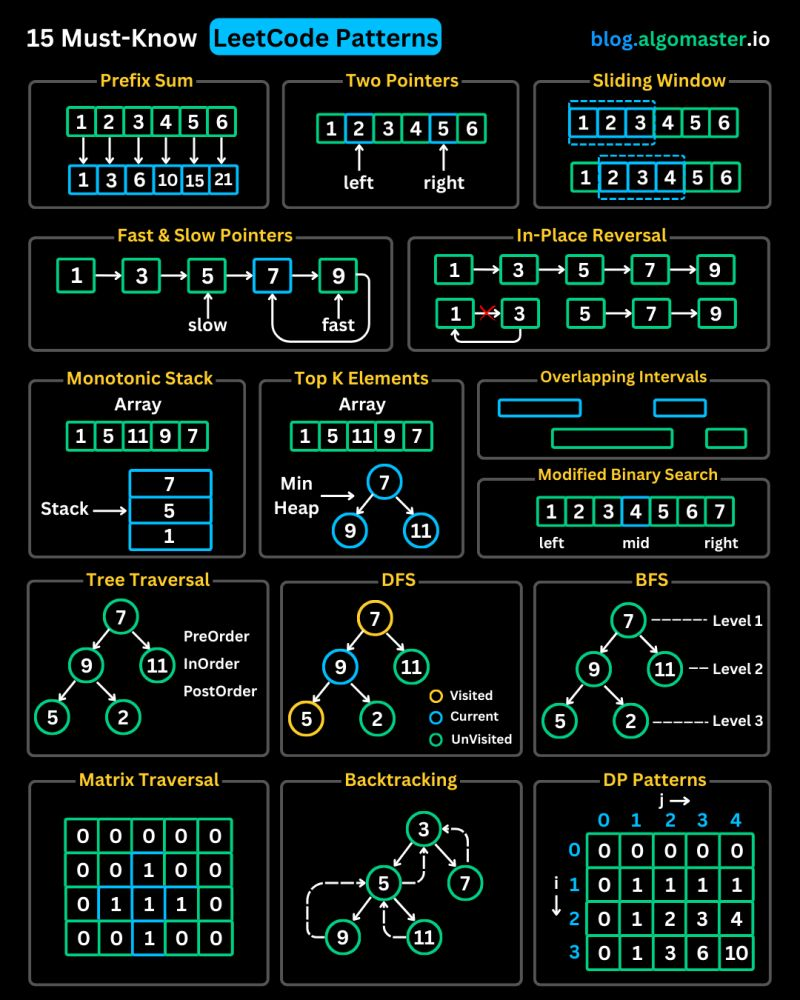

[**Cleuton Sampaio**](https://linkedin.com/in/cleutonsampaio)

[**Veja no GitHub**](https://https://github.com/cleuton/rustingcrab/tree/main/code_samples/leetcode)



[**PORTUGUESE**](./README.md)

I saw this post by [**Ashish Pratap Singh**](https://www.linkedin.com/in/ashishps1?miniProfileUrn=urn%3Ali%3Afsd_profile%3AACoAABT9QE0BiP3CAWgDMTJ5NLKmcGaVCgNn_nI&lipi=urn%3Ali%3Apage%3Ad_flagship3_detail_base%3BqTuSBrb%2BSWC2s8J1moQR%2Fg%3D%3D) on **LinkedIn** and, since I had already written implementations in **Rust** for almost all of these types of problems, I decided to create this page with explanations and source code.

I had to add two or three more, but it turned out really great for you, who are studying for **job interviews**.


## 1) Prefix Sum

**Prefix Sum:** this pattern appears in problems that require quickly calculating the sum of a subarray or answering multiple range sum queries. Typical examples include “Subarray Sum Equals K” (finding how many subarrays have a sum equal to a given value) and “Range Sum Query” (building a structure that returns the sum of elements between two indices in constant time after preprocessing).

Let’s look at a “Subarray Sum Equals K” problem:

Given an integer array `nums` and an integer `k`, return the number of contiguous subarrays whose sum is exactly `k`.
A contiguous subarray is a sequence of adjacent elements in `nums`.

**Examples**


* Input: `nums = [1, 1, 1]`, `k = 2`
  Output: `2`
  Explanation: The subarrays `[1,1]` (indexes 0–1) e `[1,1]` (1–2) result in 2.

* Input: `nums = [1, 2, 3]`, `k = 3`
  Output: `2`
  Explanation: The subarrays `[1,2]` (0–1) e `[3]` (2–2) result in 3.

**Limitations**

* `1 ≤ nums.len() ≤ 2·10⁴`
* `-1000 ≤ nums[i] ≤ 1000`
* `-10⁷ ≤ k ≤ 10⁷`

Here's an implementation: 

```Rust
use std::collections::HashMap;

fn subarray_sum(nums: &[i32], k: i32) -> i32 {
    let mut soma_prefix = 0;
    let mut freq = HashMap::<i32, usize>::new();
    let mut resposta = 0;
    freq.insert(0, 1); // To deal with subarrays that starts on index 0

    for &valor in nums {
        soma_prefix += valor; 
        let comp = soma_prefix - k;
        resposta += freq.get(&(soma_prefix - k)).unwrap_or(&0);
        *freq.entry(soma_prefix).or_insert(0) += 1
    }
    resposta as i32
}

fn main() {
    let nums = vec![1, 1, 1];
    let k = 2;
    let resultado = subarray_sum(&nums, k);
    println!("{}", resultado); // 2

    let nums2 = vec![1, 2, 3];
    let k2 = 3;
    let resultado2 = subarray_sum(&nums2, k2);
    println!("{}", resultado2); // 2

    let nums3 = vec![3, 4, 7, 2, -3, 1, 4, 2];
    let resultado3 = subarray_sum(&nums3, 7);
    println!("{}", resultado3); // 4
}
```

This function counts, in linear time, how many subarrays with sum equal to `k` exist in a slice by maintaining a running sum and a `HashMap` that stores how many times each prefix sum value has already appeared, starting with `0→1` to account for subarrays that begin at index 0. For each element, you update the sum, check how many times `(prefix_sum - k)` has already been seen, since each occurrence represents a valid subarray, and then increment the frequency of the current `prefix_sum`. In `main`, there are just three test cases illustrating this behavior.


---

## 2) Two Pointers

**Two Pointers:** consists of using two indices that move in different directions, or at different speeds, within the same array to reduce complexity. Classic problems include “Container With Most Water” (maximizing the area between two lines).

A classic problem is:

Given an unsorted array of integers, return the indices of two elements whose sum equals the given target value. Assume that each input has one and only one solution, and that it is not allowed to use the same array element more than once.
You may return the indices in any order.

Example:

* Array: 2,7,11,15, target: 9;
* Result: 0,1 (or 1,0);
* Explanation: elements zero and one (2 and 7) are the only ones whose sum is 9 (the target value).

Can you create an implementation with time complexity lower than O(n<sup>2</sup>)?

Here is an implementation using a HashMap with the value and the index:

```Rust
use std::collections::HashMap;

fn two_sum(nums: &[i32], target: i32) -> Option<Vec<i32>> {
    let mut visto = HashMap::<i32, usize>::new();
    let mut resposta = Vec::<i32>::new();
    for (i, &termo) in nums.iter().enumerate() {
        let comp = target - termo;
        if visto.contains_key(&comp) {
            resposta.push(visto[&comp] as i32);
            resposta.push(i as i32);
            return Some(resposta);
        }
        visto.insert(termo, i);
    }
    None
}

fn main() {
    let nums1 = vec![2, 7, 11, 15];
    let target1 = 9;
    if let Some(result) = two_sum(&nums1, target1) {
        println!("{:?}", result); // [0, 1]
    }

    let nums2 = vec![3, 2, 4];
    let target2 = 6;
    if let Some(result) = two_sum(&nums2, target2) {
        println!("{:?}", result); // [1, 2]
    }
}
```

## 3) Sliding Window

**Sliding Window:** useful when you need to extract the best or worst contiguous subsequence of variable length. Common cases include “Longest Substring Without Repeating Characters” (large windows covering the longest segment without repeated characters) and “Minimum Window Substring” (the shortest segment containing all the characters of a pattern).

A classic problem:

Given a string and an array of words of equal length, return the positions where these
words appear concatenated in the original string, in any order.

* Example: "tensotestetestevistatestetenso", ["tenso","teste"]
  Output: [0,20]
* Example: "carroratopenaratoratopanocarrocarrorato", ["carro","pano","rato","carro"]
  Output: [ ]

Here is my implementation:


```Rust
use std::collections::HashMap;

fn encontrar(texto: &str, palavras: &[&str]) -> Option<Vec<usize>> {
    let word_len = palavras[0].len();
    let num_words = palavras.len();
    let window_len = word_len * num_words;
    let mut resultados = Vec::new();

    // frequency map
    let mut target_count = HashMap::new();
    for &w in palavras {
        *target_count.entry(w).or_insert(0) += 1;
    }

    // for each possible alignment within the word length
    for offset in 0..word_len {
        let mut left = offset;
        let mut right = offset;
        let mut seen = HashMap::new();
        let mut count = 0;

        // Slide the window in word_len blocks
        while right + word_len <= texto.len() {
            let word = &texto[right..right + word_len];
            right += word_len;

            if target_count.contains_key(word) {
                // count the word 
                *seen.entry(word).or_insert(0) += 1;
                count += 1;

                // if it exceeds the occurrence limit, move left until it balances
                while seen[word] > target_count[word] {
                    let left_word = &texto[left..left + word_len];
                    *seen.get_mut(left_word).unwrap() -= 1;
                    left += word_len;
                    count -= 1;
                }

                // Whole window
                if count == num_words {
                    resultados.push(left);
                }
            } else {
                // unexpected word
                seen.clear();
                count = 0;
                left = right;
            }
        }
    }

    if resultados.is_empty() {
        None
    } else {
        Some(resultados)
    }
}

fn main() {
    let exemplos = [
        ("tensotestetestevistatestetenso", &["tenso", "teste"][..]),
        ("calpazcompazumacalcompesumapazcal", &["cal", "uma", "paz"][..]),
        ("carroratopenaratoratopanocarrocarrorato", &["carro", "pano", "rato", "carro"][..]),
    ];

    for &(texto, palavras) in &exemplos {
        match encontrar(texto, palavras) {
            Some(idxs) => println!("{:?}", idxs),
            None => println!("[]"),
        }
    }
}
```

The function `encontrar` first computes the length of each word and the total window length (words × size), then builds a `HashMap` (`target_count`) with the frequency of each target word. For each possible “offset” within a word, it slides two pointers (`left` and `right`) in steps equal to the word length, maintaining another `HashMap` (`seen`) that counts how many times each word has entered the window. If it encounters an unexpected word, it clears everything and restarts the window; if it exceeds the desired frequency, it advances `left` until it balances; and whenever the number of seen words reaches the required total, it records the index `left`. In the end, it returns `Some(vector of indices)` or `None` if there are no solutions. We can consider this implementation as `O(n)`.

---

## 4) Fast & Slow Pointers

**Fast & Slow Pointers:** also known as tortoise and hare, is used to detect cycles or find middle points in sequential structures. Examples include “Linked List Cycle” (detecting if there is a cycle in a linked list), “Linked List Cycle II” (finding the start of the cycle), and “Middle of the Linked List” (finding the middle node).

A typical problem:

**Middle of the Linked List**
Given the head of a singly linked list, return the node that is in the middle of the list. If the list has an even number of elements, return the second of the two middle nodes.

**Examples**

1. Input: `1 → 2 → 3 → 4 → 5`
   Output: node with value `3`
   Explanation: at the end, `slow` moves 3 steps (1→2→3) while `fast` goes 1→3→5 and stops at `None`.

2. Input: `1 → 2 → 3 → 4`
   Output: node with value `3`
   Explanation: here the list has 4 nodes. After two advances of `fast` (1→3→None), `slow` is at 3, the second of the middle pair (2 and 3).

My implementation:


```Rust
use std::collections::LinkedList;

fn encontrar_meio(lista: &LinkedList<i32>) -> Option<&i32> {
    // iterators for `slow` (1 step) and `fast` (2 steps)
    let mut slow = lista.iter();
    let mut fast = lista.iter();
    // already takes the first element or returns None if empty
    let mut mid = slow.next()?;

    // while `fast` can take at least one step...
    while fast.next().is_some() {
        // try second step
        if fast.next().is_some() {
            // then advances to slow
            if let Some(val) = slow.next() {
                mid = val;
            }
        } else {
            // Fast cannot do another step
            break;
        }
    }

    Some(mid)
}

fn main() {
    //  [1,2,3,4,5], middle → 3
    let mut l1 = LinkedList::new();
    l1.extend([1, 2, 3, 4, 5]);
    println!("{:?}", encontrar_meio(&l1)); // add(3)

    //  [10,14,29,55,65,89], middle numbers 29 e 55 → return 55
    let mut l2 = LinkedList::new();
    l2.extend([10, 14, 29, 55, 65, 89]);
    println!("{:?}", encontrar_meio(&l2)); // add(55)

    // empty → None
    let l3: LinkedList<i32> = LinkedList::new();
    println!("{:?}", encontrar_meio(&l3)); // None
}
```

I used two iterators over the list, `slow` and `fast`. First, I take the first element into `mid` or return `None` if the list is empty. Then, in a loop, I do:

* If `fast` can advance twice, then I advance `slow` once and update `mid` to this new `slow` node.
* If `fast` cannot make the second advance, I stop, as this happens exactly when there is an even number of nodes, and `mid` has already been adjusted to the “second” of the central pair.

In the end, `mid` points to the correct value, the middle node in odd-length lists or the second middle node in even-length lists, and the function returns `Some(mid)`.

## 5) LinkedList In-place Reversal

**LinkedList In-place Reversal:** focuses on reversing node links without allocating extra memory. Highlights include “Reverse Linked List” (reversing the entire list) and “Reverse Nodes in k-Group” (reversing blocks of k nodes at a time while keeping the rest intact).

A problem in this category would be:

Given the head of a singly linked list, write a function that reverses all pointers in order to return the new head, without using additional memory beyond a few temporary variables.

**Examples**

* Input: `1 → 2 → 3 → 4 → 5 → None`
  Output: `5 → 4 → 3 → 2 → 1 → None`

* Input: `1 → 2 → None`
  Output: `2 → 1 → None`

* Input: `None`
  Output: `None`

```Rust
use std::collections::LinkedList;

fn reverse_list<T>(list: &mut LinkedList<T>) {
    let mut rev = LinkedList::new();
    // keeps removing from the front of the original list and pushing to the front of the new one
    while let Some(elem) = list.pop_front() {
        rev.push_front(elem);
    }
    // replaces the contents of the original list with the reversed one
    *list = rev;
}

fn main() {
    let mut lista = LinkedList::from([1, 2, 3, 4, 5]);
    println!("Original: {:?}", lista);
    reverse_list(&mut lista);
    println!("Inverted: {:?}", lista);
}

```

The function receives a `&mut LinkedList<T>`, creates an empty auxiliary list `rev`, then, while the original is not empty, it performs `pop_front()` (`O(1)`) and immediately `push_front(elem)` into `rev` (`O(1)`), thus reversing the order of the nodes. When finished, it does `*lista = rev`, replacing all the contents of `lista` with those of `rev`; the old nodes are safely removed by Rust, without leaving dangling references. Since each element is moved exactly once, the time is **O(n)** and, as there is no extra allocation beyond temporary pointers, the extra space is **O(1)**.

---

## 6) Monotonic Stack

**Monotonic Stack:** a stack that grows or shrinks in ordered fashion to quickly answer “next greater” or “next smaller” queries. Typical problems include “Next Greater Element” and “Daily Temperatures” (calculating in how many days the future temperature will be higher).

A typical problem:

**Next Greater Element**
Given an array of integers, for each element find the first value to its right that is greater; if none exists, use −1.

**Description**
You are given `nums: Vec<i32>`. Return a vector `res` of the same size, where

```text
res[i] = the first nums[j] > nums[i] with j > i, or −1 if there is none.
```

* Time complexity: `O(n)`.

**Examples**

* Input: `[2, 1, 2, 4, 3]`
  Output:   `[4, 2, 4, -1, -1]`
* Input: `[5, 4, 3, 2, 1]`
  Output:   `[-1, -1, -1, -1, -1]`
* Input: `[1, 3, 2, 5]`
  Output:   `[3, 5, 5, -1]`

My implementation:

```Rust
fn encontrar_proximo_maior(numeros: &[i32]) -> Vec<i32> {
    let mut resultado = vec![-1; numeros.len()];
    let mut pilha = Vec::new();

    for i in (0..numeros.len()).rev() {
        let numero = numeros[i];

        // Remove elements less than or equal to the current element
        while let Some(&topo) = pilha.last() {
            if topo <= numero {
                pilha.pop();
            } else {
                break;
            }
        }

        // Are there elements?
        if let Some(&topo) = pilha.last() {
            resultado[i] = topo;
        }

        // Add current number to the Stack
        pilha.push(numero);
    }

    resultado
}

fn main() {
    let numeros = vec![2, 1, 2, 4, 3];
    let resultado = encontrar_proximo_maior(&numeros);
    println!("{:?}", resultado); // Saída: [4, 2, 4, -1, -1]
}
```

The code iterates through the array from right to left. For each element, it removes from the stack everything that is smaller than or equal to it. What remains at the top of the stack is the next greater element. If there is nothing, it becomes -1. The current element is added to the stack at the end. It runs in O(n).

---

## 7) Top ‘K’ Elements

**Top ‘K’ Elements:** extracting the k largest, smallest, or most frequent values using a heap or linear selection. Examples include “Top K Frequent Elements” (finding the k most common elements in an array) and “Kth Largest Element in an Array” (finding the k-th largest value).

Here is a typical problem:

**Top K Frequent Elements**
Given a non-empty array of integers and an integer k, return the k elements that appear most frequently.

For example:

* Input: `nums = [1,1,1,2,2,3]`, `k = 2`
  Output: `[1,2]`
  Explanation: the number 1 appears 3 times, 2 appears 2 times, and 3 appears 1 time; the two most frequent are `[1,2]`.

* Input: `nums = [4,4,5,5,6]`, `k = 1`
  Output: `[4]`
  Explanation: 4 and 5 both appear 2 times, but since we only want one element, either of the two is valid.

* Input: `nums = [7]`, `k = 1`
  Output: `[7]`

My implementation:

```Rust
use std::collections::{HashMap, BinaryHeap};
use std::cmp::Reverse;

fn top_k_frequente(nums: Vec<i32>, k: i32) -> Vec<i32> {
    let k = k as usize;
    let mut contagem = HashMap::new();
    for num in nums {
        *contagem.entry(num).or_insert(0) += 1;
    }

    // frequency min-heap 
    let mut heap: BinaryHeap<Reverse<(i32, i32)>> = BinaryHeap::new();
    for (&num, &qtd) in &contagem {
        heap.push(Reverse((qtd, num)));
        if heap.len() > k {
            heap.pop(); // remove the element with smaller frequency
        }
    }

    // extract only the remaining numbers
    heap.into_iter()
        .map(|Reverse((_, num))| num)
        .collect()
}

fn main() {
    let nums = vec![1, 1, 1, 2, 2, 3];
    let k = 2;
    let res = top_k_frequente(nums, k);
    println!("{:?}", res); // output: [1, 2] (ou [2, 1])
}
```

The function starts by counting the frequency of each number using a `HashMap`. Then, it uses a **min-heap** to keep only the `k` elements with the highest frequency: whenever the heap has more than `k` elements, it removes the one with the lowest frequency. This way, in the end, exactly the `k` most frequent elements remain. The complexity is `O(n log k)`, which is efficient for large inputs.

---

## 8) Overlapping Intervals

**Overlapping Intervals:** dealing with intervals that overlap, usually requiring sorting and merging. “Merge Intervals” (combining overlapping segments), “Insert Interval” (inserting and merging), and “Meeting Rooms II” (calculating the minimum number of rooms for schedules).

Here is a very typical problem of this kind:

You have several activities to do, each with a start and end time. Choose the largest number of activities that you can perform in a day, considering that you can only do one of them at a time. Two arrays are provided: one with the start times of the activities and another with the end times. Show the start and end times of the selected activities.

**Examples**:

* start = [9,10,12,12,13,16,15]
* end = [11,13,13,17,15,20,17]
* Result = [9,11], [12,13], [13,15], [15, 17]

My implementation:

```Rust
fn atividades(inicios: &[i32], terminos: &[i32]) -> Vec<(i32, i32)> {
    let mut atividades_ordenadas: Vec<(i32, i32)> = inicios.iter().zip(terminos.iter()).map(|(&inicios, &terminos)| (inicios, terminos)).collect();
    atividades_ordenadas.sort_by_key(|&(_, end)| end);
    
    let mut selecionadas = Vec::new();
    if let Some(&first) = atividades_ordenadas.first() {
        selecionadas.push(first);
    }
    
    for &current in atividades_ordenadas.iter().skip(1) {
        if current.0 >= selecionadas.last().unwrap().1 {
            selecionadas.push(current);
        }
    }
    
    selecionadas
}
    

fn main() {
    let inicios = vec![9, 10, 12, 12, 13, 16, 15];
    let terminos = vec![11, 13, 13, 17, 15, 20, 17];
    let resultado = atividades(&inicios, &terminos);
    println!("{:?}", resultado); // [(9,11),(12,13),(13,15),(15,17)]
}
```

The code selects the maximum number of non-overlapping intervals using a greedy strategy, sorting the intervals by their end time and always choosing the first one that starts after the end of the last selected interval. This guarantees the largest possible number of conflict-free intervals. The complexity is O(n log n) because of the sorting, where n is the number of intervals. The rest of the algorithm is linear.

---

## 9) Modified Binary Search

**Modified Binary Search:** adapting binary search for non-trivial situations. Common cases are “Search in Rotated Sorted Array” (searching in a rotated array) and “Find Peak Element” (finding a local peak).

A typical problem:

Given two sorted slices `A` (size n) and `B` (size m), find in `O(log n + log m)` time the median of the sorted concatenation of `A` and `B`. If `(n+m)` is odd, it is the middle element; if even, it is the average of the two middle values.

Examples

* A=[1,3,7,9], B=[1,5,9,20] → median = 6
* A=[1,3,7,9], B=[1,9,20] → median = 7
* A=[1,1,1,2], B=[3,4,8,9,10,10] → median = 3.5
* A=[1,2,3,3,5], B=[8,11,13] → median = 4
* A=[] , B=[1] → median = 1

Here is my implementation:

```Rust
fn mediana(slice1: &[i32], slice2: &[i32]) -> f64 {
    let tamanho1 = slice1.len() as isize;
    let tamanho2 = slice2.len() as isize;
    let total = tamanho1 + tamanho2;
    let metade = (total + 1) / 2;

    // partition indices in slice1 and slice2 may become negative or go beyond the end
    let mut fa = (tamanho1 + 1) / 2 - 1;
    let mut fb = metade - (fa + 1) - 1;

    loop {
        // takes the value or +/− infinity if out of bounds
        let p1  = if fa  < 0          { i32::MIN } else { slice1[fa  as usize] };
        let p1o = if fa+1 >= tamanho1    { i32::MAX } else { slice1[(fa+1) as usize] };
        let p2  = if fb  < 0          { i32::MIN } else { slice2[fb  as usize] };
        let p2o = if fb+1 >= tamanho2    { i32::MAX } else { slice2[(fb+1) as usize] };

        // correct partition?
        if p1 <= p2o && p2 <= p1o {
            return if total % 2 == 0 {
                (p1.max(p2) as f64 + p1o.min(p2o) as f64) / 2.0
            } else {
                p1.max(p2) as f64
            };
        }

        // adjust fa/fb
        if p1 <= p2o {
            fa += 1;
            fb -= 1;
        } else {
            fa -= 1;
            fb += 1;
        }
    }
}

fn main() {
    println!("{}", mediana(&[],      &[1]));                       // 1.0
    println!("{}", mediana(&[2],     &[]));                        // 2.0
    println!("{}", mediana(&[0, 0],  &[0, 0]));                    // 0.0
    println!("{}", mediana(&[1,3,7,9], &[1,5,9,20]));              // 6.0
    println!("{}", mediana(&[1,3,7,9], &[1,9,20]));                // 7.0
    println!("{}", mediana(&[1,1,1,2], &[3,4,8,9,10,10]));         // 3.5
    println!("{}", mediana(&[1,2,3,3,5], &[8,11,13]));             // 4.0
}
```

This function computes the median of two sorted slices without fully merging them, using partition indices (`fa` and `fb`) that may extend beyond the bounds to simulate infinite sentinels. In each iteration, it compares the elements to the left and right of these partitions—treating them as `i32::MIN` or `i32::MAX` when out of bounds—to determine whether the split between the two halves is balanced; when it finds the ideal partition, it returns the middle element, or the average of the two middle elements in the case of an even total. Otherwise, it adjusts `fa` and `fb` in a binary manner by incrementing one and decrementing the other until it converges to the correct position in logarithmic time `O(log n)`.

---

## 10) Binary Tree Traversal

**Binary Tree Traversal:** traverses trees in pre-order, in-order, post-order, or variations to solve problems ranging from printing values to validating structure. Simple problems include “Binary Tree Inorder Traversal” and “Validate Binary Search Tree”.

Here is a problem of this type, a bit larger, but one that illustrates it well:

Given a list containing a year and a historical event, build a tree with those years and find the lowest common ancestor node for two given years. Show how to traverse it in pre-order, in-order, and post-order:

(The list is in Portuguese, but this does not matter)

- 1958,"Brasil é campeão mundial de futebol na Suécia";
- 1962,"Eleição do Papa Paulo VI";
- 1954,"Primeiro transplante de órgão - Rim";
- 1962,"Crise dos mísseis em Cuba";
- 1951,"Getúlio Vargas assume seu segundo mandato de Presidente";
- 1955,"Primeira vacina contra poliomielite";
- 1960,"Inauguração de Brasília";
- 1949,"Criação da OTAN";
- 1959,"Criação da SUDENE";
- 1952,"Detonação da primeira bomba de hidrogênio";
- 1961,"Iuri Gagarin se torna o primeiro humano a ir ao espaço";
- 1958,"Revolução Cubana";
- 1963,"Lançamento do álbum de estréias do Beatles";
- 1950,"Uruguai derrota o Brasil no Maracanã e se torna campeão mundial de futebol";
- 1957,"Lançamento do primeiro satélite artificial - Sputnik";
- 1956,"Elvis Presley lança seu primeiro álbum musical";
- 1953,"Getúlio Vargas cria a Petrobras";

My implementation: 

```Rust
use std::collections::BTreeMap;

enum Arvore {
    Vazio,
    No(i32, Box<Arvore>, Box<Arvore>),
}

fn construir_arvore(anos: &[i32]) -> Arvore {
    if anos.is_empty() {
        Arvore::Vazio
    } else {
        let meio = anos.len() / 2;
        Arvore::No(
            anos[meio],
            Box::new(construir_arvore(&anos[..meio])),
            Box::new(construir_arvore(&anos[meio + 1..])),
        )
    }
}

fn pesquisar(arvore: &Arvore, ano: i32) -> bool {
    match arvore {
        Arvore::Vazio => false,
        Arvore::No(valor, esq, dir) if *valor == ano => true,
        Arvore::No(valor, esq, dir) if ano < *valor => pesquisar(esq, ano),
        Arvore::No(_, _, dir) => pesquisar(dir, ano),
    }
}

fn ancestral_comum(arvore: &Arvore, a: i32, b: i32) -> Option<i32> {
    let (menor, maior) = if a < b { (a, b) } else { (b, a) };
    match arvore {
        Arvore::Vazio => None,
        Arvore::No(valor, esq, dir) if maior < *valor => ancestral_comum(esq, menor, maior),
        Arvore::No(valor, esq, dir) if menor > *valor => ancestral_comum(dir, menor, maior),
        Arvore::No(valor, _, _) => Some(*valor),
    }
}

fn pre_ordem(arvore: &Arvore, saida: &mut Vec<i32>) {
    if let Arvore::No(valor, esq, dir) = arvore {
        saida.push(*valor);
        pre_ordem(esq, saida);
        pre_ordem(dir, saida);
    }
}

fn em_ordem(arvore: &Arvore, saida: &mut Vec<i32>) {
    if let Arvore::No(valor, esq, dir) = arvore {
        em_ordem(esq, saida);
        saida.push(*valor);
        em_ordem(dir, saida);
    }
}

fn pos_ordem(arvore: &Arvore, saida: &mut Vec<i32>) {
    if let Arvore::No(valor, esq, dir) = arvore {
        pos_ordem(esq, saida);
        pos_ordem(dir, saida);
        saida.push(*valor);
    }
}

fn main() {
    let mut mapa_eventos = BTreeMap::new();
    mapa_eventos.insert(1958, "Brasil é campeão mundial de futebol na Suécia");
    mapa_eventos.insert(1962, "Eleição do Papa Paulo VI");
    mapa_eventos.insert(1954, "Primeiro transplante de órgão - Rim");
    mapa_eventos.insert(1962, "Crise dos mísseis em Cuba");
    mapa_eventos.insert(1951, "Getúlio Vargas assume seu segundo mandato");
    mapa_eventos.insert(1955, "Primeira vacina contra poliomielite");
    mapa_eventos.insert(1960, "Inauguração de Brasília");
    mapa_eventos.insert(1949, "Criação da OTAN");
    mapa_eventos.insert(1959, "Criação da SUDENE");
    mapa_eventos.insert(1952, "Primeiro teste de bomba de hidrogênio");
    mapa_eventos.insert(1961, "Iuri Gagarin primeiro humano no espaço");
    mapa_eventos.insert(1958, "Revolução Cubana");
    mapa_eventos.insert(1963, "Estreia do primeiro álbum dos Beatles");
    mapa_eventos.insert(1950, "Uruguai campeão mundial no Maracanã");
    mapa_eventos.insert(1957, "Lançamento do Sputnik");
    mapa_eventos.insert(1956, "Elvis Presley lança primeiro álbum");
    mapa_eventos.insert(1953, "Getúlio Vargas cria a Petrobras");

    let anos: Vec<i32> = mapa_eventos.keys().cloned().collect();
    let arvore = construir_arvore(&anos);

    println!("Existe 1954? {}", pesquisar(&arvore, 1954));
    println!("Existe 1952? {}", pesquisar(&arvore, 1952));

    if let Some(anc) = ancestral_comum(&arvore, 1953, 1954) {
        println!("LCA 1953–1954: {}", mapa_eventos[&anc]);
    }
    if let Some(anc) = ancestral_comum(&arvore, 1958, 1963) {
        println!("LCA 1958–1963: {}", mapa_eventos[&anc]);
    }

    let mut v = Vec::new();
    pre_ordem(&arvore, &mut v);
    println!("Pré-ordem: {:?}", v);
    v.clear();
    em_ordem(&arvore, &mut v);
    println!("Em-ordem: {:?}", v);
    v.clear();
    pos_ordem(&arvore, &mut v);
    println!("Pós-ordem: {:?}", v);
}

```

The implementation builds a **balanced binary search tree** from a sorted list of years using recursive division at the midpoint. The traversals (pre-order, in-order, and post-order) walk the tree as expected. The search and the lowest common ancestor follow standard BST logic.

* **Search:** `O(log n)` — fast, because the tree is balanced.
* **In-order:** `O(n)` — visits all nodes once.
* **Pre-order:** `O(n)` — same, visits all nodes.
* **Post-order:** `O(n)` — also visits all nodes.

---

## 11) Depth-First Search (DFS)

**Depth-First Search (DFS):** recursively explores paths to the end before backtracking. It is used in “Path Sum” (checking the sum along a path), “Number of Islands” (counting islands by marking water and land), and cycle detection in graphs.

Here is an example of a typical problem:

Given a list of pairs of cities connected by roads, indicate whether it is possible to go from a given city, the source, to another city, the destination.

```
                 [['b','f'],['a','b'],['d','e'],['a','c'],['c','d'],['f','e'],['b','c'],['j','k'],['c','e']]
```

My implementation: 

```Rust
use std::collections::{HashMap, HashSet};

/// Checks via DFS whether there is a directed path from `origem` (origin) to `destino` (destination)
fn existe_caminho_dfs(arestas: &[(char, char)], origem: char, destino: char) -> bool {
    // Builds the adjacency list
    let mut grafo: HashMap<char, Vec<char>> = HashMap::new();
    for &(de, para) in arestas {
        grafo.entry(de).or_default().push(para);
    }
    // Set of visited nodes to avoid loops
    let mut visitadas = HashSet::new();
    // Invoke initial DFS
    dfs(origem, destino, &grafo, &mut visitadas)
}

fn dfs(
    atual: char,
    destino: char,
    grafo: &HashMap<char, Vec<char>>,
    visitadas: &mut HashSet<char>,
) -> bool {
    if atual == destino {
        return true;
    }
    // Marks before recursion to avoid revisiting
    visitadas.insert(atual);
    // Explore each neighbor (vizinho)
    if let Some(vizinhos) = grafo.get(&atual) {
        for &vizinho in vizinhos {
            if !visitadas.contains(&vizinho) {
                if dfs(vizinho, destino, grafo, visitadas) {
                    return true;
                }
            }
        }
    }
    false
}

fn main() {
    let rede = [
        ('b','f'), ('a','b'), ('d','e'),
        ('a','c'), ('c','d'), ('f','e'),
        ('b','c'), ('j','k'), ('c','e'),
    ];
    println!("{}", existe_caminho_dfs(&rede, 'a', 'e')); // true
    println!("{}", existe_caminho_dfs(&rede, 'a', 'k')); // false

    let rede2 = [
        ('d','f'), ('d','c'), ('c','e'),
        ('b','d'), ('b','c'), ('a','b'), ('f','e'),
    ];
    println!("{}", existe_caminho_dfs(&rede2, 'a', 'e')); // true
}

```

This code implements a depth-first search (DFS) to check whether there is a path from `origem` to `destino` in a directed graph. It uses recursion to explore each path to the end before backtracking. The complexity is `O(V + E)`, where `V` is the number of nodes and `E` is the number of edges in the graph.

DFS explores a path to the end using recursion or a stack, while BFS explores level by level using a queue. Both have complexity `O(V + E)`, but BFS guarantees the shortest path in an unweighted graph, and DFS is useful for tasks such as cycle detection or topological ordering.

---

## 12) Breadth-First Search (BFS)

**Breadth-First Search (BFS):** progresses level by level, ideal for finding the shortest path in unweighted graphs or trees. Examples include “Word Ladder” (transforming one word into another with the minimum number of steps) and “Binary Tree Level Order Traversal”.

A typical problem would be:

Given a list of pairs of cities connected by roads, determine the shortest route between two given cities.


```
            {'b','f'},{'a','b'},{'d','e'},
            {'a','c'},{'c','d'},{'f','e'},
            {'b','c'},{'c','e'}
```

My implementation: 

```Rust
use std::collections::{HashMap, VecDeque};

fn menor_caminho(arestas: &[(char, char)], inicio: char, fim: char) -> Vec<char> {
    // Builds the adjacency list
    let mut grafo: HashMap<char, Vec<char>> = HashMap::new();
    for &(a, b) in arestas {
        grafo.entry(a).or_default().push(b);
        grafo.entry(b).or_default().push(a);
    }

    // Maps each node to its predecessor in the search
    let mut anteriores: HashMap<char, char> = HashMap::new();
    // BFS Queue
    let mut fila: VecDeque<char> = VecDeque::new();
    // Mark visited
    let mut visitados: HashMap<char, bool> = HashMap::new();

    fila.push_back(inicio);
    visitados.insert(inicio, true);

    // Run BFS until find `fim` or empty
    while let Some(cidade) = fila.pop_front() {
        if cidade == fim {
            // Rebuild transverse path
            let mut caminho = vec![fim];
            let mut atual = fim;
            while let Some(&ant) = anteriores.get(&atual) {
                caminho.push(ant);
                atual = ant;
            }
            caminho.reverse();
            return caminho;
        }
        for &vizinho in &grafo[&cidade] {
            if !visitados.get(&vizinho).copied().unwrap_or(false) {
                visitados.insert(vizinho, true);
                anteriores.insert(vizinho, cidade);
                fila.push_back(vizinho);
            }
        }
    }

    // If the path is not found
    Vec::new()
}

fn main() {
    let rede1 = [
        ('b','f'), ('a','b'), ('d','e'),
        ('a','c'), ('c','d'), ('f','e'),
        ('b','c'), ('c','e'),
    ];
    let rota1 = menor_caminho(&rede1, 'a', 'e');
    println!("{:?}", rota1); // ['a', 'c', 'e']

    let rede2 = [
        ('d','f'), ('d','c'), ('c','e'),
        ('b','d'), ('b','c'), ('a','b'), ('f','e'),
    ];
    let rota2 = menor_caminho(&rede2, 'a', 'e');
    println!("{:?}", rota2); // ['a', 'b', 'c', 'e']
}
```

The function implements a breadth-first search (BFS) to find the **shortest path** in an unweighted graph, using a queue (`VecDeque`), an adjacency list, and a predecessor map to reconstruct the path.

It works as follows:

* Builds the graph from the edges.
* Performs BFS starting from the initial node.
* Records where each visited node came from.
* When it reaches the destination, it reconstructs the path back.

Complexity: `O(V + E)` — it visits each vertex and edge once.

---

## 13) Matrix Traversal

**Matrix Traversal:** adaptations of DFS/BFS or special pointer techniques for grids. “Number of Islands” on a matrix, “Rotting Oranges” (spread of rot), and “Spiral Matrix” (listing elements in spiral order) are classic cases.

Here is an example of a problem:

Sorry for the confusion. In “Matrix Traversal” we are talking about traversing a **2D grid**, not a graph adjacency matrix. A classic and simple example is:

**Number of Islands**
Given a matrix of characters where `'1'` represents land and `'0'` represents water, count how many “islands” exist — regions of `'1'` connected vertically or horizontally.

For example, in this grid:


```
1 1 0 0 0
1 1 0 0 0
0 0 1 0 0
0 0 0 1 1
```

there are three islands:

* One in the upper-left corner (four connected ‘1’s),
* One isolated in the middle (a single ‘1’),
* And one in the lower-right corner (two connected ‘1’s).

Another example:

```
1 0 1 1
1 0 0 1
0 0 1 0
```

there are three islands:

* the region `[(0,0),(1,0)]`,
* the block `[(0,2),(0,3),(1,3)]`,
* and the point `(2,2)`.

This problem is solved exactly with **DFS** or BFS on the **grid**: you scan each cell, and when you find an unvisited `'1'`, you trigger a DFS that “floods” that island by marking all connected cells, increment the counter, and continue until the entire grid has been examined.

My implementation:


```Rust
fn contar_ilhas(grid: &mut Vec<Vec<char>>) -> usize {
    let linhas = grid.len();
    if linhas == 0 { return 0; }
    let colunas = grid[0].len();
    let mut total = 0;

    for i in 0..linhas {
        for j in 0..colunas {
            if grid[i][j] == '1' {
                total += 1;
                inundar_ilha(grid, i, j, linhas, colunas);
            }
        }
    }
    total
}

/// Recursively marks all cells connected to the island at (i, j) as '0'
fn inundar_ilha(
    grid: &mut Vec<Vec<char>>,
    i: usize,
    j: usize,
    linhas: usize,
    colunas: usize,
) {
    // If it is out of bounds or already water, nothing to do
    if i >= linhas || j >= colunas || grid[i][j] != '1' {
        return;
    }
    // “Floods” the cell, avoiding revisits
    grid[i][j] = '0';

    // Try 4 directions
    if i > 0 {
        inundar_ilha(grid, i - 1, j, linhas, colunas);
    }
    if i + 1 < linhas {
        inundar_ilha(grid, i + 1, j, linhas, colunas);
    }
    if j > 0 {
        inundar_ilha(grid, i, j - 1, linhas, colunas);
    }
    if j + 1 < colunas {
        inundar_ilha(grid, i, j + 1, linhas, colunas);
    }
}

fn main() {
    let mut exemplo1 = vec![
        vec!['1','1','0','0','0'],
        vec!['1','1','0','0','0'],
        vec!['0','0','1','0','0'],
        vec!['0','0','0','1','1'],
    ];
    println!("Ilhas no exemplo1: {}", contar_ilhas(&mut exemplo1)); // 3

    let mut exemplo2 = vec![
        vec!['1','0','1','1'],
        vec!['1','0','0','1'],
        vec!['0','0','0','0'],
    ];
    println!("Ilhas no exemplo2: {}", contar_ilhas(&mut exemplo2)); // 2
}
```

The function `contar_ilhas` uses depth-first search (DFS) to identify and count islands in a matrix of `'1'` and `'0'`. Each time it finds a `'1'`, it starts a recursive flood (`inundar_ilha`) that marks the entire island as visited by turning it into `'0'`. The complexity is **O(m × n)**, where `m` is the number of rows and `n` is the number of columns, since each cell is visited at most once.

14. Backtracking

**Backtracking:** systematic trial and error to build partial solutions and undo them as needed. It is used for “Permutations”, “Combination Sum”, and “N-Queens”, where each choice opens multiple paths to explore.

Here is an example of a problem:

Given the number of rows and columns, generate a **perfect maze** (that is, connected and without cycles) on a 2D grid by removing walls between neighboring cells randomly and backtracking whenever there are no options left. Mark cell (0,0) as the **start** and (rows−1,columns−1) as the **end**. After building the maze, find a path from the entrance to the exit, returning the sequence of coordinates that leads to the destination.

My implementation:

```Rust
use rand::Rng;
use std::fmt;

// Definition of the `Celula` struct (maze cell)
struct Celula {
    paredes: [bool; 4], // Walls: North, South, East, West
    visitada: bool,
    inicio: bool,
    fim: bool,
    x: usize,
    y: usize,
}

// directions constants
const NORTE: usize = 0; //North
const SUL: usize = 1; //South
const LESTE: usize = 2; //East
const OESTE: usize = 3; //West

// Stack struct
struct Pilha<T> {
    data: Vec<T>,
}

impl<T> Pilha<T> {
    fn new() -> Self {
        Pilha { data: Vec::new() }
    }

    fn push(&mut self, value: T) {
        self.data.push(value);
    }

    fn pop(&mut self) -> Option<T> {
        self.data.pop()
    }

    fn is_empty(&self) -> bool {
        self.data.is_empty()
    }

    fn top(&self) -> Option<&T> {
        self.data.last()
    }
}

// maze Struct
struct Labirinto {
    linhas: usize,
    colunas: usize,
    celulas: Vec<Vec<Celula>>,
    valido: bool,
    _corrente: Option<(usize, usize)>,
    _proxima: Option<(usize, usize)>,
    _qtd_total: usize,
    _qtd_visitadas: usize,
    pilha: Pilha<(usize, usize)>,
    caminho: Option<Vec<(usize, usize)>>,
}

impl Labirinto {
    // New maze
    fn new(linhas: usize, colunas: usize) -> Self {
        let mut labirinto = Labirinto {
            linhas,
            colunas,
            celulas: Vec::new(),
            valido: false,
            _corrente: None,
            _proxima: None,
            _qtd_total: 0,
            _qtd_visitadas: 0,
            pilha: Pilha::new(),
            caminho: None,
        };
        labirinto.inicializar();
        labirinto
    }

    // Initialize maze
    fn inicializar(&mut self) {
        let mut contador = 0;
        while contador < 4 {
            self.celulas = Vec::new();
            for i in 0..self.linhas {
                let mut linha = Vec::new();
                for j in 0..self.colunas {
                    let celula = Celula {
                        paredes: [true, true, true, true],
                        visitada: false,
                        inicio: false,
                        fim: false,
                        x: j,
                        y: i,
                    };
                    linha.push(celula);
                }
                self.celulas.push(linha);
            }
            self.celulas[0][0].inicio = true;
            self.celulas[self.linhas - 1][self.colunas - 1].fim = true;
            contador += 1;
            self.pilha = Pilha::new();
            self._qtd_visitadas = 0;
            self.criar();
            if !self.fechada(&self.celulas[1][1]) && !self.fechada(&self.celulas[self.linhas - 2][self.colunas - 2]) {
                break;
            }
        }
        if contador < 4 {
            self.valido = true;
        }
    }

    // Method to check if a cell is closed (all walls intact)
    fn fechada(&self, celula: &Celula) -> bool {
        celula.paredes[NORTE] && celula.paredes[SUL] && celula.paredes[LESTE] && celula.paredes[OESTE]
    }

    // Method to create the maze using backtracking
    fn criar(&mut self) {
        self._qtd_total = self.linhas * self.colunas;
        let mut rng = rand::thread_rng();
        let linha = rng.gen_range(0..self.linhas);
        let coluna = rng.gen_range(0..self.colunas);
        self._corrente = Some((linha, coluna));
        self.celulas[linha][coluna].visitada = true;
        if let Some(proxima) = self.pegar_vizinha(linha, coluna) {
            self.celulas[proxima.0][proxima.1].visitada = true;
            self.quebrar_paredes((linha, coluna), proxima);
            self.pilha.push((linha, coluna));
            self._qtd_visitadas += 1;
            self._corrente = Some(proxima);
            self.processa_celula();
        }
    }

    // Method to process cells during maze generation
    fn processa_celula(&mut self) {
        loop {
            if !self.pilha.is_empty() {
                let corrente = self._corrente.unwrap();
                if self.is_dead_end(corrente) || self.celulas[corrente.0][corrente.1].fim || self.celulas[corrente.0][corrente.1].inicio {
                    if let Some(proxima) = self.pilha.pop() {
                        self._corrente = Some(proxima);
                    } else {
                        self._corrente = None;
                    }
                } else {
                    if let Some(proxima) = self.pegar_vizinha(corrente.0, corrente.1) {
                        self.quebrar_paredes(corrente, proxima);
                        self.pilha.push(corrente);
                        self.celulas[proxima.0][proxima.1].visitada = true;
                        self._qtd_visitadas += 1;
                        self._corrente = Some(proxima);
                    }
                }
            } else {
                self.celulas[0][0].paredes[NORTE] = false;
                self.celulas[self.linhas - 1][self.colunas - 1].paredes[SUL] = false;
                return;
            }
        }
    }

    // Method to check whether a cell is a dead end
    fn is_dead_end(&self, celula: (usize, usize)) -> bool {
        let (y, x) = celula;
        if y > 0 && !self.celulas[y - 1][x].visitada {
            return false;
        }
        if y + 1 < self.linhas && !self.celulas[y + 1][x].visitada {
            return false;
        }
        if x > 0 && !self.celulas[y][x - 1].visitada {
            return false;
        }
        if x + 1 < self.colunas && !self.celulas[y][x + 1].visitada {
            return false;
        }
        true
    }

    // Method to break the walls between two cells
    fn quebrar_paredes(&mut self, c1: (usize, usize), c2: (usize, usize)) {
        let (y1, x1) = c1;
        let (y2, x2) = c2;
        if x1 > x2 {
            self.celulas[y1][x1].paredes[OESTE] = false;
            self.celulas[y2][x2].paredes[LESTE] = false;
        } else if x1 < x2 {
            self.celulas[y1][x1].paredes[LESTE] = false;
            self.celulas[y2][x2].paredes[OESTE] = false;
        } else if y1 > y2 {
            self.celulas[y1][x1].paredes[NORTE] = false;
            self.celulas[y2][x2].paredes[SUL] = false;
        } else if y1 < y2 {
            self.celulas[y1][x1].paredes[SUL] = false;
            self.celulas[y2][x2].paredes[NORTE] = false;
        }
    }

    // Method to get an unvisited neighboring cell (vizinha)
    fn pegar_vizinha(&self, y: usize, x: usize) -> Option<(usize, usize)> {
        let mut procurar = true;
        let mut cel = None;
        let mut rng = rand::thread_rng();
        while procurar {
            let vizinha = rng.gen_range(0..4);
            match vizinha {
                NORTE => {
                    if y > 0 && !self.celulas[y - 1][x].visitada {
                        cel = Some((y - 1, x));
                        procurar = false;
                    }
                }
                SUL => {
                    if y + 1 < self.linhas && !self.celulas[y + 1][x].visitada {
                        cel = Some((y + 1, x));
                        procurar = false;
                    }
                }
                LESTE => {
                    if x + 1 < self.colunas && !self.celulas[y][x + 1].visitada {
                        cel = Some((y, x + 1));
                        procurar = false;
                    }
                }
                OESTE => {
                    if x > 0 && !self.celulas[y][x - 1].visitada {
                        cel = Some((y, x - 1));
                        procurar = false;
                    }
                }
                _ => {}
            }
        }
        cel
    }
}

// Maze display
impl fmt::Display for Labirinto {
    fn fmt(&self, f: &mut fmt::Formatter<'_>) -> fmt::Result {
        let mut linhas = vec![vec![' '; (self.colunas * 3) + 1]; self.linhas * 3];
        for z in linhas.iter_mut() {
            z[self.colunas * 3] = '\n';
        }
        for i in 0..self.linhas {
            for j in 0..self.colunas {
                let matriz = self.get_celula(&self.celulas[i][j]);
                self.insert(&mut linhas, &matriz, i, j);
            }
        }
        for linha in linhas {
            for c in linha {
                write!(f, "{}", c)?;
            }
        }
        Ok(())
    }
}

impl Labirinto {
    // Represents a cell
    fn get_celula(&self, cel: &Celula) -> Vec<Vec<char>> {
        let mut linha1 = vec![' ', ' ', ' '];
        let mut linha2 = vec![' ', ' ', ' '];
        let mut linha3 = vec![' ', ' ', ' '];
        if cel.paredes[NORTE] {
            linha1 = vec!['-', '-', '-'];
        }
        if cel.paredes[SUL] {
            linha3 = vec!['-', '-', '-'];
        }
        if cel.paredes[OESTE] {
            linha1[0] = if linha1[0] == '-' { '+' } else { '|' };
            linha2[0] = '|';
            linha3[0] = if linha3[0] == '-' { '+' } else { '|' };
        }
        if cel.paredes[LESTE] {
            linha1[2] = if linha1[2] == '-' { '+' } else { '|' };
            linha2[2] = '|';
            linha3[2] = if linha3[2] == '-' { '+' } else { '|' };
        }
        // Marca o caminho se existir
        if let Some(ref caminho) = self.caminho {
            if caminho.contains(&(cel.y, cel.x)) {
                linha2[1] = '*';
            }
        }
        vec![linha1, linha2, linha3]
    }

    // Insert cell representation
    fn insert(&self, linhas: &mut Vec<Vec<char>>, matriz: &Vec<Vec<char>>, i: usize, j: usize) {
        let linha = i * 2;
        let coluna = j * 2;
        for l in 0..3 {
            for c in 0..3 {
                linhas[linha + l][coluna + c] = matriz[l][c];
            }
        }
    }
}

// Maze solver
struct Solver {
    pilha: Pilha<(usize, usize)>,
    corrente: Option<(usize, usize)>,
    caminho: Vec<(usize, usize)>,
    incrementos: Vec<(isize, isize)>,
    visitadas: Vec<Vec<bool>>,
}

impl Solver {
    // New Solver
    fn new() -> Self {
        Solver {
            pilha: Pilha::new(),
            corrente: None,
            caminho: Vec::new(),
            incrementos: vec![(0, -1), (0, 1), (1, 0), (-1, 0)], // Norte, Sul, Leste, Oeste
            visitadas: Vec::new(),
        }
    }

    // Solve the maze
    fn solve(&mut self, labirinto: &mut Labirinto) {
        self.visitadas = vec![vec![false; labirinto.colunas]; labirinto.linhas];
        self.corrente = Some((0, 0));
        self.pilha.push((0, 0));
        self.procurar(labirinto);
        while let Some(pos) = self.pilha.pop() {
            self.caminho.push(pos);
        }
        labirinto.caminho = Some(self.caminho.clone());
    }

    // Find path thru the maze
    fn procurar(&mut self, labirinto: &Labirinto) {
        let mut buffer = None;
        while !self.pilha.is_empty() {
            let (y, x) = *self.pilha.top().unwrap();
            self.visitadas[y][x] = true;
            if labirinto.celulas[y][x].fim {
                return;
            }
            let mut proxima = None;
            for parede in 0..4 {
                if !labirinto.celulas[y][x].paredes[parede] {
                    let dy = self.incrementos[parede].1;
                    let dx = self.incrementos[parede].0;
                    let ny = y as isize + dy;
                    let nx = x as isize + dx;
                    if ny < 0 || nx < 0 || ny as usize >= labirinto.linhas || nx as usize >= labirinto.colunas {
                        continue;
                    }
                    let ny = ny as usize;
                    let nx = nx as usize;
                    if self.visitadas[ny][nx] {
                        continue;
                    }
                    proxima = Some((ny, nx));
                    if let Some(pos) = buffer {
                        self.pilha.push(pos);
                        buffer = None;
                    }
                    self.pilha.push((ny, nx));
                    self.corrente = Some((ny, nx));
                    break;
                }
            }
            if proxima.is_none() {
                let pos = self.pilha.pop().unwrap();
                self.corrente = Some(pos);
                buffer = Some(pos);
            }
        }
    }
}

fn main() {
    let args: Vec<String> = std::env::args().collect();
    let linhas = if args.len() > 1 { args[1].parse::<usize>().unwrap_or(10) } else { 10 };
    let colunas = if args.len() > 2 { args[2].parse::<usize>().unwrap_or(10) } else { 10 };

    let mut labirinto = Labirinto::new(linhas, colunas);
    println!("{}", labirinto);

    let mut solver = Solver::new();
    solver.solve(&mut labirinto);
    println!("{}", labirinto);
}
```

#### Maze Generation

The maze is generated using a **recursive backtracking algorithm**, with an explicit stack to avoid repetition. The logic is:

* Choose a random starting cell.
* While there are unvisited cells:

  * Randomly choose a neighboring cell that has not yet been visited.
  * Break the wall between the current cell and the neighbor.
  * Push the current cell onto the stack and mark the neighbor as visited.
  * If the current cell has no more available neighbors, backtrack (pop from the stack).

This process builds a connected, acyclic maze.

**Time complexity of generation:**
It is **O(m × n)**, where `m` is the number of rows and `n` is the number of columns. Each cell is visited exactly once, and operations per cell are constant.

#### Maze Solving

The maze is solved using depth-first search (**DFS**), also based on **backtracking**. The `Solver` uses a stack to traverse possible paths:

* Starts from the entrance (position (0,0)).
* At each step, tries to move in one of four directions, as long as the wall is open and the new position has not yet been visited.
* If no path is available, it backtracks to the previous position.
* Stops when it reaches the exit (position (m-1, n-1)).

**Time complexity of solving:**
Also **O(m × n)**. Each cell is visited at most once during the search.

You can find the [**complete maze project here**](https://github.com/cleuton/rustingcrab/tree/main/code_samples/labirinto).

--- 

## 15) Dynamic Programming Patterns

**Dynamic Programming Patterns:** recognition of overlapping subproblems and states. It includes “Climbing Stairs” (simple Fibonacci), “Coin Change” (coins to form a value), and “Longest Increasing Subsequence”, where tables help avoid recomputing results.

Example problem:

Given an array of integers, which may be positive or negative, find the maximum sum that can be obtained by selecting elements such that no two selected elements are adjacent in the array. For example, in

```
[10, –3, 7, 8, –1, 0, 2]  
```

the best choice is to take 10 + 7 + 8 + 2 = 27? No—since 8 and 7 are adjacent, we can only choose one of them, so is the optimal 10 + 7 + 8? Not that either: the algorithm finds that 10 + 7 + 8 + 2 violates the condition, and in fact the maximum valid sum is 10 + 7 + 8 skipping the −1 or 10 + 7 + 2, etc., resulting in 20. In

```
[12, 2, 1, –2, 4, 5]  
```

the best sum without adjacencies is 12 + 1 + 5 = 18. This is the “House Robber” version from LeetCode, a classic dynamic programming pattern in which at each position `i` you choose between keeping the result from `i–1` or adding the value at `i` to the best result from `i–2`.

My implementation:

```Rust
fn maior_soma_sem_adjacentes(valores: &[i32]) -> i32 {
    let n = valores.len();
    if n == 0 {
        return 0;
    }
    if n == 1 {
        return valores[0];
    }

    // dp[i] = greatest possible sum
    let mut dp = vec![0; n];
    dp[0] = valores[0];
    // second element
    dp[1] = valores[0].max(valores[1]);

    for i in 2..n {

        // if you skip element i, keep dp[i-1];
        // if you choose element i, sum dp[i-2] + values[i]

        dp[i] = dp[i - 1].max(dp[i - 2] + valores[i]);
    }

    // last dp value is the answer
    dp[n - 1]
}

fn main() {
    let exemplo1 = vec![10, -3, 7, 8, -1, 0, 2];
    let exemplo2 = vec![12, 2, 1, -2, 4, 5];

    println!(
        "Maior soma sem adjacentes em {:?} = {}",
        exemplo1,
        maior_soma_sem_adjacentes(&exemplo1)
    ); // 20

    println!(
        "Maior soma sem adjacentes em {:?} = {}",
        exemplo2,
        maior_soma_sem_adjacentes(&exemplo2)
    ); // 18
}

```

This code implements a **dynamic programming** solution for the classic problem of finding the **maximum sum of non-adjacent elements** in an array.

It works as follows:

For each position `i`, it computes the maximum possible sum up to that point, using the relation:

```rust
dp[i] = max(dp[i - 1], dp[i - 2] + valores[i])

```
This means you choose between keeping the previous best sum or including the current value added to the best sum two indices before.

This approach is typical of dynamic programming, with **time O(n)** and **space O(n)**, where `n` is the size of the array. It can be optimized to use only two variables, reducing the space to **O(1)**.
