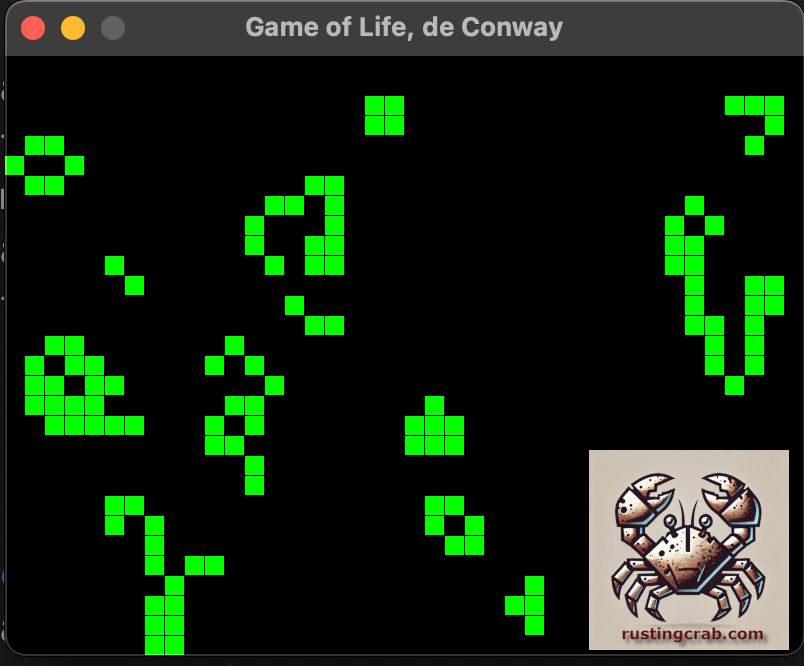

[**Cleuton Sampaio**](https://linkedin.com/in/cleutonsampaio)

[**VEJA NO GITHUB**](https://github.com/cleuton/rustingcrab)

[**Link para esse projeto**](https://github.com/cleuton/rustingcrab/tree/main/code_samples/life)

# O Jogo da Vida de Conway: Uma Simulação de Vida Artificial em Rust 

Criado pelo matemático britânico **John Horton Conway** em 1970, o **Jogo da Vida** é um autômato celular que simula a evolução de uma população de "organismos" em uma grade bidimensional, seguindo regras simples. Apesar do nome, não é um jogo tradicional: não há jogadores, e o sistema evolui autonomamente a partir de uma configuração inicial, revelando padrões complexos e surpreendentes.  

## Regras Básicas 

Cada célula na grade pode estar **viva** ou **morta**, e seu estado futuro é determinado pelo número de vizinhos vivos:  

1. **Solidão**: Uma célula viva com **menos de 2 vizinhos** morre (subpopulação).  
2. **Superlotação**: Uma célula viva com **mais de 3 vizinhos** morre (superpopulação).  
3. **Sobrevivência**: Uma célula viva com **2 ou 3 vizinhos** permanece viva.  
4. **Nascimento**: Uma célula morta com **exatamente 3 vizinhos** torna-se viva.  

Os "vizinhos" são as 8 células adjacentes (horizontal, vertical e diagonal).  

## Comportamentos Emergentes* 

A simulação gera padrões dinâmicos a partir dessas regras simples:  

- **Formas Estáveis**:  
  - **Blocos**: Grupos de células que não mudam (exemplo: quadrado 2x2).  
  - **Blinkers**: Padrões que oscilam entre duas formas (exemplo: linha de 3 células que gira 90°).  

- **Formas Móveis**:  
  - **Gliders**: Estruturas que se deslocam diagonalmente pela grade.  
  - **Naves Espaciais**: Padrões maiores que se movem em linha reta.  

- **Formas Complexas**:  
  - **Geradores**: Estruturas que produzem gliders indefinidamente.  
  - **Jardins do Éden**: Configurações que só existem na primeira geração.  

## Importância Científica

O Jogo da Vida é um marco na teoria da computação e na biologia teórica:  

- **Universalidade Computacional**: É capaz de simular uma **Máquina de Turing**, demonstrando que sistemas simples podem realizar cálculos complexos.  
- **Estudo da Emergência**: Ilustra como comportamentos complexos surgem de regras básicas, analogamente a fenômenos naturais.  
- **Modelagem de Sistemas**: Usado para simular dinâmicas populacionais, propagação de epidemias e até comportamento de partículas físicas.  

## Aplicações Práticas

- **Arte Generativa**: Criação de padrões visuais dinâmicos.  
- **Educação**: Ensino de conceitos como autoorganização e sistemas complexos.  
- **Otimização**: Inspira algoritmos para resolver problemas de logística ou redes.  

## Curiosidades 
- **Vida Artificial**: Alguns padrões são "imortais", como o **R-pentomino**, que gera caos por milhares de gerações.  
- **Cultura Pop**: Aparece em filmes, jogos e até na música (como na capa do álbum *OK Computer* do Radiohead).  

Em resumo, o Jogo da Vida é uma janela fascinante para a complexidade emergente, mostrando como a vida (mesmo artificial) pode surgir de regras mínimas e determinísticas.

## Sobre a implementação: 

O código fonte é [**ESTE**](https://github.com/cleuton/rustingcrab/tree/main/code_samples/life/src/main.rs)

### Configuração Básica
- **Grade**: Matriz de `40x30` células (colunas x linhas).
- **Tamanho das Células**: Cada célula é um quadrado de `20x20` pixels.
- **Atualizações**: O estado do jogo é recalculado a cada `0.15 segundos`.

### Inicialização
1. **Células Aleatórias**:
   - 25% das células começam vivas (em verde), geradas aleatoriamente.
2. **Glider Central**:
   - Um padrão móvel (glider) é adicionado no centro da grade para garantir movimento inicial.
   - Formato:
     ```
     ███
       █
      █
     ```

### Lógica do Jogo
1. **Vizinhança**:
   - Cada célula verifica suas **8 células adjacentes** (incluindo diagonais).
   - Fronteiras são fixas: células na borda não "enxergam" o lado oposto.
   
2. **Regras de Atualização**:
   - **Sobrevivência**: Células com 2 ou 3 vizinhos permanecem vivas.
   - **Morte**: Células com menos de 2 ou mais de 3 vizinhos morrem.
   - **Nascimento**: Células mortas com exatamente 3 vizinhos tornam-se vivas.

### Renderização
1. **Centralização**:
   - A grade é centralizada na janela, independente do tamanho da tela.
   - Cálculo dinâmico de posição usando as dimensões da janela.

2. **Visual das Células**:
   - Células vivas: Quadrados verdes com `1px` de espaçamento entre eles.
   - Fundo: Preto.

### Controle de Tempo
- **Atualizações por Segundo**:
  - O jogo atualiza o estado a cada `0.15 segundos`, independente do FPS.
  - Usa um acumulador de tempo para garantir ritmo constante.

### Tecnologias Utilizadas
- **ggez**: Framework para criação da janela, renderização e controle de eventos.
- **rand**: Geração de números aleatórios para a configuração inicial.

### Fluxo de Execução
1. **Inicialização**:
   - Cria janela `800x600` pixels.
   - Preenche a grade com células aleatórias e o glider central.

2. **Loop Principal**:
   - **Atualização**: Recalcula o estado das células no intervalo configurado.
   - **Desenho**: Renderiza todas as células vivas na posição correta.

### Padrões Esperados
- **Glider**: Move-se diagonalmente a cada 4 gerações.
- **Evolução Caótica**: Interações entre células aleatórias criam padrões imprevisíveis.
- **Formas Estáveis**: Alguns grupos podem se estabilizar ou oscilar.

Esta implementação combina simplicidade e eficiência, demonstrando como regras mínimas podem gerar comportamentos complexos, fiel ao espírito original do Jogo da Vida de Conway. 

