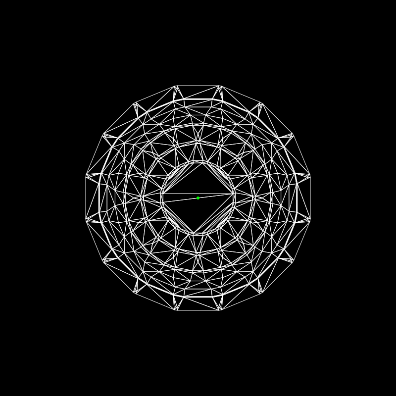

---

# Mandalas

Eu sempre gostei de **mandalas** e já implementei algoritmos para criação delas antes (**Python**), mas queria criar algo em **Rust** e essa foi a minha primeira tentativa. 

Segui aproximadamente o que [**esse artigo**](https://medium.com/@blackpolygon/plotting-mandalas-86bdf0c12d92) dizia e ficou um resultado interessante (é um trabalho ainda em andamento).

## Qual algoritmo foi usado para gerar a mandala?

O algoritmo tem **quatro etapas principais**, baseadas na sua descrição inicial:

1. **Gerar camadas de círculos ao redor do centro**  
   - Cada "camada" é um anel concêntrico.
   - Colocamos `N` círculos pequenos distribuídos uniformemente ao longo da circunferência dessa camada.
   - Ex: 8 círculos a 100px do centro, depois 12 a 160px, etc.

2. **Calcular os pontos de interseção entre círculos de camadas adjacentes**  
   - Para cada círculo da camada 0, calculamos onde ele **intersecta** com os círculos da camada 1.
   - Usamos a **fórmula matemática de interseção entre dois círculos**.
   - Os pontos onde eles se cruzam são guardados.

3. **Remover os círculos e usar apenas os pontos de interseção**  
   - Depois de coletar todos os pontos onde círculos se cruzam, **descartamos os círculos**.
   - Ficamos só com uma "nuvem" de pontos simétricos — a base do padrão.

4. **Conectar os pontos com triângulos usando Delaunay Triangulation**  
   - Com os pontos em mãos, usamos **Delaunay Triangulation** para formar uma malha de triângulos que cobre toda a área.
   - Isso cria um padrão geométrico denso, sem sobreposições, ideal para arte.

> **Delaunay Triangulation** é um **algoritmo clássico de geometria computacional** que, dado um conjunto de pontos no plano, cria uma **triangulação** (ou seja, uma rede de triângulos) com uma propriedade muito especial: Nenhum ponto fica dentro do círculo circunscrito de qualquer triângulo.

O resultado é uma lista de triângulos que cobrem toda a área com uma malha limpa e simétrica.

## Fórmula de Interseção de Círculos

Para calcular onde dois círculos se cruzam, usamos matemática analítica:

Dados:
- Círculo 1: centro \((x_1, y_1)\), raio \(r_1\)
- Círculo 2: centro \((x_2, y_2)\), raio \(r_2\)

Calculamos:
- Distância \(d\) entre centros
- Se \(|r_1 - r_2| < d < r_1 + r_2\), há duas interseções
- Usamos álgebra vetorial para encontrar os dois pontos

Essa parte é pura geometria, e é o que cria a **base simétrica e orgânica** da mandala.

## Por que isso gera uma "mandala"?

Porque:
- **Simetria radial**: círculos distribuídos em anéis
- **Padrão geométrico**: interseções criam pontos em posições harmônicas
- **Malha densa**: Delaunay conecta tudo de forma ordenada
- **Estética sagrada**: triângulos e círculos são elementos clássicos de mandalas

