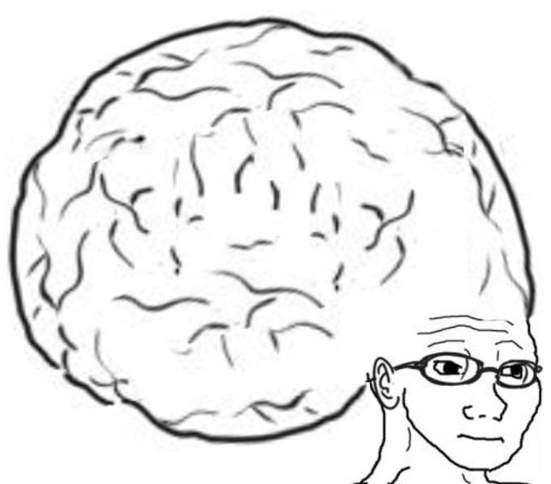

[**Cleuton Sampaio**](https://linkedin.com/in/cleutonsampaio) - Me siga!
[**RustingCrab.com**](https://rustingcrab.com).

# Você é bom de Rust?

**Rust** não é uma linguagem de programação simples, de uso geral, para iniciantes. É complexa e cheia de surpresas. 

Mas você é fera de **Rust**, certo? Então não se importaria em responder a um teste simples, não? Preste atenção!




Ok, então responda se esse código daria erro e qual seria o motivo: 

```rust
fn main() {
    let mut v = vec![String::from("Item1"), String::from("Item2"), String::from("Item3")];

    {
        let emprestado = &v[1];
        println!("Usando temporariamente o objeto emprestado: {}", emprestado);
        println!("Do vetor {}", v[1]);
        v.pop();
        v.pop();
    }

    let removido = v.pop();
    println!("Removemos um elemento: {:?}", removido);
    println!("Estado final do vetor: {:?}", v);
}
``` 

Pode rodar no [**My Compiler**](https://www.mycompiler.io/pt) ou no [**Rust playground**](https://play.rust-lang.org/?version=stable&mode=debug&edition=2021). 

E aí? Deu erro? Teria que dar erro? Por que? 

Por que isso deveria dar erro?

- `emprestado` é uma referência imutável para `v[1]`.
- Enquanto essa referência estiver ativa, o Rust não permite que você altere a estrutura do `v` de forma que possa invalidar essa referência.
- Ao chamar `v.pop()` enquanto há uma referência para `v[1]`, estamos tentando modificar o Vec (removendo elementos do final), o que pode mudar a posição dos elementos na memória ou até remover o próprio elemento referenciado.

E por que não deu erro? 

Vamos fazer uma pequena mudança no código: 

```rust
fn main() {
    let mut v = vec![String::from("Item1"), String::from("Item2"), String::from("Item3")];

    {
        let emprestado = &v[1];
        println!("Usando temporariamente o objeto emprestado: {}", emprestado);
        println!("Do vetor {}", v[1]);
        v.pop();
        v.pop();
        println!("Emprestado {}", emprestado);
    }

    let removido = v.pop();
    println!("Removemos um elemento: {:?}", removido);
    println!("Estado final do vetor: {:?}", v);
}
``` 

E agora? Deu erro? Claro que sim! Você fez um "empréstimo" imutável de `v[1]` para a variável `emprestado`. Depois, você tentou fazer outro "empréstimo" mutável quando tentou fazer o primeiro `v.pop()`. 

O sistema de "propriedade" (ownership) e "empréstimo" ("borrow") do Rust funciona bem sim. É que na primeira versão o compilador antecipou o fim do "empréstimo" de `v[1]` para a variável `emprestado`, que só deveria ocorrer no final do bloco no qual a variável foi definida. Ele utilizou a técnica **NLL** - "Non-Lexical Lifetimes",  o compilador é mais inteligente e percebe quando você não precisa mais da referência, encerrando o empréstimo mais cedo.

Ao tentar modificar o vetor `v`, ele considerou que o "empréstimo" duraria até o final do bloco, esquecendo o **NLL**, e portanto deu o erro. 

## Moral da história

**Rust** é mais complexa do que você pensa e essa questão caiu em uma **entrevista** de **emprego** que um amigo meu fez para um job internacional. 

No meu curso de rust **Rusting with style** você aprende isso!