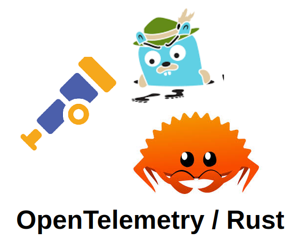
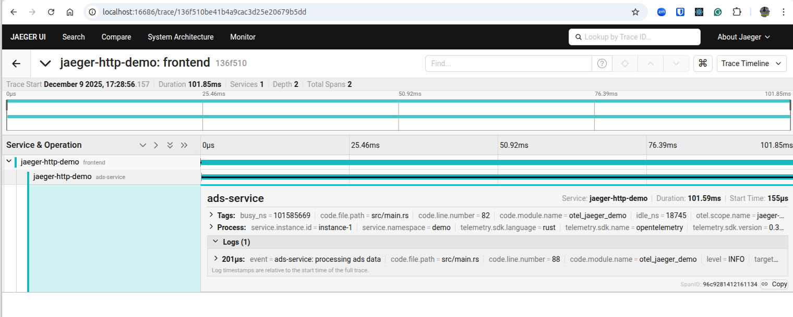

[**REPO**](https://github.com/cleuton/rustingcrab/tree/main/code_samples/opentelemetry)

[**Cleuton Sampaio**](https://linkedin.com/in/cleutonsampaio)

[**Portuguese**](./README.md)

# jaeger-http-demo

Distributed tracing demo in Rust using OpenTelemetry, OTLP/HTTP, and Jaeger.

This project implements a minimal yet realistic distributed tracing example. A request begins in a simulated “frontend”, then calls a simulated “ads-service” while keeping the same trace and span context. This makes it possible to visualize the entire call chain inside Jaeger.

---

## What this demonstrates

This example covers the fundamental components of the OpenTelemetry ecosystem:

### 1. Manual instrumentation

We manually create spans using `tracing` + `tracing-opentelemetry`, allowing us to record events, attributes, and parent-child relationships.

### 2. OTLP exporting (OpenTelemetry Protocol)

We use **OTLP** in **HTTP** mode to send traces directly into Jaeger without the OpenTelemetry collector.

Endpoint used:

```
http://localhost:4318/v1/traces
```

### 3. Context propagation between services

This example demonstrates real distributed tracing by propagating context between separate “services”.

### 4. Visualization in Jaeger

All span structure, attributes, and hierarchy can be inspected visually.

---

## Architecture

```
frontend (root span)
     │
     ▼
ads-service (child span)
```

Each component creates its own spans, but they all belong to the same trace.

---

## How to run it

### 1. Start Jaeger (with OTLP enabled)

Using only Docker (no docker-compose):

```bash
docker run \
  -e COLLECTOR_OTLP_ENABLED=true \
  -p 16686:16686 \
  -p 4317:4317 \
  -p 4318:4318 \
  jaegertracing/all-in-one:latest
```

Then open:

```
http://localhost:16686
```

---

### 2. Run the Rust program

```bash
cargo run
```

You should see logs such as:

```
frontend: received request
ads-service: processing ads data
```

If Jaeger is running, the spans will appear automatically.

---

## Inspecting the trace in Jaeger

In the UI, search for the service:

```
jaeger-http-demo
```

You’ll see:

* the “frontend” span
* the “ads-service” span
* parent-child hierarchy
* attributes
* timing
* timeline



---

## How OTLP works here

OTLP is the native OpenTelemetry protocol.
This example uses the HTTP version, sending spans directly to Jaeger’s `/v1/traces`.

No Collector in the middle.
Jaeger receives and displays traces.

---

## Key code snippets

### get the tracer

```rust
let tracer = global::tracer("jaeger-http-demo");
```

### create the root span

```rust
let root_span = span!(Level::INFO, "frontend", user_id = 42);
```

### inject context

```rust
prop.inject_context(&cx, &mut injector);
```

### extract context downstream

```rust
prop.extract(&extractor)
```

---

## This is distributed tracing

Because:

* each service creates its own spans
* context is propagated across services
* Jaeger recognizes the call path
* the full request chain is visible end-to-end


