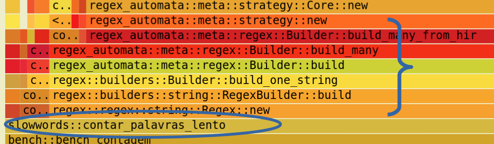

---


---

[**Cleuton Sampaio**](https://linkedin.com/in/cleutonsampaio)

[**Veja no GitHub**](https://github.com/cleuton/rustingcrab/tree/main/code_samples/perf_prof)

# Análise de performance com flamegraph

**Profiling** é o processo de medir o comportamento de um programa durante sua execução para entender como ele usa recursos como tempo de CPU e memória. O objetivo principal é descobrir quais partes do código estão consumindo mais tempo ou recursos, o que ajuda a identificar onde é possível melhorar o desempenho.

Um **flamegraph** é uma representação visual dos dados coletados durante o profiling. Ele mostra a pilha de chamadas de funções ao longo do tempo. Cada função é representada por uma barra horizontal, e a largura da barra indica a quantidade de tempo gasto nessa função. Funções que aparecem mais largas são as que mais consomem tempo.

As barras são organizadas em camadas. A função no topo é a que está sendo executada no momento, e abaixo dela estão as funções que a chamaram. A leitura é feita de cima para baixo, seguindo a sequência de chamadas.

Para interpretar um flamegraph, basta procurar as barras mais largas na parte superior. Elas indicam as funções que mais contribuem para o tempo total de execução. Se uma função aparece em várias partes do gráfico ou tem grande largura, ela é um bom candidato para otimização. Também é útil observar funções que, embora pequenas individualmente, aparecem muitas vezes, pois seu custo pode ser alto quando somado.

Resumindo, profiling serve para analisar o desempenho de um programa, e o flamegraph é uma ferramenta visual que ajuda a identificar rapidamente onde o tempo está sendo gasto, permitindo focar nas partes do código que mais precisam de atenção.

## Benchmarks em Rust

`cargo bench` é o comando do Cargo para compilar e executar alvos de benchmark do seu projeto, usando o perfil “bench” (otimizações ligadas e símbolos de depuração, se configurado). Na prática, ele procura arquivos em `benches/`, compila cada um como um binário de benchmark e os executa. Como o harness oficial de benchmark do Rust permanece instável, o fluxo mais comum é usar uma biblioteca de benchmarking (ex.: Criterion) como dependência de desenvolvimento; ela providencia aquecimento, amostragem estatística, detecção de outliers e relatórios, permitindo comparar versões de uma função sob condições controladas.

Benchmarking responde “quanto tempo demora” em cenários reproduzíveis; profiling responde “onde o tempo é gasto” durante uma execução. É aí que entra o pprof. O crate pprof é um profiler embutido no processo: ele amostra periodicamente as pilhas de chamadas enquanto o seu código roda e, a partir dessas amostras, consegue gerar um flamegraph. O flamegraph é uma visualização em que cada retângulo representa uma função, a largura é proporcional à quantidade de amostras atribuídas àquela função (tempo), e a altura representa a profundidade da pilha. Combinando `cargo bench` para produzir uma execução representativa e o pprof para amostrar essa execução, você mede e visualiza o mesmo workload: o benchmark te diz se ficou mais rápido ou mais lento; o flamegraph te diz por quê, apontando os hotspots.

Há dois jeitos de acoplar isso no fluxo. Você pode perfilar “por fora”, usando ferramentas do sistema (como `perf` ou `cargo flamegraph`) sobre o binário que `cargo bench` executa; nesse caso, o profiler não aparece no Cargo.toml e age externamente. Ou pode perfilar “por dentro”, iniciando o pprof dentro do próprio benchmark; nesse caso, o profiler vira dependência de desenvolvimento e o próprio benchmark escreve o arquivo `flamegraph.svg`. Em ambos os casos, a leitura é a mesma: procure a função-alvo no gráfico, siga o caminho de caixas mais largas acima dela e você terá a cadeia de chamadas onde a CPU está realmente sendo gasta.

O `cargo bench` gera um relatório bem interessante do seu código (`target/criterion/report/index.html`) com a distribuição dos tempos e várias outras estatísticas: 


## O exemplo

Criamos um código propositalmente lento, com um problema implícito, para tentarmos identificar com o **flamegraph**. O código “lento” que criamos era uma função de contagem de palavras escrita de propósito de forma ineficiente. A cada linha do texto, ela chamava `Regex::new` para compilar um padrão de regex, e ainda criava um segundo regex para “limpar” cada palavra. Isso significa que, em vez de reaproveitar um regex pronto, ela recompilava o autômato de busca milhares de vezes. Além disso, fazia alocações desnecessárias (`to_string`, `to_lowercase`, `format!`, `clone`) e, no fim, ainda recopiava o mapa inteiro para ordenar por tamanho de chave. O resultado é um gargalo artificial: o flamegraph mostra quase todo o tempo gasto em funções internas do `regex` ligadas à construção de autômatos (`Builder::build*`), em vez de na lógica de contagem em si.

Você [**pode ver esse código aqui:**](./antes/src/lib.rs).

Na configuração do nosso projeto, temos esse `Cargo.toml`: 

```toml
[package]
name = "slowwords"
version = "0.1.0"
edition = "2021"

[lib]
name = "slowwords"
path = "src/lib.rs"

[dependencies]
regex = "1.10"

[dev-dependencies]
criterion = "0.7.0"
pprof = { version = "0.15", features = ["flamegraph"] }

[[bench]]
name = "bench"
harness = false

[profile.bench]
debug = true
```

Esse trecho é o **Cargo.toml** do projeto, que descreve como o Cargo deve compilar e quais bibliotecas usar. Resumidamente:

– A seção `[package]` define os metadados do pacote: nome (`slowwords`), versão inicial (`0.1.0`) e edição do Rust usada (`2021`).
– A seção `[lib]` indica que o projeto expõe uma biblioteca chamada `slowwords`, cujo código-fonte principal está em `src/lib.rs`.
– Em `[dependencies]`, incluímos o crate `regex`, versão 1.10, para lidar com expressões regulares. Essa é a dependência principal, usada pelo código da biblioteca.
– Em `[dev-dependencies]`, estão as dependências necessárias apenas em desenvolvimento e testes de performance:
• `criterion`, versão 0.7.0, fornece o framework de benchmarking estatístico;
• `pprof`, versão 0.15 com a feature `flamegraph`, fornece o profiler embutido que gera gráficos de chama (flamegraphs) diretamente durante a execução do benchmark.
– O bloco `[[bench]]` declara um benchmark chamado `bench`, apontando para o arquivo `benches/bench.rs` e desabilitando o harness de teste padrão (`harness = false`) para que possamos controlar a execução via Criterion.
– Finalmente, `[profile.bench] debug = true` garante que o binário de benchmark seja compilado com informações de debug, o que torna os símbolos visíveis no flamegraph e facilita identificar as funções no relatório.

Assim, esse projeto junta três coisas: uma biblioteca (`slowwords`), um benchmark estatístico (Criterion), e um profiler embutido (pprof) para visualizar onde o tempo de CPU é gasto.

O [**código de `benchmark`**](./antes/benches/bench.rs) (`benches/bench.rs`) existe porque o Cargo procura nesse diretório (`benches/`) os alvos de benchmark declarados no `Cargo.toml`. Ele é necessário para que o `cargo bench` saiba o que executar.

Quando usamos o comando: `cargo bench` ele executa esse programa. 

Nesse projeto, ele carrega a função da biblioteca (`contar_palavras_*`), monta um texto artificial grande para servir de carga de trabalho e mede o tempo de execução com o Criterion. Além disso, dentro dele inicializamos o `pprof`, executamos a função algumas vezes sob amostragem e, no fim, gravamos um arquivo `flamegraph.svg`. Ou seja, o `bench.rs` cumpre dois papéis ao mesmo tempo: rodar benchmarks estatísticos (quanto tempo demora) e gerar um flamegraph (onde o tempo é gasto).

## Identificando o "culpado"

Após executar o `benches/bench.rs` com o comando `cargo bench`, um arquivo `flamegraph.svg` será criado na raiz do projeto: 


Fica difícil visualizar, mas as barras mais largas próximas ao topo, são as "culpadas". No nosso código, temos uma função `contar_palavras_lento` e algumas funções de barras largas acima dela. Eu fiz um **zoom** para você: 



Podemos ver que ele está invocando uma série de funções "largas" e "vermelhas", todas ligadas à compilação de **regex**, ou seja, essa função está compilando a `regex` a cada palavra!

E no report do `criterion` isso fica evidente: 


– O gráfico da esquerda é a distribuição estimada do tempo de execução de uma iteração. Ele parece próximo de uma curva normal simétrica, não apresenta cauda longa visível. Portanto, não há skew significativo, embora essa deformação possa ser um sinal de que algo está fora do esperado. 

– A média (`Mean`) está em **182,80 ms** por iteração. O valor realmente está em milissegundos, o que confirma que cada chamada demora centenas de milhares de microssegundos, ou seja, centenas de milissegundos — muito mais do que seria aceitável para uma função tão simples.

– O desvio padrão (\~705 µs) e o MAD (\~767 µs) são pequenos em relação à média (182 ms), indicando que as execuções são consistentes, o tempo é estável.

– A figura da direita mostra as amostras individuais por iteração; a maior parte delas se concentra perto da média, sem outliers extremos.

**Conclusão:** a função é consistentemente lenta (em torno de 182 ms por execução) devido ao problema proposital de recompilar regex, embora a distribuição de tempos não esteja tecnicamente "skewed". O fato de a média estar em milissegundos confirma que o custo artificial da recompilação de regex dominou completamente o tempo de execução.

## Corrigindo o problema

Bem, [**na versão `depois`**](./depois/src/lib.rs) o código foi alterado para eliminar esse **gargalo**. Tirei a compilação do regex do caminho crítico. Em vez de chamar `Regex::new(...)` a cada linha e a cada palavra, criei um único regex global e preguiçoso com `once_cell::sync::Lazy`, inicializado na primeira utilização e reaproveitado em todas as chamadas e threads. Isso elimina o custo de parse/compilação do padrão em tempo de execução repetidamente; o flamegraph deixa de mostrar a cadeia `Regex::new → Builder::build*` como dominante e passa a concentrar o tempo no uso do motor (`find_iter`), em `to_lowercase` e nas inserções no mapa. Aproveitei para reduzir alocações óbvias: abandonei `format!` e `clone` de chaves e passei a usar `entry` no `BTreeMap`. O ganho vem, principalmente, de amortizar a compilação do regex para “uma vez só”, removendo o gargalo estrutural sem alterar a lógica de contagem.

Depois de rodar o `cargo bench` novamente, vemos um novo `flamegraph`: 


Não vemos mais barras tão largas acima de `contar_palavras_rapido`. Mas o que isso significa exatamente? Vejamos o report do `criterion`: 


Esse relatório do Criterion mostra bem o efeito da correção com o regex estático.

– **Tempo médio:** caiu para cerca de **451 µs** por iteração (menos de meio milissegundo). Compare com os **182 ms** da versão lenta: estamos falando de uma melhora de quase **400 vezes**.

– **Distribuição:** o gráfico da esquerda mostra uma curva bem centrada, praticamente simétrica. A média (451,83 µs) e a mediana (451,20 µs) praticamente coincidem, o que indica que não há skew significativo.

– **Desvio padrão:** \~1,8 µs, e MAD \~1,5 µs, valores minúsculos em relação à média. Isso mostra que o benchmark é extremamente estável, com pouca variação entre iterações.

– **Gráfico da direita:** agora é uma regressão linear dos tempos acumulados pelas iterações (feature do Criterion). A linha azul segue os pontos sem grandes desvios — outro sinal de consistência.

**Conclusão:**
A versão rápida eliminou o gargalo da recompilação de regex. O tempo caiu de centenas de milissegundos para microssegundos, com distribuição bem comportada e variabilidade baixíssima. O hotspot agora, como se viu no flamegraph, é apenas o uso normal do regex e operações auxiliares (como `to_lowercase` e inserção no mapa).

## Conclusão

Quando temos um problema de `performance`, depois de eliminados os `culpados` externos:

1. **Agendador do sistema operacional** – trocas de contexto, competição por CPU.
2. **Ruído de outros processos** – antivírus, navegador, serviços em segundo plano.
3. **Gerenciamento de energia/turbo** – CPU reduzindo frequência ou mudando clocks.
4. **Caches e memória** – cold caches, swapping, pressão de RAM.
5. **Ambiente de build** – flags de compilação, ausência de otimização, símbolos extras.
6. **Interferência de I/O** – disco ou rede ativando durante o teste.
7. **Virtualização/containers** – overhead de hipervisor ou limites de cgroup.

Como identificar: repetir testes em condições controladas, observar variância no Criterion (alto desvio padrão sugere ruído externo), usar ferramentas de sistema (htop, perf, iostat) para checar contenda, e comparar flamegraphs: se o tempo se perde em camadas do sistema e não no seu código, o culpado é externo.

Se a **culpa** estiver no seu código (barras largas nele e acima dele), então a otimização é o melhor caminho. Aqui vai um checklist enxuto, guiado por flamegraph:

1. Algoritmo e complexidade
   – Trocar O(n·m) por O(n log n) ou O(n) antes de qualquer micro‐otimização.
   – Evitar trabalho repetido (memoização, mover trabalho para fora do loop).

2. Estruturas de dados
   – Escolher a certa para o acesso: HashMap vs BTreeMap; Vec vs LinkedList.
   – Prealocar (reserve) e reutilizar buffers; evitar coleções intermediárias.

3. Alocações e cópias
   – Cortar `clone`, `to_string`, `format!` desnecessários; preferir `&str`/slices.
   – Evitar criar objetos por iteração; usar objetos estáticos/singletons (ex.: Regex).

4. Strings e Unicode
   – Só fazer `to_lowercase`/normalização quando preciso; usar ASCII fast-path.
   – Evitar regex quando um scanner simples resolve.

5. Hot loops
   – Remover ramificações frias; puxar checks para fora; inlining seletivo (`#[inline]`).
   – Batching: operar em blocos para reduzir overhead de chamadas e locks.

6. Localidade de cache e layout
   – Acessos lineares em `Vec`/slices; evitar estruturas dispersas; compactar dados.
   – Evitar “array de ponteiros”; preferir “struct of arrays” quando convém.

7. Concorrência e sincronização
   – Reduzir locks/contended atomics; usar shards ou lock-free quando fizer sentido.
   – Evitar ping-pong entre threads; preferir work-stealing bem granulado.

8. I/O e fronteiras
   – Bufferizar I/O; agrupar syscalls; evitar formatação/log em caminho quente.
   – Desligar debug pesado em produção.

9. Especialização e CPU
   – Habilitar `target-cpu=native`, LTO/ThinLTO; considerar SIMD (crates como `wide`/`std::simd`).
   – Evitar branch misprediction óbvio; usar `#[cold]`/`#[expect]` quando apropriado.

10. Provas rápidas pelo perfil
    – Atacar os frames com maior “tempo inclusivo”; validar cada mudança no flamegraph.
    – Só depois mexer em micro‐otimizações com pouco impacto.
