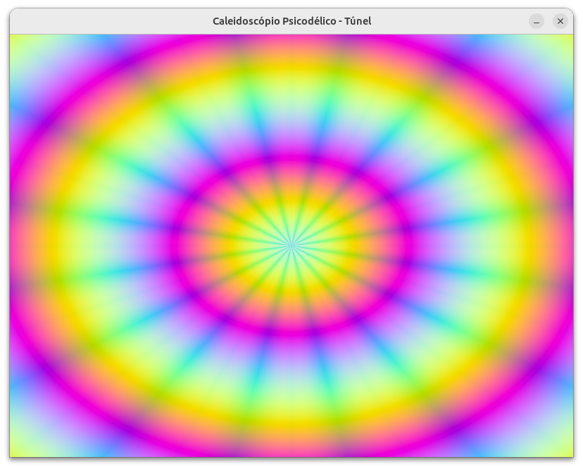

# Tunel psicodélico

[**Cleuton Sampaio**](https://linkedin.com/in/cleutonsampaio)
[**REPO**](https://github.com/cleuton/rustingcrab/blob/main/code_samples/psycho)

Legal, né? Cara, esse foi ouvindo **Led Zeppelin**, **Deep Purple** e **Yes**... 

## A matemática

A ideia central é usar geometria polar e funções de onda para montar um túnel que se repete como num caleidoscópio e ainda “pulse” no tempo. Primeiro você cria uma grade de pontos X e Y que variam de –1 a 1, de modo que o meio da tela seja (0,0). Para cada ponto dessa grade, calcula-se:

1. **R**, a distância do ponto ao centro, usando a fórmula de círculo $R = \sqrt{X^2 + Y^2}$.
2. **Θ**, o ângulo relativo ao eixo X, com $Θ = atan2(Y, X).

Em seguida, “dobra-se” esse ângulo em fatias iguais — se for 16 segmentos, você pega o ângulo original e aplica um módulo para repetir o padrão a cada $2\pi/16$. Ainda faz um valor absoluto para simular o reflexo de um caleidoscópio, como se cada fatia fosse um espelho.

Com o raio e o ângulo dobrado em mãos, gera-se dois padrões de onda:

* Um componente radial: $\sin(10 R - 4 t)$, que cria anéis que parecem avançar no túnel.
* Um componente angular: $\sin(16 Θ_{\text{dobrado}} + 6 t)$, que gera as “pétalas” giratórias conforme o túnel se move.

Você soma esses dois sinais e normaliza de –1…1 para 0…255, obtendo um padrão em escala de cinza. Para fazer as cores, repete a função seno sobre R com deslocamentos de fase (por exemplo +2 e +4 radianos) para os canais verde e azul. Cada pixel vira então um triplete RGB com tonalidades que se alternam no tempo.

O resultado é um mosaico de ondas radiais e angulares, espelhado em triângulos, e animado pelo termo que depende de “tempo”. É essa combinação de coordenadas polares, dobra angular e funções seno com fases diferentes que cria a ilusão de estar viajando por um túnel psicodélico.

## A implementação

Este código foi migrado da versão **Python** para **Rust**, atualizando do **PyGame** para o **ggez**. Vou comentar as diferenças na implementação... Por favor veja o [**código original em Python**](https://github.com/cleuton/pythondrops/tree/master/psycho) para ter uma referência. 

### Comparando com a implementação em Python

Vamos comparar as implementações em **Python (PyGame)** e **Rust (ggez)**, mostrando as principais diferenças de arquitetura, desempenho e estilo de código.

**1. Inicialização do contexto e janela**
- *Python (pygame)*: uso de `pygame.init()`, criação de `Surface` via `display.set_mode`, e configuração de título com `display.set_caption` dentro de `iniciar_pygame`.
- *Rust (ggez)*: configuração no `main` com `ContextBuilder`, especificando `window_setup` e `window_mode`. Não há chamada manual de inicialização de subsistemas; o `build()?` já faz toda a configuração.

**2. Geração da malha de coordenadas**
- *Python*: utiliza `numpy.linspace` e `numpy.meshgrid` para criar matrizes 2D (`X`, `Y`) em operações vetorizadas de alto nível.
- *Rust*: gera manualmente vetores `malha_x` e `malha_y` em loops aninhados, calculando cada par `(x, y)`. Não existe biblioteca de álgebra vetorial padrão, então o código é mais explícito e imperativo.

**3. Cálculo do padrão caleidoscópico**
- *Python*: expressões vetorizadas em NumPy para `R`, `Theta`, `padrao_radial`, `padrao_angular` e normalização, resultando em arrays de bytes direto (`uint8`).
- *Rust*: percorrimento explícito de cada índice no buffer, realizando as mesmas operações num loop `for`, atribuindo canais RGB no vetor `buffer`. Ganha-se controle fino e ausência de overhead de GC, mas perde-se a concisão do NumPy.

**4. Manipulação de buffer e renderização**
- *Python*: após montar `imagem` e transpor, usa `pygame.surfarray.blit_array` e `display.flip` para desenhar no `Surface`.
- *Rust*: converte `buffer` em `Image` via `Image::from_pixels`, desenha com `Canvas::from_frame`, chama `canvas.draw` e finaliza com `canvas.finish(ctx)?`. O fluxo é mais orientado a objetos e utiliza recursos do GPU.

**5. Loop principal e controle de tempo**
- *Python*: loop infinito sobre `pygame.event.get()`, obtém `ticks` de `pygame.time.get_ticks()/1000.0` e limita FPS com `Clock.tick(30)`.
- *Rust*: `event::run(ctx, event_loop, estado)` orquestra o loop, chama `update` e `draw` automaticamente. Usa `ctx.time.time_since_start()` e não há controle manual de FPS (pode ser configurado via `timer`) mas ggez lida com chamadas de renderização.

**6. Vantagens e trade‑offs**
- **Python**: sintaxe concisa, alto nível, rápido para protótipos visuais. Contudo, depende de NumPy e pode apresentar overhead em loops e conversões de array.
- **Rust**: código mais verboso, maior controle de memória e performance nativa. ggez abstrai camadas de OpenGL/Vulkan, mas requer código detalhado para cada etapa.

