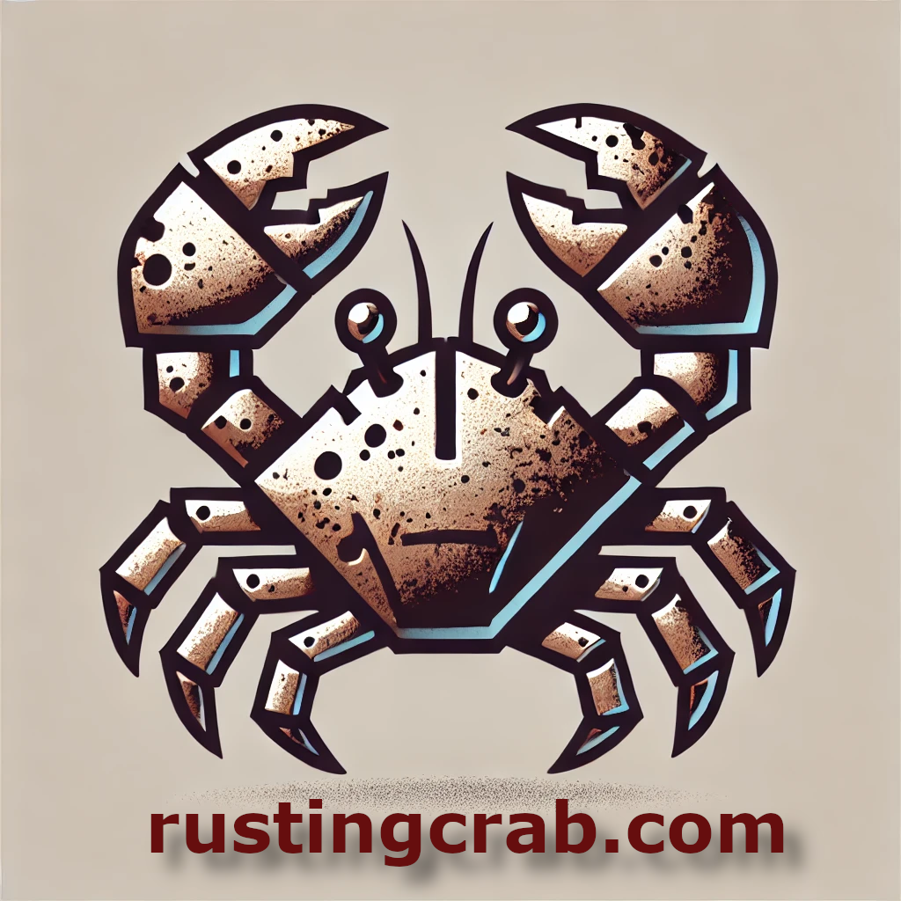
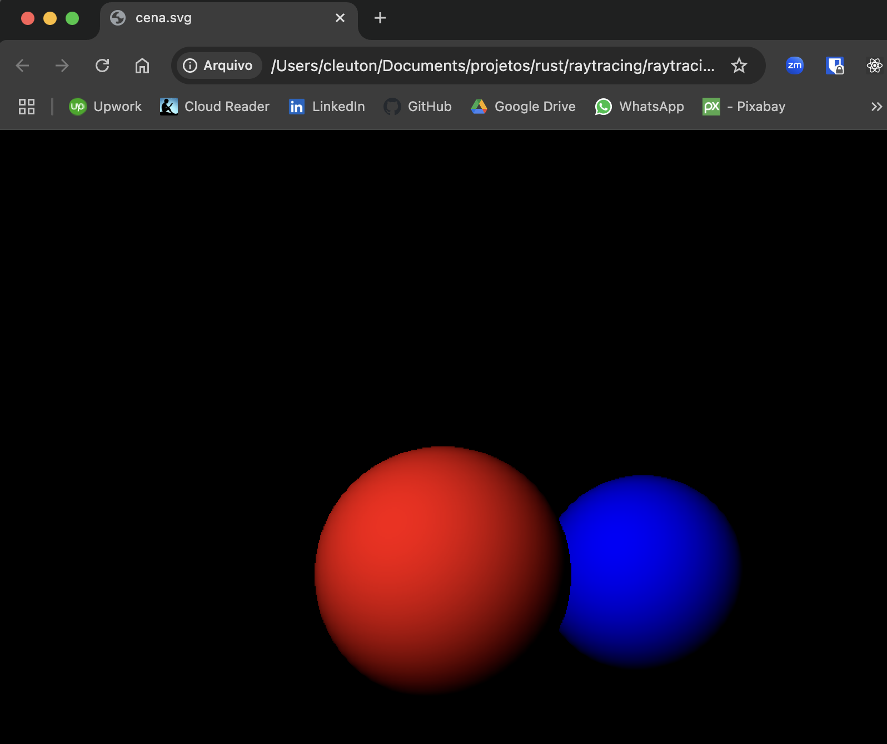
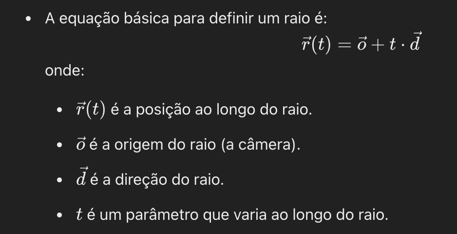

# Rusting game tech

[*Cleuton Sampaio*](https://linkedin.com/in/cleutonsampaio).

Fala, #dev! Procurando algo legal para fazer nesse fim de feriadão (pelo menos no Rio?) Bom, aqui vai uma coisinha procê: Ray tracing com **Rust**. 



Vou mostrar a você como renderizar uma cena 3d com a técnica de **ray tracing**, gerando um arquivo **SVG**, ou seja: Roda em qualquer plataforma.

## Ray tracing

A técnica de **ray tracing** é um método para renderizar imagens tridimensionais com alta fidelidade visual, baseado na simulação de como a luz interage com os objetos em um ambiente virtual. Ele se fundamenta em traçar o caminho dos raios de luz através de coordenadas virtuais em um espaço 3D e determinar como esses raios interagem com os objetos e fontes de luz na cena.

### Elementos do Ray Tracing:

1. **Câmera e Raios de Visão**:
   - A cena é observada através de uma câmera virtual, que possui uma posição e uma orientação.
   - Cada pixel na tela é mapeado para um raio que é emitido a partir da câmera, passando por um plano de projeção virtual (normalmente chamado de "plano da imagem").

2. **Emissão de Raios**:
   - Um **raio primário** é lançado a partir da posição da câmera, atravessando o plano da imagem na direção correspondente ao pixel.
   - A equação básica para definir um raio é: 
 


3. **Interseção com Objetos**:
   - O algoritmo verifica se o raio primário intercepta algum objeto na cena (como esferas, planos, ou polígonos).
   - Para cada objeto, são resolvidas equações que determinam se e onde ocorre a interseção.
   - O ponto mais próximo da câmera é identificado como o ponto visível para aquele raio.

4. **Calculo de Iluminação**:
   - No ponto de interseção, a iluminação é calculada considerando:
     - **Luz direta**: O impacto da luz proveniente de fontes luminosas na cena.
     - **Reflexão**: Raios secundários são emitidos para simular superfícies refletivas.
     - **Refração**: Para materiais translúcidos, raios são desviados para simular a passagem de luz.
     - **Sombreamento**: Raios são lançados em direção às fontes de luz para determinar se o ponto está na sombra.

5. **Propagação de Raios Secundários**:
   - Raios adicionais são lançados para calcular:
     - Reflexões (como em espelhos).
     - Refracções (como em vidro ou água).
     - Dispersão (como em superfícies rugosas).
   - Este processo pode ser recursivo, gerando uma árvore de raios que modela múltiplas interações com os objetos.

6. **Acumulação de Cor**:
   - A cor final de um pixel é calculada combinando as contribuições de luz direta, reflexões, refrações e sombras, conforme as propriedades físicas dos materiais (como cor, índice de refração, rugosidade, etc.).

7. **Renderização Final**:
   - Cada pixel na imagem é associado à cor resultante dos cálculos acima.
   - O resultado é uma imagem renderizada que pode incluir reflexos realistas, sombras suaves, transparências e dispersão de luz.

### Resultados do Ray Tracing:
- **Realismo**: É capaz de gerar imagens bem realistas, simulando fenômenos como reflexos, refrações e iluminação global.
- **Custo Computacional**: É computacionalmente intensivo, pois exige muitos cálculos para cada raio e interações na cena. 
- **Uso de Espaços Virtuais**:
  - Objetos e luzes são posicionados em um espaço tridimensional virtual.
  - Coordenadas (x, y, z) definem a localização de objetos, luzes e a câmera.

Ray tracing é amplamente utilizado em filmes, animações e recentemente em jogos, graças à evolução do hardware gráfico, que agora permite calcular esses raios em tempo real.

## Implementação em Rust

Vamos dar uma olhadinha no código, que é relativamente simples, considerando que é **Rust**: 

```rust
use std::fs::File;
use std::io::Write;

#[derive(Debug, Clone, Copy)]
struct Vetor3D {
    x: f64,
    y: f64,
    z: f64,
}

impl Vetor3D {
    fn novo(x: f64, y: f64, z: f64) -> Self {
        Vetor3D { x, y, z }
    }

    fn somar(self, outro: Vetor3D) -> Vetor3D {
        Vetor3D::novo(self.x + outro.x, self.y + outro.y, self.z + outro.z)
    }

    fn produto_escalar(self, outro: Vetor3D) -> f64 {
        self.x * outro.x + self.y * outro.y + self.z * outro.z
    }

    fn normalizar(self) -> Vetor3D {
        let magnitude = (self.x * self.x + self.y * self.y + self.z * self.z).sqrt();
        Vetor3D::novo(self.x / magnitude, self.y / magnitude, self.z / magnitude)
    }

    fn subtrair(self, outro: Vetor3D) -> Vetor3D {
        Vetor3D::novo(self.x - outro.x, self.y - outro.y, self.z - outro.z)
    }

    fn escalar(self, escalar: f64) -> Vetor3D {
        Vetor3D::novo(self.x * escalar, self.y * escalar, self.z * escalar)
    }
}

#[derive(Debug, Clone, Copy)]
struct Raio {
    origem: Vetor3D,
    direcao: Vetor3D,
}

impl Raio {
    fn novo(origem: Vetor3D, direcao: Vetor3D) -> Self {
        Raio { origem, direcao }
    }
}

#[derive(Debug)]
struct Esfera {
    centro: Vetor3D,
    raio: f64,
    cor: (u8, u8, u8),
}

impl Esfera {
    fn interseccao(&self, raio: &Raio) -> Option<f64> {
        let oc = raio.origem.subtrair(self.centro);
        let a = raio.direcao.produto_escalar(raio.direcao);
        let b = 2.0 * oc.produto_escalar(raio.direcao);
        let c = oc.produto_escalar(oc) - self.raio * self.raio;
        let discriminante = b * b - 4.0 * a * c;

        if discriminante < 0.0 {
            None
        } else {
            Some((-b - discriminante.sqrt()) / (2.0 * a))
        }
    }
}

fn calcular_sombra(esfera: &Esfera, ponto: Vetor3D, luz: Vetor3D) -> (u8, u8, u8) {
    let normal = ponto.subtrair(esfera.centro).normalizar();
    let direcao_luz = luz.subtrair(ponto).normalizar();
    let intensidade = normal.produto_escalar(direcao_luz).max(0.0); // Sombreamento Lambertiano
    let (r, g, b) = esfera.cor;
    (
        (r as f64 * intensidade) as u8,
        (g as f64 * intensidade) as u8,
        (b as f64 * intensidade) as u8,
    )
}

fn main() {
    let largura = 800;
    let altura = 800;

    let camera = Vetor3D::novo(0.0, 0.0, -5.0);
    let tamanho_projecao = 2.0;
    let tamanho_canvas = 2.0;

    let esferas = vec![
        Esfera {
            centro: Vetor3D::novo(0.0, 0.0, 2.0),
            raio: 1.0,
            cor: (255, 0, 0),
        },
        Esfera {
            centro: Vetor3D::novo(2.0, 0.0, 4.0),
            raio: 1.0,
            cor: (0, 0, 255),
        },
    ];

    let luz = Vetor3D::novo(-5.0, 5.0, -10.0);

    let mut svg_conteudo = String::new();
    svg_conteudo.push_str(&format!(
        r#"<svg xmlns="http://www.w3.org/2000/svg" viewBox="0 0 {} {}" width="{}" height="{}" style="background-color: black;">"#,
        largura, altura, largura, altura
    ));

    for y in 0..altura {
        for x in 0..largura {
            let canvas_x = (x as f64 / largura as f64) * tamanho_canvas - tamanho_canvas / 2.0;
            let canvas_y = -(y as f64 / altura as f64) * tamanho_canvas + tamanho_canvas / 2.0;

            let direcao = Vetor3D::novo(canvas_x, canvas_y, tamanho_projecao).normalizar();
            let raio = Raio::novo(camera, direcao);

            for esfera in &esferas {
                if let Some(distancia) = esfera.interseccao(&raio) {
                    let ponto_intersecao = raio.origem.somar(raio.direcao.escalar(distancia));
                    let cor = calcular_sombra(esfera, ponto_intersecao, luz);
                    svg_conteudo.push_str(&format!(
                        r#"<rect x="{}" y="{}" width="1" height="1" fill="rgb({}, {}, {})"/>"#,
                        x, y, cor.0, cor.1, cor.2
                    ));
                    break;
                }
            }
        }
    }

    svg_conteudo.push_str("</svg>");

    let mut arquivo = File::create("cena.svg").expect("Erro ao criar arquivo SVG");
    arquivo
        .write_all(svg_conteudo.as_bytes())
        .expect("Erro ao escrever no arquivo SVG");

    println!("Renderização concluída! O arquivo 'cena.svg' foi gerado.");
}

```

Este código cria uma imagem renderizada com um simples ray tracing, salvando o resultado em um arquivo SVG. Vou explicá-lo por partes:

### **Estruturas Básicas**
1. **Vetor3D**:
   Representa um ponto ou direção no espaço 3D. É usado para:
   - Calcular interseções entre raios e objetos.
   - Realizar operações matemáticas como soma, subtração e normalização (tornar o vetor com comprimento 1).

2. **Raio**:
   Representa um "raio de luz" no espaço, com:
   - Origem: de onde o raio parte.
   - Direção: para onde o raio aponta.

3. **Esfera**:
   Representa objetos esféricos na cena. Cada esfera tem:
   - Um centro no espaço.
   - Um raio.
   - Uma cor.

### **Interseção com Esferas**
- A função `interseccao` calcula se um raio atinge uma esfera.
- Resolve uma equação quadrática (matemática básica para geometria) para encontrar o ponto de contato do raio com a esfera, se houver.

### **Calcular Sombra**
- A função `calcular_sombra` adiciona iluminação básica usando o sombreamento de Lambert:
  - Calcula o ângulo entre a direção da luz e a superfície da esfera.
  - Quanto mais "de frente" a luz incide, mais clara a cor do ponto.
  - O resultado é ajustado pela cor da esfera.

### **Parte Principal do Código**
1. **Configuração Inicial**:
   - Define a câmera virtual no espaço 3D.
   - Configura o tamanho da imagem e do espaço da cena.
   - Cria duas esferas na cena, cada uma com posição, raio e cor.

2. **Luz**:
   - Uma fonte de luz é posicionada em um ponto no espaço.

3. **Gerar Imagem**:
   - Para cada pixel na imagem:
     - Calcula a direção do raio correspondente.
     - Verifica se o raio atinge alguma esfera.
     - Se sim, calcula a cor do ponto usando a iluminação.
     - Cria um retângulo (1x1 pixel) na cor correspondente no SVG.

4. **Criar SVG**:
   - Escreve todos os retângulos gerados em um arquivo `cena.svg`.
   - O fundo é preto, e as esferas aparecem com iluminação simples.

### **Como Funciona**
- Cada pixel na imagem é um raio disparado da câmera.
- Se o raio atinge uma esfera:
  - Determina a cor baseada na posição do ponto atingido e na direção da luz.
- O arquivo final é um SVG, onde cada pixel é representado como um pequeno retângulo.

O código faz um "esboço" de ray tracing para criar uma cena 3D simplificada com sombras básicas. A lógica principal é lançar raios, verificar interseções e calcular as cores com base na luz. O resultado é uma imagem gerada como SVG.

## Como criar um projeto Rust

Se ainda não tem **Rust** instalada, instale o [**rustup**](https://rustup.rs/). 

Crie um projeto com o **cargo**:

```shell
cargo new raytracing_demo --bin
```

Abra a subpasta `src` e substitua o arquivo `main.rs` pelo que está na listagem desse artigo. Volte à pasta superior (`raytracing_demo`) e execute: 

```shell
cargo run
``` 

Você verá um arquivo `cena.svg` é só abri-lo com o **Chrome** ou qualquer outro navegador. 

Me siga para mais conteúdos como esse e confira [**minha página de cursos**](https://www.cleutonsampaio.com/#cursos)