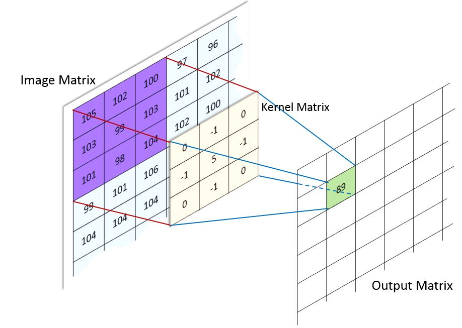

# CNN - Convolutional Neural Network em Rust!

## Rede Neural Convolucional

[**Cleuton Sampaio**](https://linkedin.com/in/cleutonsampaio)

[**github**](https://github.com/cleuton/rustingcrab)

É uma rede neural dupla, sendo que a primeira parte é dedicada a capturar as características de cada imagem, enquanto a segunda, classifica essa característica de acordo com os pesos.

Neste exemplo veremos a implementação de uma rede CNN simplificada em **Rust**, para treinar e inferir algarismos desenhados manualmente, baseados no dataset **MINST**.

Para começar, baixe o dataset e descompacte para uma pasta **data** na raiz do projeto: 

```shell
cd data

wget https://ossci-datasets.s3.amazonaws.com/mnist/train-images-idx3-ubyte.gz

wget https://ossci-datasets.s3.amazonaws.com/mnist/train-labels-idx1-ubyte.gz

wget https://ossci-datasets.s3.amazonaws.com/mnist/t10k-images-idx3-ubyte.gz

wget https://ossci-datasets.s3.amazonaws.com/mnist/t10k-labels-idx1-ubyte.gz

gunzip data/train-images-idx3-ubyte.gz
gunzip data/train-labels-idx1-ubyte.gz
gunzip data/t10k-images-idx3-ubyte.gz
gunzip data/t10k-labels-idx1-ubyte.gz
```

Este é um exemplo de código em Rust que adapta a ideia do código fornecido para uma rede neural convolucional (CNN) simples. Esse exemplo implementa (de forma “do-it-yourself” e não otimizada) as seguintes camadas:

- Uma camada convolucional com função de ativação sigmoide;
- Uma camada de max pooling (com regiões não sobrepostas);
- Uma camada de flatten para transformar a saída 3D em um vetor 1D;
- Uma camada totalmente conectada (dense) com função de ativação sigmoide.

O treinamento usa o gradiente descendente estocástico (SGD) e o erro é calculado com MSE.

> Atenção: Este exemplo é didático e simplificado. Para aplicações reais (como reconhecimento de objetos em imagens reais), recomenda‑se o uso de bibliotecas otimizadas e uma implementação mais robusta do cálculo dos gradientes (backpropagation).

## Convolução

Convolução é o processo de adicionar cada elemento da imagem aos seus vizinhos locais, compensado por um núcleo ou Kernel. O kernel ou matriz de convolução, ou ainda "máscara", é uma pequena matriz, que determina o que deve ser ser multiplicado e adicionado a cada pixel, gerando uma imagem menor. 

É utilizada em operações de sharpening, blurring, embossing, detecção de bordas e outras operações em imagens.



([*crédito*](http://machinelearninguru.com/computer_vision/basics/convolution/image_convolution_1.html))


O kernel é rotacionado sobre todos os pixes da imagem original, gerando uma matriz resumida, onde cada ponto é um resumo das operações de multiplicação de cada elemento do kernel.

## Pooling

Pooling é o processo de reduzir a dimensionalidade das características, reduzindo o tamanho da entrada. Além de tornar o processamento mais simples e rápido, evita o **overfitting**.

Utilizamos uma matriz de pooling para sumarizar os pontos da imagem convolucionada. Podemos sumarizar pegando o maior valor de um grupo de pontos (MAX) ou a sua média (AVERAGE).


([*crédito*](https://ujjwalkarn.me/2016/08/11/intuitive-explanation-convnets/))

## Camadas de uma rede convolucional

Geralmente, temos um núcleo convolucional, formado por 3 camadas, que pode se repetir em uma CNN, antes de passar para a segunda parte, que é a classificação: 

1. **Convolução**;
2. **Retificação** (adicionar não-linearidade);
3. **Pooling**.

A **retificação** elimina os pontos negativos na imagem, substituindo-os por zero. Ela pode ser feita utilizando qualquer uma das funções de ativação mais comuns, como: **ReLU**, **sigmoid** ou **tanh**.

Geralmente, uma CNN é a união de duas Redes Neurais: uma Convolucional, e outra Classificatória, como na imagem: 


([*crédito*](https://ujjwalkarn.me/2016/08/11/intuitive-explanation-convnets/))

## O código fonte

O [**link para o projeto no GitHub está aqui!**](https://github.com/cleuton/rustingcrab/tree/main/code_samples/rust_cnn).

A seguir, uma explicação detalhada do código, dividida em seções.

Este código implementa uma rede neural convolucional (CNN) do zero, voltada para o dataset MNIST (imagens de dígitos manuscritos). A implementação inclui:

- **Funções de ativação:** A função sigmoide e sua derivada.
- **Camadas da rede:** Camada convolucional, camada de max pooling, camada de flatten (achatamento) e camada totalmente conectada (dense).
- **Treinamento e retropropagação:** Processamento forward e backward, com atualização dos pesos.
- **Persistência dos pesos:** Serialização dos parâmetros da rede em JSON para salvar e, se disponíveis, recarregá-los evitando treinar novamente.

## Funções de Ativação e Utilitárias

### Sigmoide e sua Derivada

```rust
fn sigmoid(x: f32) -> f32 {
    1.0 / (1.0 + (-x).exp())
}

fn sigmoid_derivada_da_saida(a: f32) -> f32 {
    a * (1.0 - a)
}
```

- **sigmoid:** Calcula a ativação sigmoide, transformando qualquer entrada em um valor entre 0 e 1.
- **sigmoid_derivada_da_saida:** Calcula a derivada da função sigmoide usando o valor já ativado. Essa derivada é usada durante o backpropagation para ajustar os pesos.

### Produto Externo

```rust
fn produto_externo(a: &Array1<f32>, b: &Array1<f32>) -> Array2<f32> {
    let n = a.len();
    let m = b.len();
    let mut result = Array2::<f32>::zeros((n, m));
    for i in 0..n {
        for j in 0..m {
            result[[i, j]] = a[i] * b[j];
        }
    }
    result
}
```

- Essa função calcula o produto externo entre dois vetores (necessário para o cálculo dos gradientes em camadas densas).

## Camada Convolucional

A struct `CamadaConvolucional` representa uma camada convolucional básica:

```rust
struct CamadaConvolucional {
    num_filters: usize,
    filter_height: usize,
    filter_width: usize,
    in_channels: usize,
    filters: Array4<f32>,
    biases: Array1<f32>,
    last_input: Option<Array3<f32>>,
    last_output: Option<Array3<f32>>,
}
```

- **fields:**  
  - `filters`: Um tensor 4D com os filtros (kernels) com formato (número de filtros, canais de entrada, altura do filtro, largura do filtro).  
  - `biases`: Um vetor com um bias por filtro.
- **last_input** e **last_output** armazenam, respectivamente, a entrada e a saída do forward pass para uso na retropropagação.

### Métodos

- **new:** Inicializa os filtros e os biases com valores aleatórios (distribuição uniforme entre -1 e 1).

- **forward:**  
  - Realiza a operação de convolução “válida” (sem padding e com stride = 1).  
  - Para cada filtro, para cada posição válida na imagem de entrada, calcula a soma ponderada dos valores locais e adiciona o bias; em seguida, aplica a função sigmoide.  
  - Armazena a entrada e a saída para uso na retropropagação.

- **backward:**  
  - Calcula os gradientes dos filtros, dos biases e da entrada, com base no gradiente recebido (`d_out`) e na derivada da função sigmoide.  
  - Atualiza os parâmetros (filtros e biases) usando o _learning rate_.

## Camada de Max Pooling

A camada de max pooling reduz a dimensionalidade espacial extraindo o valor máximo em blocos não sobrepostos.

```rust
struct MaxPoolingLayer {
    pool_size: usize,
    last_input: Option<Array3<f32>>,
    max_indices: Option<Vec<Array2<(usize, usize)>>>,
}
```

- **last_input:** Armazena a entrada para poder mapear os gradientes de volta à posição correta.
- **max_indices:** Guarda, para cada canal, os índices onde o valor máximo foi selecionado em cada bloco, permitindo o _backward_ direcionado.

### Métodos

- **forward:** Divide cada canal em blocos do tamanho definido por `pool_size` e seleciona o valor máximo de cada bloco.
- **backward:** Propaga o gradiente apenas para as posições dos valores máximos, usando os índices armazenados.

## Camada Flatten

A camada de flatten "achata" um tensor 3D (por exemplo, com dimensões: canais, altura e largura) em um vetor 1D, que será a entrada para a camada totalmente conectada.

```rust
struct FlattenLayer {
    input_shape: Option<(usize, usize, usize)>,
}
```

- **forward:** Salva a forma original e converte o tensor em um vetor.
- **backward:** Reverte o achatamento para restaurar a forma original dos dados.

## Camada Totalmente Conectada (Dense)

Representa uma camada densa (fully connected):

```rust
struct DenseLayer {
    weights: Array2<f32>, // (output_size, input_size)
    biases: Array1<f32>,   // (output_size)
    last_input: Option<Array1<f32>>,
    last_output: Option<Array1<f32>>,
}
```

- **weights:** Matriz de pesos que conecta a entrada à saída.
- **biases:** Vetor de biases para cada neurônio de saída.
- **last_input** e **last_output:** Usados para a retropropagação.

### Métodos

- **new:** Inicializa pesos e biases aleatoriamente.
- **forward:** Calcula o produto dos pesos com a entrada, adiciona os biases e aplica a função sigmoide.
- **backward:** Calcula os gradientes dos pesos, biases e da entrada, e atualiza os parâmetros.

## Estrutura da CNN

A struct `CNN` compõe as camadas implementadas:

```rust
struct CNN {
    conv: CamadaConvolucional,
    pool: MaxPoolingLayer,
    flatten: FlattenLayer,
    fc: DenseLayer,
}
```

### Métodos

- **new:** Constrói a rede criando cada camada com os parâmetros apropriados. Calcula as dimensões intermediárias (por exemplo, a dimensão da saída da camada convolucional e do pooling) para definir o tamanho do vetor de entrada da camada densa.
- **forward:** Encadeia as operações: a entrada passa pela camada convolucional, depois pelo pooling, é achatada e finalmente processada pela camada totalmente conectada.
- **backward:** Propaga o gradiente recebido de volta por todas as camadas, na ordem inversa da propagação forward.
- **train:** Executa um passo de treinamento para um exemplo: faz forward, calcula a derivada do erro (aqui, usando MSE como referência) e executa o backward.
- **get_weights & load_weights:** Permitem salvar e carregar os parâmetros da rede para persistência entre execuções.

## Persistência dos Pesos

A struct `CNNWeights` (anotada com `#[derive(Serialize, Deserialize)]`) é usada para armazenar os parâmetros que desejamos salvar:

```rust
#[derive(Serialize, Deserialize)]
struct CNNWeights {
    conv_filters: Array4<f32>,
    conv_biases: Array1<f32>,
    fc_weights: Array2<f32>,
    fc_biases: Array1<f32>,
}
```

As funções `save_weights` e `load_weights_from_file` utilizam a crate `serde_json` para serializar e desserializar os pesos para um arquivo JSON. Essa estratégia permite que, se os pesos já estiverem salvos, o programa os carregue e evite treinar novamente a rede.

## Pipeline de Treinamento e Teste

No `main`:

1. **Carregamento do MNIST:**  
   A crate `mnist` é usada para baixar e preparar o dataset. As imagens são normalizadas para o intervalo [0, 1]. Em seguida, os dados são convertidos para o formato esperado (imagens como `Array3<f32>` e rótulos convertidos para vetores one-hot).

2. **Divisão dos Dados:**  
   Para acelerar o exemplo, é usado um subconjunto (por exemplo, 1000 amostras de treinamento e 200 de teste).

3. **Configuração da CNN:**  
   São definidos os parâmetros da rede (por exemplo, 1 canal de entrada, dimensões 28×28, 8 filtros na camada convolucional, etc.).

4. **Verificação dos Pesos:**  
   Se o arquivo de pesos existe, os parâmetros são carregados; caso contrário, a rede é treinada por um número de épocas, e após o treinamento os pesos são salvos para futuras execuções.

5. **Predição Final:**  
   O programa realiza uma predição em uma imagem de teste e exibe a saída prevista e o rótulo esperado.

## Resumo

Este código demonstra, de maneira didática, como implementar uma CNN do zero em Rust, desde a definição das camadas básicas e suas operações forward/backward até a persistência dos pesos usando serialização JSON. Cada parte foi construída de forma modular, permitindo que desenvolvedores intermediários possam entender e adaptar a implementação para experimentos e projetos mais complexos.

Essa abordagem proporciona uma visão aprofundada dos conceitos de redes neurais convolucionais e do fluxo de dados durante o treinamento e a inferência, servindo tanto para aprendizado quanto para futuras extensões e otimizações.

## Treinamento, teste e inferência

Ao executar `cargo run` ele treinará o modelo e salvará os pesos no arquivo `pesos.json`, depois, fará uma inferência de teste.

```shell
Baixando e carregando o MNIST...
Treinamento: 1000 amostras; Teste: 200 amostras
Pesos não encontrados. Iniciando treinamento...
Epoch 1: Test MSE = 0.093142
Epoch 2: Test MSE = 0.089582
Epoch 3: Test MSE = 0.086736
Epoch 4: Test MSE = 0.084437
Epoch 5: Test MSE = 0.083292
Epoch 6: Test MSE = 0.081915
Epoch 7: Test MSE = 0.080214
Epoch 8: Test MSE = 0.078670
Epoch 9: Test MSE = 0.077400
Epoch 10: Test MSE = 0.076310
Treinamento concluído. Salvando pesos...

Predição para a primeira imagem do teste:
Saída prevista: [9.21565e-5, 0.00017337395, 0.007715295, 0.015219106, 0.000297992, 2.2828715e-5, 0.0006794478, 0.9792802, 0.033919033, 0.0019736418], shape=[10], strides=[1], layout=CFcf (0xf), const ndim=1
Rótulo esperado: [0.0, 0.0, 0.0, 0.0, 0.0, 0.0, 0.0, 1.0, 0.0, 0.0], shape=[10], strides=[1], layout=CFcf (0xf), const ndim=1
```

Se quiser que ele repita o treinamento, é só deletar o arquivo `pesos.json`. 

Como podemos ver, ele acertou o dígito: 7.
