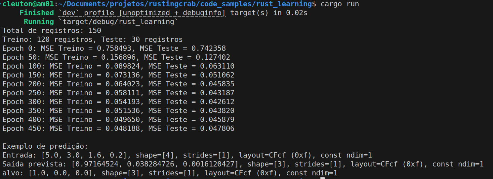

[**Cleuton Sampaio**](https://linkedin.com/in/cleutonsampaio)

[**Veja no GitHub**](https://https://github.com/cleuton/rustingcrab/tree/main/code_samples/rust_learning)

# Quando os padrões não se encaixam

A ideia desse artigo surgiu depois de um pool request "turbulento" pelo qual passei. Estava trabalhando em um projeto com partes em **Rust**, e eu implementei e criei o PR. O **techlead** e outro **dev** encheram de comentários sobre **clean code** e sugeriram o uso de alguns **design patterns**. Apesar de eu dizer que nenhuma sugestão se aplicava, pois tornariam o código mais complexo, eles resolveram fazer eles mesmos. 

Então, muitos WTF depois, desistiram e voltaram à minha implementação original. 

Simplesmente, nem todas as recomendações do Clean Code e nem todos os Design Patterns se aplicam em todos os casos, especialmente em linguagens mais modernas como **Golang** e **Rust**. No caso de Rust então, o mecanismo de propriedade e empréstimo torna quase impossível adaptar essas coisas. 

Aí vem gente com soluções para **quebrar** a proteção do Rust, como `Rc<RefCell<T>>` ou **raw pointers**, que simplesmente violam a proteção de memória, uma das grandes características da linguagem. Então, por que usar Rust? 

Mas falando poucas pessoas acreditam, então resolvi provar. Aliás, o código ao qual me referi era muito semelhante a esse, embora fosse um problema diferente. Em vez de implementar uma estrutura de objetos com referências, eu usei matrizes. 

## A história de uma família de classes...

Quando eu implementei meu framework de **deep learning** em **Java** a intenção era demonstrar como é o algoritmo de uma **rede neural** e seus passos, como: **Forward pass** e **Backpropagation**, além do uso de funções de **ativação**. Por esta razão, criei uma estrutura de classes para representar o problema: Modelo, Camada, Nó e Sinapse, além de Função de Ativação. Ficou bem simples de entender com tudo em uma estrutura elegante. 

Você pode ver o projeto original no [**meu repositório**](https://github.com/cleuton/neuraljava/tree/master/iris/src/main/java/com/neuraljava/samples/mlpgen/api). 

Então, quando fui criar a versão em **Rust**, simplesmente não funcionava... Devido às dependências cíclicas entre as instâncias (Node->Sinapses, Sinapse->Nodes) ficava quase impossível implementar. Eu teria que violar a proteção de memória do Rust, ou então utilizar índices e colocar todas as instâncias em vetores. Foi o que eu fiz, mas ficou muito difícil de ler. 

Tentei até utilizar o padrão **Arena** (typed arena) para isso, mas o resultado final era muito mais complexo do que deveria. Então, parti para a solução mais simples, de acordo com o próprio livro **Clean Code**: **G21 - Entenda o algoritmo**. Treinar e inferir com uma rede neural é um problema de multiplicação de matrizes. E foi dessa forma que eu fiz. 

Vou explicar como é o treinamento e a inferência em uma rede neural com matrizes.

## Rede neural com matrizes

Imagine que você precisa construir uma rede neural para classificar flores do dataset Iris e, em vez de criar muitas estruturas interligadas, você decide representar tudo com matrizes. A ideia central é que cada camada da rede é definida por uma matriz de pesos e um vetor de vieses, e os cálculos se dão por meio de operações matriciais.

### Montagem da Rede

- **Arquitetura em Matrizes:**  
  A rede é montada definindo os tamanhos das camadas. Por exemplo, para o Iris, você tem 4 entradas (as medidas) e 3 saídas (uma para cada espécie). Entre essas camadas, você pode ter uma ou mais camadas ocultas (como uma com 8 neurônios).  
  Cada par de camadas é representado por uma matriz de pesos que "conecta" os neurônios da camada anterior aos da próxima, e por um vetor de vieses que é somado ao resultado dessa multiplicação.

- **Inicialização:**  
  Os pesos e vieses são inicializados com valores aleatórios, normalmente distribuídos de forma a evitar que todos os neurônios comecem com os mesmos valores. Isso garante que a rede tenha diversidade para aprender padrões distintos.

### Treinamento da Rede

- **Forward Propagation (Propagação para Frente):**  
  Para um dado exemplo de entrada, você multiplica o vetor de entrada pela matriz de pesos da primeira camada, soma o vetor de vieses, e aplica uma função de ativação (como a sigmoide) em cada resultado. Essa operação transforma a entrada em uma nova representação (a "ativação") que é passada para a próxima camada. Esse processo se repete até chegar à camada de saída.

- **Armazenamento de Intermediários:**  
  Durante a propagação para frente, você guarda não só as ativações de cada camada, mas também os valores "pré-ativação" (os resultados da multiplicação e soma, antes de aplicar a função de ativação). Esses valores são importantes para o cálculo dos gradientes durante o backpropagation.

- **Backpropagation (Retropropagação do Erro):**  
  Após calcular a saída da rede, você compara com o valor esperado (target) usando uma medida de erro, como o erro quadrático médio (MSE).  
  A partir do erro da camada de saída, você calcula o quanto cada peso e viés contribuiu para o erro, usando o conceito de gradiente.  
  - **Cálculo do Delta:** Para a camada final, o "delta" (erro multiplicado pela derivada da função de ativação) é calculado a partir da diferença entre a saída e o target.  
  - **Propagação do Delta para as Camadas Anteriores:** Esse erro é então "retropropagado" para as camadas ocultas: você multiplica o delta da camada seguinte pelo transposto da matriz de pesos correspondente e multiplica pela derivada da função de ativação dos neurônios da camada atual.  
  - **Gradientes (os "Nabla"):** Durante esse processo, são calculados os gradientes para cada peso e viés. Esses gradientes, que usamos o termo "nabla" para representá-los (do símbolo ∇, que significa gradiente), indicam em que direção e quanto cada parâmetro deve ser ajustado para reduzir o erro.

- **Atualização dos Parâmetros:**  
  Com os gradientes em mãos, você ajusta os pesos e vieses da rede, normalmente subtraindo uma fração dos gradientes (multiplicados pela taxa de aprendizado). Essa etapa é repetida para cada exemplo do conjunto de treinamento, em um processo conhecido como descida de gradiente.

### Inferência

- **Propagação para Frente na Predição:**  
  Quando a rede já está treinada, para fazer uma predição você simplesmente realiza a propagação para frente: o vetor de entrada é passado pelas camadas, realizando as multiplicações matriciais, somas com os vieses e aplicando a função de ativação.  
  O resultado final é um vetor com 3 posições, onde cada posição representa a "confiança" da rede de que o exemplo pertence a uma das espécies do Iris (após, geralmente, aplicar alguma forma de decisão, como escolher a classe com o valor mais alto).

### Contextualizando com o Dataset Iris

- **Pré-processamento:**  
  O dataset Iris é lido de um arquivo CSV, onde cada linha tem 4 números (as medidas) e uma string que indica a espécie. Essa string é convertida em um vetor "one-hot" (por exemplo, `[1, 0, 0]` para "Iris-setosa").  
  Depois de carregar todos os exemplos, os dados são embaralhados e divididos em duas partes: um conjunto de treinamento (80% dos exemplos) e um conjunto de teste (20% dos exemplos).

- **Treinamento e Avaliação:**  
  Durante o treinamento, a rede processa cada exemplo do conjunto de treinamento, ajustando os pesos e vieses para minimizar o MSE. Periodicamente, o erro é calculado tanto para o conjunto de treinamento quanto para o de teste para monitorar o desempenho da rede.

- **Preditiva:**  
  Após o treinamento, a rede é usada para prever a espécie de novas entradas, fazendo a propagação para frente e retornando uma saída que, depois de interpretada (por exemplo, usando a classe com maior valor), indica a classificação.

### Resumindo a Ideia

A ideia é simplificar a implementação de uma rede neural usando operações com matrizes. Em vez de lidar com estruturas complicadas que representam cada conexão individual, você agrupa tudo em grandes matrizes que, por meio de multiplicações e somas, processam os dados de maneira eficiente. O treinamento se dá ajustando esses valores (pesos e vieses) de acordo com o erro entre a saída prevista e a desejada, utilizando o método de backpropagation para calcular os gradientes, e a inferência é apenas passar um exemplo pela rede e ler a saída. Essa abordagem é poderosa porque aproveita o cálculo matricial para tornar os processos de treinamento e predição muito mais rápidos e escaláveis.

## O código-fonte

Vamos listar o código aqui, embora ele possa ser [**acessado no repositório**](https://github.com/cleuton/rustingcrab/blob/main/code_samples/rust_learning/src/main.rs): 

```rust
use csv;
use ndarray::prelude::*;
use ndarray_rand::RandomExt;
use rand::distributions::Uniform;
use rand::seq::SliceRandom;
use rand::thread_rng;
use std::error::Error;
use std::fs::File;
use std::io::BufReader;

/// Função de ativação sigmoide.
fn sigmoid(x: f32) -> f32 {
    1.0 / (1.0 + (-x).exp())
}

/// Derivada da sigmoide em função da própria ativação.
/// Se a = sigma(z), então sigma'(z) = a * (1 - a).
fn derivada_sigmoide(a: f32) -> f32 {
    a * (1.0 - a)
}

/// Calcula o produto externo (produto_externo product) entre dois vetores.
/// Se `a` tem dimensão (n,) e `b` tem dimensão (m,),
/// o resultadoado será uma matriz de dimensão (n, m) onde resultado[[i, j]] = a[i] * b[j].
fn produto_externo(a: &Array1<f32>, b: &Array1<f32>) -> Array2<f32> {
    let n = a.len();
    let m = b.len();
    let mut resultado = Array2::<f32>::zeros((n, m));
    for i in 0..n {
        for j in 0..m {
            resultado[[i, j]] = a[i] * b[j];
        }
    }
    resultado
}

/// Representação da rede neural:
/// - pesos: vetor de matrizes onde cada matriz conecta uma camada à próxima.
/// - biases: vetor de vetores com os vieses de cada camada.
struct RedeNeural {
    pesos: Vec<Array2<f32>>,
    biases: Vec<Array1<f32>>,
}

impl RedeNeural {
    /// Cria uma nova rede dada a lista de tamanhos de camada.
    /// Por exemplo, tamanho_camadas = &[4, 8, 3] cria uma rede com 4 entradas, 8 neurônios na camada oculta e 3 saídas.
    fn new(tamanho_camadas: &[usize]) -> Self {
        let mut pesos = Vec::new();
        let mut biases = Vec::new();
        let dist = Uniform::new(-1.0, 1.0);
        for janela in tamanho_camadas.windows(2) {
            let (n_in, n_out) = (janela[0], janela[1]);
            pesos.push(Array2::random((n_out, n_in), dist));
            biases.push(Array1::random(n_out, dist));
        }
        RedeNeural { pesos, biases }
    }

    /// Propagação para frente simples: dado um vetor de entrada, retorna a ativação da camada de saída.
    fn propagacao_frente(&self, entrada: &Array1<f32>) -> Array1<f32> {
        let mut ativacao = entrada.clone();
        for (w, b) in self.pesos.iter().zip(self.biases.iter()) {
            // z = W * a + b
            let z = w.dot(&ativacao) + b;
            // a = sigma(z)
            ativacao = z.mapv(sigmoid);
        }
        ativacao
    }

    /// Propagação para frente que armazena as ativações e os valores z (pré-ativação) de cada camada.
    /// Retorna uma tupla: (vetor de ativações, vetor de z's).
    fn propagacao_frente_com_intermediarios(
        &self,
        entrada: &Array1<f32>,
    ) -> (Vec<Array1<f32>>, Vec<Array1<f32>>) {
        let mut ativacoes = Vec::new();
        let mut zs = Vec::new();
        let mut ativacao = entrada.clone();
        ativacoes.push(ativacao.clone());
        for (w, b) in self.pesos.iter().zip(self.biases.iter()) {
            let z = w.dot(&ativacao) + b;
            zs.push(z.clone());
            ativacao = z.mapv(sigmoid);
            ativacoes.push(ativacao.clone());
        }
        (ativacoes, zs)
    }

    /// Executa um passo de treinamento para cada exemplo dos dados de treinamento.
    /// Aqui usamos *Stochastic Gradient Descent* (SGD) sem mini-batches para simplicidade.
    fn treinar(
        &mut self,
        entradas: &Vec<Array1<f32>>,
        alvos: &Vec<Array1<f32>>,
        learning_rate: f32,
    ) {
        // Para cada exemplo, realizamos a propagação para frente, o backpropagation e atualizamos os pesos.
        for (entrada, alvo) in entradas.iter().zip(alvos.iter()) {
            // Propagação para frente armazenando ativações e valores z
            let (ativacoes, _zs) = self.propagacao_frente_com_intermediarios(entrada);
            let num_camadas = self.pesos.len();

            // Vetores para armazenar os gradientes (nabla) para vieses e pesos
            let mut nabla_b = Vec::with_capacity(num_camadas);
            let mut nabla_w = Vec::with_capacity(num_camadas);

            // --- Backpropagation ---

            // Para a camada de saída (última camada):
            // delta = (a_l - y) * sigma'(a_l)  (lembrando que a_l = sigma(z_L))
            let a_l = &ativacoes[num_camadas];
            let mut delta = a_l.mapv(|_| 0.0);
            for i in 0..a_l.len() {
                delta[i] = (a_l[i] - alvo[i]) * derivada_sigmoide(a_l[i]);
            }
            // Gradiente para os vieses da camada de saída:
            nabla_b.push(delta.clone());
            // Gradiente para os pesos da camada de saída: produto_externo product entre delta e a^(L-1)
            nabla_w.push(produto_externo(&delta, &ativacoes[num_camadas - 1]));

            // Backpropagate para as camadas ocultas
            let mut delta_corrente = delta;
            // Itera de l = num_camadas-1 até 1 (índices para pesos e biases: 0 .. num_camadas-1)
            for l in (1..num_camadas).rev() {
                let w_next = &self.pesos[l];
                let a_l = &ativacoes[l];
                let mut delta_proximo = w_next.t().dot(&delta_corrente);
                for i in 0..delta_proximo.len() {
                    delta_proximo[i] *= derivada_sigmoide(a_l[i]);
                }
                nabla_b.insert(0, delta_proximo.clone());
                nabla_w.insert(0, produto_externo(&delta_proximo, &ativacoes[l - 1]));
                delta_corrente = delta_proximo;
            }

            // --- Atualização dos parâmetros ---
            for i in 0..num_camadas {
                self.pesos[i] = &self.pesos[i] - &(learning_rate * &nabla_w[i]);
                self.biases[i] = &self.biases[i] - &(learning_rate * &nabla_b[i]);
            }
        }
    }

    /// Calcula o Mean Squared Error (MSE) sobre um conjunto de dados.
    fn mse(&self, entradas: &Vec<Array1<f32>>, alvos: &Vec<Array1<f32>>) -> f32 {
        let mut sum = 0.0;
        let n = entradas.len() as f32;
        for (entrada, alvo) in entradas.iter().zip(alvos.iter()) {
            let output = self.propagacao_frente(entrada);
            let diff = &output - alvo;
            sum += diff.mapv(|x| x * x).sum();
        }
        sum / n
    }
}

/// Converte a string de classe em um vetor one-hot encoding com 3 posições.
fn one_hot(label: &str) -> Array1<f32> {
    match label.trim() {
        "Iris-setosa" => array![1.0, 0.0, 0.0],
        "Iris-versicolor" => array![0.0, 1.0, 0.0],
        "Iris-virginica" => array![0.0, 0.0, 1.0],
        _ => panic!("Classe desconhecida: {}", label),
    }
}

/// Lê o dataset Iris a partir de um arquivo CSV e retorna um vetor de (entrada, alvo).
fn carrega_iris_dataset(path: &str) -> Result<Vec<(Array1<f32>, Array1<f32>)>, Box<dyn Error>> {
    let arq = File::open(path)?;
    let mut rdr = csv::ReaderBuilder::new()
        .has_headers(false)
        .from_reader(BufReader::new(arq));
    let mut dataset = Vec::new();

    for resultado in rdr.records() {
        let registro = resultado?;
        if registro.len() < 5 {
            continue; // pula linhas inválidas
        }
        // Parse dos 4 entradas:
        let entrada: Array1<f32> = array![
            registro[0].parse::<f32>()?,
            registro[1].parse::<f32>()?,
            registro[2].parse::<f32>()?,
            registro[3].parse::<f32>()?
        ];
        // Última coluna: label
        let alvo = one_hot(&registro[4]);
        dataset.push((entrada, alvo));
    }
    Ok(dataset)
}

fn main() -> Result<(), Box<dyn Error>> {
    // Lê o dataset do arquivo "iris.data".
    let mut dataset = carrega_iris_dataset("iris.data")?;
    println!("Total de registros: {}", dataset.len());

    // Embaralha o dataset
    let mut rng = thread_rng();
    dataset.shuffle(&mut rng);

    // Separa em treino (80%) e teste (20%)
    let indice_separacao = (dataset.len() as f32 * 0.8).round() as usize;
    let (conjunto_treino, conjunto_teste) = dataset.split_at(indice_separacao);

    // Separa entradas e alvos para cada conjunto.
    let treinar_entradas: Vec<Array1<f32>> = conjunto_treino.iter().map(|(x, _)| x.clone()).collect();
    let treinar_alvos: Vec<Array1<f32>> = conjunto_treino.iter().map(|(_, y)| y.clone()).collect();

    let testar_entradas: Vec<Array1<f32>> = conjunto_teste.iter().map(|(x, _)| x.clone()).collect();
    let testar_alvos: Vec<Array1<f32>> = conjunto_teste.iter().map(|(_, y)| y.clone()).collect();

    println!(
        "Treino: {} registros, Teste: {} registros",
        treinar_entradas.len(),
        testar_entradas.len()
    );

    // Configuração da rede: 4 entradas, 8 neurônios na camada oculta e 3 saídas.
    let tamanho_camadas = vec![4, 8, 3];
    let mut rede = RedeNeural::new(&tamanho_camadas);

    let learning_rate = 0.05;
    let epochs = 500;

    // Loop de treinamento
    for epoch in 0..epochs {
        rede.treinar(&treinar_entradas, &treinar_alvos, learning_rate);
        if epoch % 50 == 0 {
            let treinar_error = rede.mse(&treinar_entradas, &treinar_alvos);
            let test_error = rede.mse(&testar_entradas, &testar_alvos);
            println!(
                "Epoch {}: MSE Treino = {:.6}, MSE Teste = {:.6}",
                epoch, treinar_error, test_error
            );
        }
    }

    // Exemplo de predição: escolhe um registro do conjunto de teste.
    let indice_exemplo = 0;
    let entrada_exemplo = &testar_entradas[indice_exemplo];
    let alvo_exemplo = &testar_alvos[indice_exemplo];
    let saida_exemplo = rede.propagacao_frente(entrada_exemplo);
    println!("\nExemplo de predição:");
    println!("Entrada: {:?}", entrada_exemplo);
    println!("Saída prevista: {:?}", saida_exemplo);
    println!("alvo: {:?}", alvo_exemplo);

    Ok(())
}

```

Esse código implementa, de forma relativamente simples, uma rede neural feedforward usando operações com matrizes, e o utiliza para classificar amostras do dataset Iris. Vou explicar as partes principais de forma que um desenvolvedor médio possa entender:

### Bibliotecas e Funções Utilitárias

- **Bibliotecas Usadas:**  
  São usadas bibliotecas para ler arquivos CSV (para carregar o dataset Iris), para manipular matrizes e vetores (com a crate *ndarray* e sua extensão para números aleatórios), e para operações de aleatorização (como embaralhar os dados).

- **Função Sigmoide e Sua Derivada:**  
  A função de ativação escolhida é a sigmoide, que transforma qualquer valor real em um número entre 0 e 1. Ela é aplicada após cada operação linear (multiplicação de matriz por vetor e soma de bias) para introduzir não-linearidade.  
  A derivada da sigmoide também é definida, pois é crucial no cálculo dos gradientes durante o backpropagation.

- **Produto Externo:**  
  Há uma função que calcula o produto externo entre dois vetores. Essa operação gera uma matriz onde cada elemento é o produto dos elementos correspondentes dos dois vetores. Essa matriz é usada para calcular os gradientes dos pesos (ou seja, o quanto cada peso deve ser ajustado) durante o treinamento.

### Montagem da Rede Neural

- **Estrutura da Rede:**  
  A rede neural é representada por uma estrutura que contém dois vetores:
  - **Pesos:** Cada elemento desse vetor é uma matriz que conecta uma camada à próxima. Por exemplo, se a rede tem 4 neurônios na entrada e 8 na camada oculta, a matriz correspondente terá 8 linhas e 4 colunas.
  - **Biases:** Cada elemento é um vetor que representa os vieses (offsets) de cada camada. Esses valores são somados à saída da multiplicação da matriz de pesos com as ativações da camada anterior.

- **Inicialização:**  
  Na função que cria a rede, os tamanhos das camadas são passados como parâmetro (por exemplo, `[4, 8, 3]` para o dataset Iris). Para cada par de camadas consecutivas, são gerados pesos e biases aleatórios – geralmente com valores entre -1 e 1 – garantindo que a rede comece com parâmetros distintos.

### Propagação para Frente (Forward Propagation)

- **Cálculo da Saída:**  
  Quando um exemplo (um vetor com 4 entradas) é passado para a rede, ele é processado camada a camada. Em cada camada, o algoritmo:
  1. Multiplica o vetor de entrada pela matriz de pesos da camada.
  2. Soma o vetor de biases.
  3. Aplica a função de ativação sigmoide a cada componente do resultado.  
     
  Esse processo transforma a entrada inicial em ativações que vão passando de camada para camada, até chegar à camada de saída, onde se obtém o vetor final (por exemplo, com 3 elementos para as 3 classes do Iris).

- **Armazenamento dos Intermediários:**  
  Há uma versão da propagação para frente que, além de calcular a saída final, guarda todas as ativações e os valores “pré-ativação” (os resultados da multiplicação e soma antes da aplicação da função sigmoide) de cada camada. Esses valores intermediários são essenciais para o cálculo dos gradientes durante o treinamento.

### Treinamento (Backpropagation e Atualização dos Parâmetros)

- **Cálculo dos Gradientes:**  
  Durante o treinamento, para cada exemplo do conjunto de dados, o código:
  1. Realiza a propagação para frente, armazenando as ativações e os valores pré-ativação.
  2. Compara a saída obtida com o alvo (target) do exemplo para calcular o erro.  
     
  Na camada de saída, o erro (ou “delta”) é calculado como a diferença entre a saída da rede e o target, multiplicada pela derivada da função sigmoide (essa multiplicação "pesada" determina quanto o erro deve ser “propagado” para ajustar cada neurônio).

- **Retropropagação do Erro (Backpropagation):**  
  Esse erro é, então, retropropagado para as camadas anteriores. Para cada camada, o código calcula:
  - **Gradientes dos Biases:** São basicamente o delta da respectiva camada.
  - **Gradientes dos Pesos:** Calculados como o produto externo entre o delta da camada e as ativações da camada anterior.
  
  Esses gradientes são armazenados em vetores chamados “nabla” (em referência ao símbolo ∇, usado para representar gradientes). Eles indicam a direção e o tamanho dos ajustes que devem ser feitos.

- **Atualização dos Parâmetros:**  
  Após calcular os gradientes para todos os exemplos, a rede ajusta os pesos e biases usando descida de gradiente. Cada parâmetro é atualizado subtraindo o gradiente correspondente multiplicado por uma taxa de aprendizado (um valor pequeno que controla o tamanho do passo de atualização).

### Inferência e Avaliação

- **Cálculo do Erro (MSE):**  
  A função de erro utilizada é o Mean Squared Error (MSE), que calcula a média dos quadrados das diferenças entre as saídas previstas pela rede e os alvos. Esse valor é usado para monitorar o desempenho da rede, tanto no conjunto de treinamento quanto no de teste.

- **Predição:**  
  Uma vez treinada, a rede pode receber novos exemplos e processá-los com a propagação para frente, retornando uma saída que indica a “confiança” para cada uma das 3 classes. Em um exemplo prático, o código pega um registro do conjunto de teste e imprime tanto a saída prevista quanto o alvo real.

### Carregamento e Preparação do Dataset Iris

- **Leitura do CSV:**  
  O dataset é carregado de um arquivo CSV. Cada linha contém 4 valores numéricos (as características da flor) e uma string com o nome da classe (por exemplo, "Iris-setosa").

- **One-Hot Encoding:**  
  A string de classe é convertida em um vetor one-hot: um vetor com 3 posições, onde somente a posição correspondente à classe correta é 1 e as demais são 0.

- **Divisão em Treino e Teste:**  
  Depois de carregar e embaralhar os dados, o conjunto é dividido em duas partes: 80% dos exemplos para treinamento e 20% para teste, permitindo avaliar o desempenho da rede em dados que ela não viu durante o treinamento.

### Visão geral

Esse código constrói uma rede neural simples utilizando matrizes para representar conexões e vieses, realiza o treinamento usando backpropagation (calculando os gradientes dos pesos e biases e atualizando-os com descida de gradiente), e depois usa a rede treinada para classificar amostras do dataset Iris. A abordagem baseada em operações matriciais torna os cálculos eficientes e o código mais organizado, evitando a complexidade de gerenciar muitas referências interligadas entre neurônios.

Em outras palavras, o que ele faz é:
1. Ler e preparar os dados do Iris.
2. Montar uma rede com uma camada de entrada, uma oculta e uma de saída.
3. Treinar essa rede ajustando os pesos e biases para minimizar o erro (MSE) na classificação.
4. Usar a rede para prever a classe de novas amostras e avaliar o desempenho.


