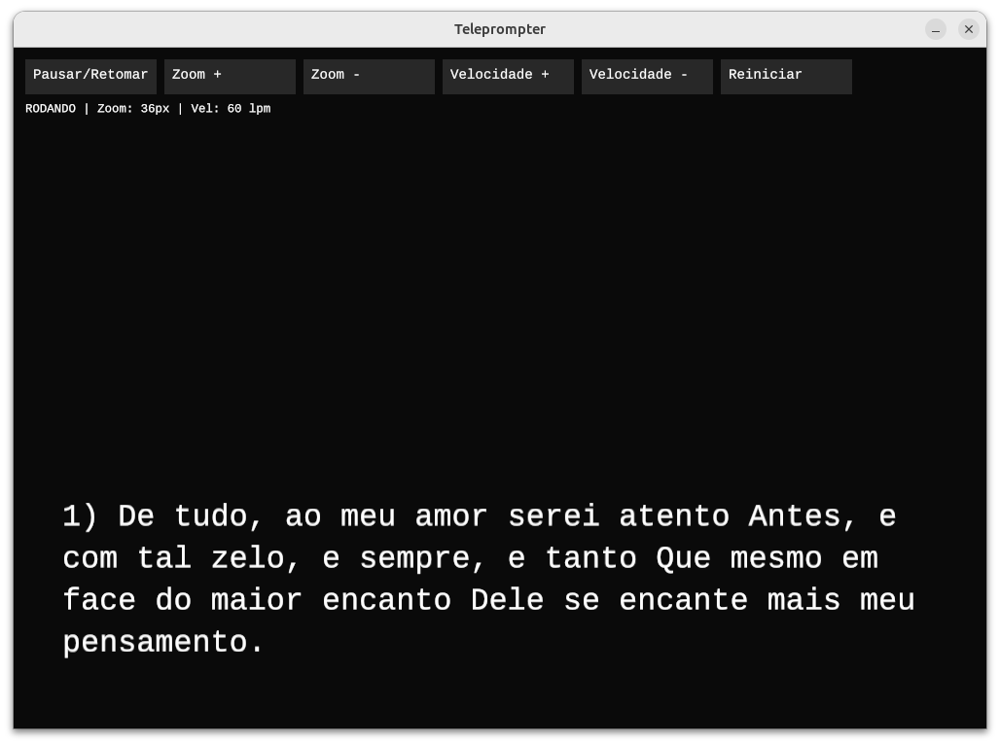

---


---

[**Cleuton Sampaio**](https://linkedin.com/in/cleutonsampaio)

[**Veja no GitHub**](https://https://github.com/cleuton/rustingcrab/tree/main/code_samples/teleprompter)

# Teleprompter em Rust (ggez)

Este é um teleprompter implementado em **Rust**, usando a biblioteca **[ggez](https://ggez.rs/)** para renderização gráfica e entrada de eventos. Serve para quem precisa gravar vídeos e ler textos. É um trabalho em andamento, mas já funciona razoavelmente. 

A rolagem é **suave e contínua**, linha a linha, com espaçamento configurável entre parágrafos e um lead-in inicial que mantém a tela vazia antes do início da fala.
O layout do texto é **prequebrado** para caber na largura disponível, evitando reflow e "pulinhos" durante a leitura.

## Funcionalidades

* **Rolagem suave** linha a linha.
* **Pré-layout fixo** das linhas para não mudar no meio da leitura.
* **Espaçamento entre parágrafos** configurável no código.
* **Zoom**, **velocidade** e **pausa** controláveis por **botões na tela** ou **atalhos de teclado**.
* **Centralização automática** da janela.
* **Reinício rápido** sem esperar o lead-in.

## Requisitos

* [Rust](https://www.rust-lang.org/tools/install) instalado.
* Cargo configurado.
* Dependências da biblioteca `ggez` (no Linux, instale `libasound2-dev libudev-dev pkg-config`).

## Build

Clone o repositório e compile:

```bash
git clone https://github.com/cleuton/rustingcrab.git
cd code_samples/teleprompter
cargo build --release
```

---

## Execução

O teleprompter lê um arquivo de texto e exibe cada parágrafo numerado.

```bash
cargo run --release -- --file "./soneto.txt" --lpm 40 --zoom 36
```

### Parâmetros

* `--file` (obrigatório): caminho para o arquivo `.txt` contendo o texto.
* `--lpm`: linhas por minuto (padrão: `60`).
* `--zoom`: tamanho da fonte em pixels (padrão: `36`).

Exemplo:

```bash
cargo run --release -- --file "soneto.txt" --lpm 40 --zoom 40
```

## Controles

### **Botões na tela**

* **Pausar/Retomar**: inicia ou pausa a rolagem.
* **Zoom +** / **Zoom -**: aumenta/diminui o tamanho do texto.
* **Velocidade +** / **Velocidade -**: ajusta as linhas por minuto.
* **Reiniciar**: volta ao início, pronto para começar a rolagem imediatamente.

### **Atalhos de teclado**

* **Espaço**: Pausar/Retomar (ao retomar, pula direto para a primeira linha).
* **`+`** ou **`=`**: Aumenta o zoom.
* **`-`**: Diminui o zoom.
* **Seta ↑**: Aumenta a velocidade.
* **Seta ↓**: Diminui a velocidade.
* **`R`**: Reinicia.

## Implementação

O código divide o texto em **parágrafos**, remove numeração pré-existente e re-numera.
Cada parágrafo é **quebrado em linhas** que cabem na largura da janela com base no tamanho da fonte e largura disponível.
Essas linhas são organizadas em um vetor único (`stream_lines`) que inclui:

* **Lead-in** (linhas vazias iniciais)
* **Linhas de texto**
* **Linhas vazias** entre parágrafos

A rolagem é feita controlando o índice da **linha corrente** como um valor `f32`, permitindo deslocamentos parciais e rolagem suave.
