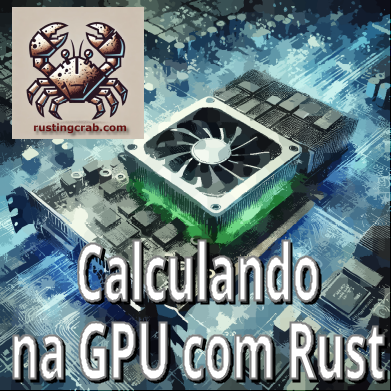

[**Cleuton Sampaio**](https://linkedin.com/in/cleutonsampaio)

# Zoando a GPU com RUST

Brincadeira! O título correto é: "Calculando na GPU com Rust"! Este artigo demonstra como podemos utilizar a **GPU** (não precisa ser **nVidia**) para executar cálculos. É parte do meu esforço para implementar aquela rede neural utilizando a GPU para os cálculos. 

O processo não é tão simples! Você precisa criar um **shader** que efetue o cálculo para você! Vamos utilizar o [**crate** `WGPU`](https://wgpu.rs/) para isso. 

Para utilizar a **GPU** para cálculos com o **WGPU** em **Rust**, você inicia configurando um device e uma queue, que estabelecem a comunicação com a GPU e permitem o envio de comandos. Em seguida, cria-se buffers para armazenar os dados e define-se um pipeline de computação que organiza o processamento desses dados na GPU. É necessário escrever um **shader**, um programa específico (geralmente em **WGSL**) que roda na GPU para executar os cálculos de forma paralela. Após a compilação, esse shader é despachado para execução pela queue. 

O WGPU suporta vários **backends**, como **Vulkan**, **Metal**, **DirectX 12** (e experimentalmente DirectX 11) e **OpenGL ES**, o que garante compatibilidade com diferentes plataformas e dispositivos.

## O código que vamos rodar

[**veja no repositório**](https://github.com/cleuton/rustingcrab/tree/main/code_samples/wgpu).

Esse código faz a **multiplicação de duas matrizes 2x2** na **GPU** usando a biblioteca **wgpu** para computação em paralelo. Vou explicar o funcionamento passo a passo.

### O que o código faz?
1. **Inicializa o WGPU** e seleciona uma GPU disponível.
2. **Cria buffers** na GPU para armazenar as matrizes de entrada (**A** e **B**) e a matriz de saída (**C**).
3. **Define e compila um shader** WGSL que faz a multiplicação das matrizes na GPU.
4. **Configura um pipeline de computação** para executar o shader.
5. **Executa o shader na GPU**, calculando os valores da matriz C.
6. **Copia os resultados da GPU de volta para a CPU** e imprime a matriz resultante.


### Como o código faz isso?

#### 1 - Inicialização do WGPU e seleção da GPU
```rust
let instance = wgpu::Instance::new(wgpu::Backends::PRIMARY);
let adapter = instance.request_adapter(&wgpu::RequestAdapterOptions {
    power_preference: wgpu::PowerPreference::HighPerformance,
    compatible_surface: None,
    force_fallback_adapter: false,
}).await.expect("Falha ao encontrar um adapter");
```
Aqui, ele cria uma **instância WGPU** e escolhe um **adapter** (GPU) disponível no sistema.

Depois, ele solicita um **dispositivo (device)** e uma **fila (queue)** para comunicação com a GPU:
```rust
let (device, queue) = adapter.request_device(
    &wgpu::DeviceDescriptor {
        features: wgpu::Features::empty(),
        limits: wgpu::Limits::default(),
        label: None,
    },
    None,
).await.expect("Falha ao criar o dispositivo");
```

#### 2- Criação das matrizes de entrada
As matrizes **A** e **B** são definidas como arrays **1D** com 4 elementos (`f32`), organizadas em **row-major order**:
```rust
let matrix_a: [f32; MATRIX_SIZE] = [1.0, 2.0, 3.0, 4.0];
let matrix_b: [f32; MATRIX_SIZE] = [5.0, 6.0, 7.0, 8.0];
```

##### Buffers na GPU
Esses dados precisam ser copiados para a **memória da GPU**. Para isso, o código cria **buffers**:
```rust
let buffer_a = device.create_buffer_init(&wgpu::util::BufferInitDescriptor {
    label: Some("Buffer A"),
    contents: bytemuck::cast_slice(&matrix_a),
    usage: wgpu::BufferUsages::STORAGE,
});
```
Isso é feito também para `buffer_b` e `buffer_c` (onde o resultado será armazenado).

#### 3 - Shader para multiplicação de matrizes
O **cálculo real acontece dentro do shader** WGSL:
```wgsl
@compute @workgroup_size(1, 1, 1)
fn main(@builtin(global_invocation_id) global_id: vec3<u32>) {
    let i: u32 = global_id.x;
    let j: u32 = global_id.y;
    
    var sum: f32 = 0.0;
    for (var k: u32 = 0u; k < 2u; k = k + 1u) {
        sum = sum + matrix_a[i * 2u + k] * matrix_b[k * 2u + j];
    }
    matrix_c[i * 2u + j] = sum;
}
```
##### Como isso funciona?
- **Cada thread do shader** computa **um único elemento da matriz C**.
- `i` e `j` representam a **linha** e **coluna** do elemento sendo calculado.
- O loop percorre `k = 0` a `1` para calcular:
  \[
  C[i][j] = A[i][0] \times B[0][j] + A[i][1] \times B[1][j]
  \]
  Esse é o **cálculo básico da multiplicação de matrizes**.

---

#### 4 - Configuração do pipeline de computação**
Para que a GPU execute o shader, é necessário configurar um **pipeline**:
```rust
let compute_pipeline = device.create_compute_pipeline(&wgpu::ComputePipelineDescriptor {
    label: Some("Compute Pipeline"),
    layout: Some(&pipeline_layout),
    module: &shader_module,
    entry_point: "main",
});
```
Isso diz à GPU que **usaremos computação, não gráficos**.

Depois, vinculamos os buffers ao **bind group** para que o shader possa acessá-los:
```rust
let bind_group = device.create_bind_group(&wgpu::BindGroupDescriptor {
    label: Some("Bind Group"),
    layout: &bind_group_layout,
    entries: &[
        wgpu::BindGroupEntry { binding: 0, resource: buffer_a.as_entire_binding() },
        wgpu::BindGroupEntry { binding: 1, resource: buffer_b.as_entire_binding() },
        wgpu::BindGroupEntry { binding: 2, resource: buffer_c.as_entire_binding() },
    ],
});
```

#### 5-  Execução do cálculo na GPU
Agora, precisamos **enviar comandos para a GPU**:
```rust
let mut encoder = device.create_command_encoder(&wgpu::CommandEncoderDescriptor {
    label: Some("Command Encoder"),
});

{
    let mut compute_pass = encoder.begin_compute_pass(&wgpu::ComputePassDescriptor {
        label: Some("Compute Pass"),
    });
    compute_pass.set_pipeline(&compute_pipeline);
    compute_pass.set_bind_group(0, &bind_group, &[]);
    compute_pass.dispatch_workgroups(2, 2, 1);
}
```
Aqui, **dispatch_workgroups(2, 2, 1)** significa que **4 threads serão lançadas** (uma para cada elemento de C).

Após isso, o código **submete os comandos** para a GPU:
```rust
queue.submit(Some(encoder.finish()));
```

#### 6 - Recuperação do resultado da GPU
A matriz C está armazenada no buffer da GPU. Para lê-la, o código:
1. **Cria um buffer de leitura** (`readback_buffer`)
2. **Copia o buffer C para ele**
3. **Mapeia os dados para a CPU**
```rust
let buffer_slice = readback_buffer.slice(..);
buffer_slice.map_async(wgpu::MapMode::Read, |_| {});
device.poll(wgpu::Maintain::Wait);
let data = buffer_slice.get_mapped_range();
let result: &[f32] = bytemuck::cast_slice(&data);
println!("Resultado da multiplicação (matriz C):");
println!("[[{}, {}],", result[0], result[1]);
println!(" [{}, {}]]", result[2], result[3]);
```
Isso converte os bytes de volta para `f32`, imprimindo a matriz final.

O resultado da multiplicação de:
\[
\begin{bmatrix} 1 & 2 \\ 3 & 4 \end{bmatrix}
\]
e
\[
\begin{bmatrix} 5 & 6 \\ 7 & 8 \end{bmatrix}
\]
será:
\[
\begin{bmatrix} 1×5 + 2×7 & 1×6 + 2×8 \\ 3×5 + 4×7 & 3×6 + 4×8 \end{bmatrix} =
\begin{bmatrix} 19 & 22 \\ 43 & 50 \end{bmatrix}
\]

## O código do Shader

Esse é o código fonte do **shader** para multiplicação das matrizes na GPU: 

```wsgl
        // Declaração dos buffers:
        @group(0) @binding(0)
        var<storage, read> matrix_a: array<f32>;
        @group(0) @binding(1)
        var<storage, read> matrix_b: array<f32>;
        @group(0) @binding(2)
        var<storage, read_write> matrix_c: array<f32>;

        // Função compute: cada thread usa sua posição (i, j) para calcular:
        // C[i][j] = A[i][0]*B[0][j] + A[i][1]*B[1][j]
        @compute @workgroup_size(1, 1, 1)
        fn main(@builtin(global_invocation_id) global_id: vec3<u32>) {
            // global_id.x -> linha (i), global_id.y -> coluna (j)
            let i: u32 = global_id.x;
            let j: u32 = global_id.y;

            // Como a matriz é 2x2, o número de colunas é 2.
            var sum: f32 = 0.0;
            for (var k: u32 = 0u; k < 2u; k = k + 1u) {
                // Índice para A: i*2 + k
                // Índice para B: k*2 + j
                sum = sum + matrix_a[i * 2u + k] * matrix_b[k * 2u + j];
            }
            // Salva o resultado em C na posição (i,j)
            matrix_c[i * 2u + j] = sum;
        }
```

Esse código é um **shader de computação** que roda na GPU e faz **multiplicação de matrizes**. Ele recebe duas matrizes \(A\) e \(B\), multiplica e armazena o resultado na matriz \(C\).  

### O que são os buffers?
Os buffers são **áreas de memória na GPU** que armazenam os dados das matrizes. Aqui temos:  

```wgsl
@group(0) @binding(0) var<storage, read> matrix_a: array<f32>; // Matriz A (somente leitura)
@group(0) @binding(1) var<storage, read> matrix_b: array<f32>; // Matriz B (somente leitura)
@group(0) @binding(2) var<storage, read_write> matrix_c: array<f32>; // Matriz C (leitura e escrita)
```
- `matrix_a` e `matrix_b` são **somente leitura** (a GPU apenas lê seus valores).  
- `matrix_c` é **leitura e escrita** (a GPU escreve nela o resultado da multiplicação).  

### Como o cálculo é feito?
A GPU executa a **função principal** (`main`), e cada **thread** da GPU calcula **um elemento da matriz resultado**.  

```wgsl
@compute @workgroup_size(1, 1, 1)
fn main(@builtin(global_invocation_id) global_id: vec3<u32>) {
```
- `@compute` diz que esse **código será rodado em paralelo na GPU**.  
- `@workgroup_size(1, 1, 1)` indica que **cada thread computa um único elemento da matriz**.  
- `global_id.x` e `global_id.y` indicam **qual elemento da matriz a thread deve calcular**.  

**Exemplo:**  
Se `global_id = (1,0)`, então a thread está calculando o elemento **linha 1, coluna 0** da matriz resultado.

### Como a multiplicação acontece?
A multiplicação de matrizes segue a regra:  

\[
C[i][j] = A[i][0] \times B[0][j] + A[i][1] \times B[1][j]
\]

No código:  
```wgsl
let i: u32 = global_id.x;
let j: u32 = global_id.y;

var sum: f32 = 0.0;
for (var k: u32 = 0u; k < 2u; k = k + 1u) {
    sum = sum + matrix_a[i * 2u + k] * matrix_b[k * 2u + j];
}
matrix_c[i * 2u + j] = sum;
```
- **O loop percorre `k = 0` e `k = 1`**, somando os produtos das matrizes \(A\) e \(B\).  
- O resultado é salvo na matriz \(C\).  

### Se você nunca viu isso antes...
- O código **roda na GPU**, processando **vários cálculos ao mesmo tempo**.  
- Cada **thread** calcula **um número** da matriz final.  
- O cálculo segue a regra normal de multiplicação de matrizes.  
- O resultado é salvo no buffer `matrix_c`, que pode ser lido depois pela CPU.  

## Por que usar a GPU?
Multiplicação de matrizes é **altamente paralelizável**: cada elemento de C pode ser calculado **simultaneamente**. Na CPU, o cálculo seria sequencial. Na GPU, usamos **4 threads ao mesmo tempo**, o que acelera a computação.

Esse exemplo é pequeno, mas para **matrizes grandes (ex: 1024x1024)**, a GPU é **muito mais eficiente** do que a CPU.

## Exemplo de execução

É só [**clonar o repo**](https://github.com/cleuton/rustingcrab.git), ir para a [**pasta do projeto**](https://github.com/cleuton/rustingcrab/tree/main/code_samples/wgpu), e rodar `cargo run`. O resultado será esse: 

```shell
Usando adapter: AdapterInfo { name: "AMD Radeon Graphics (RADV RENOIR)", vendor: 4098, device: 5708, device_type: IntegratedGpu, driver: "radv", driver_info: "Mesa 24.0.9-0ubuntu0.2", backend: Vulkan }
Resultado da multiplicação (matriz C):
[[19, 22],
 [43, 50]]
```

Claro que a informação do `adapter` pode ser diferente na sua máquina. A minha é um Rayzen 5 com placa gráfica embutida. 

Gostou? dê aquele **star** no repo e me siga para mais conteúdos como esse. 


