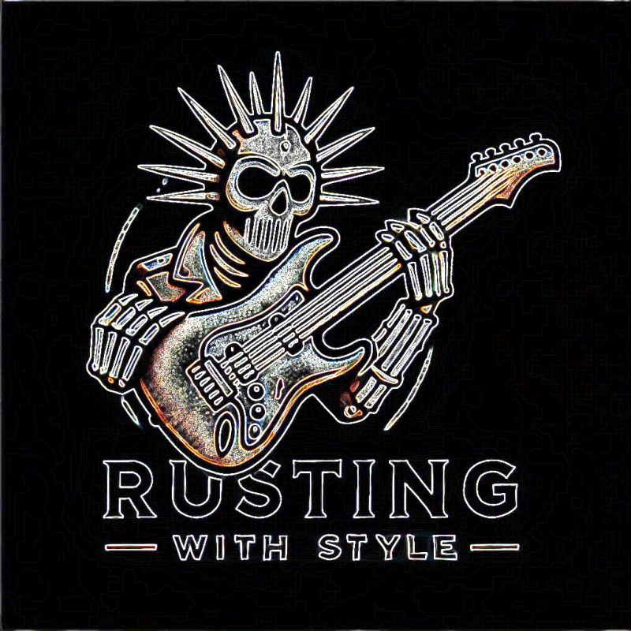

# Rusting with style

[**Veja no GitHub**](https://github.com/cleuton/rustingcrab)

1. [**Conhecendo Rust**](./lição%201%20-%20Conhecendo/) - [**pdf**](./lição%201%20-%20Conhecendo/licao01.pdf) - [**Vídeo**](https://youtu.be/MGVtr31_H-0).
2. [**Estrutura**](./lição%202%20-%20Estrutura/) - [**pdf**](./lição%201%20-%20Estrutura/licao02.pdf) - [**Vídeo**](https://youtu.be/ZLOtPwL88OA?si=lCYr89gtXHQx1u85).
2. [**Desafio**](./lição%203%20-%20Desafio%201/) - [**pdf**](./lição%203%20-%20Desafio%201/licao03.pdf) - [**Vídeo**](https://rustingcrab.com/rusting_with_style_PTBR/li%C3%A7%C3%A3o%203%20-%20Desafio%201/).